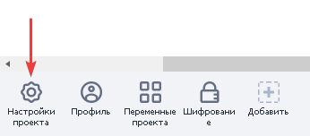
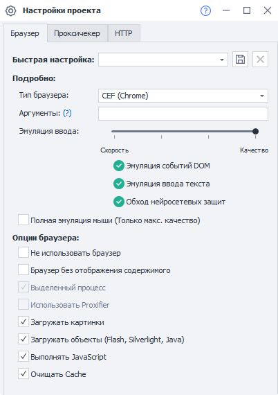
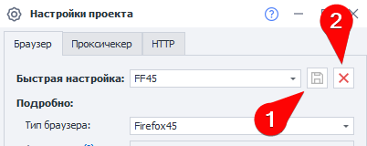
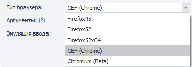
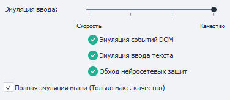
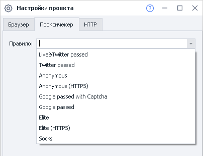
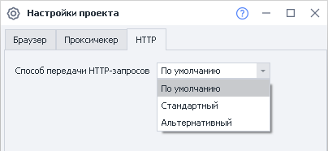

---
sidebar_position: 2
title: "Настройки проекта"
description: ""
date: "2025-08-04"
converted: true
originalFile: "Настройки проекта.txt"
targetUrl: "https://zennolab.atlassian.net/wiki/spaces/RU/pages/534315477"
---
:::info **Пожалуйста, ознакомьтесь с [*Правилами использования материалов на данном ресурсе*](../Disclaimer).**
:::

> 🔗 **[Оригинальная страница](https://zennolab.atlassian.net/wiki/spaces/RU/pages/534315477)** — Источник данного материала

_______________________________________________  
# Настройки проекта

## Описание

С помощью данных настроек можно выполнить тонкую настройку работы проекта. Определяет, какие параметры будут автоматически применены при запуске шаблона.

## Как открыть настройки?

Для того чтобы открыть настройки проекта, необходимо нажать соответствующую кнопку в панели статических блоков. Если вы не видите статические блоки, то кликните правой клавишей мыши на пустом пространстве рабочего окна и установите чекбокс “**Показать статические блоки**” в контекстном меню.

Настройки проекта содержат 3 раздела - настройки браузера, настройки проксичекера и настройки HTTP.

## Настройки браузера

### Быстрая настройка

Позволяет выбрать 2 варианта быстрых настроек из шаблонов - **Качество** или **Скорость**. В зависимости этого выбора, автоматически будут выставлены общие настройки браузера, которые при необходимости можно изменить по отдельности на своё усмотрение.

#### Сохранение настроек

Если Вы часто используете одну и ту же комбинацию настроек в своих проектах, то её можно сохранить с помощью соответствующей кнопки (1), после клика по ней Вам будет предложено ввести имя для новой конфигурации.

:::warning Внимание
Сохранены будут настройки с вкладки “Браузер” и “Проксичекер”. Настройки с вкладки “HTTP” не сохраняются.
:::

Для удаления конфигурации стоит использовать соответствующую кнопку (2).

### Тип браузера

:::info Информация
В версии 7.5.0.0 был добавлен движок Chromium.Движок Chrome переименован в CEF (Chrome).
:::

Какой браузер использовать при работе проекта. На выбор предоставляется несколько вариантов. Переключение с одного браузера на другой также доступно непосредственно во время выполнения проекта с помощью экшена [❗→ Настройки браузера](https://zennolab.atlassian.net/wiki/spaces/RU/pages/489324572#%D0%97%D0%B0%D0%BF%D1%83%D1%81%D1%82%D0%B8%D1%82%D1%8C-%D0%B8%D0%BD%D1%81%D1%82%D0%B0%D0%BD%D1%81 "https://zennolab.atlassian.net/wiki/spaces/RU/pages/489324572#%D0%97%D0%B0%D0%BF%D1%83%D1%81%D1%82%D0%B8%D1%82%D1%8C-%D0%B8%D0%BD%D1%81%D1%82%D0%B0%D0%BD%D1%81").
В [❗→ настройках программы](https://zennolab.atlassian.net/wiki/spaces/RU/pages/808845378#%D0%91%D1%80%D0%B0%D1%83%D0%B7%D0%B5%D1%80-%D0%BF%D0%BE-%D1%83%D0%BC%D0%BE%D0%BB%D1%87%D0%B0%D0%BD%D0%B8%D1%8E "https://zennolab.atlassian.net/wiki/spaces/RU/pages/808845378#%D0%91%D1%80%D0%B0%D1%83%D0%B7%D0%B5%D1%80-%D0%BF%D0%BE-%D1%83%D0%BC%D0%BE%D0%BB%D1%87%D0%B0%D0%BD%D0%B8%D1%8E") можно выбрать браузер, который будет использоваться по умолчанию во всех новых проектах.

### Аргументы

Для браузера Chrome можно добавить свои аргументы запуска, перечисляя их через пробел. Полный список аргументов можно посмотреть по ссылкам:
https://www.chromium.org/developers/how-tos/run-chromium-with-flags
https://peter.sh/experiments/chromium-command-line-switches/

После изменения аргументов необходимо перезапустить браузер. Это можно сделать с помощью нажатия кнопки «С начала» или при выполнении действия «[❗→ Запуск инстанса](https://zennolab.atlassian.net/wiki/spaces/RU/pages/489324572#%D0%97%D0%B0%D0%BF%D1%83%D1%81%D1%82%D0%B8%D1%82%D1%8C-%D0%B8%D0%BD%D1%81%D1%82%D0%B0%D0%BD%D1%81 "https://zennolab.atlassian.net/wiki/spaces/RU/pages/489324572#%D0%97%D0%B0%D0%BF%D1%83%D1%81%D1%82%D0%B8%D1%82%D1%8C-%D0%B8%D0%BD%D1%81%D1%82%D0%B0%D0%BD%D1%81")».

### Эмуляция ввода

Позволяет эмулировать действия реального пользователя при заполнении полей на web страницах, кликов по кнопкам и ссылкам, тем самым обходя защиту на сайтах. Используя ползунок можно выбрать 4 варианта предустановленных значений, тем самым выбирая между скоростью работы проекта и его качеством. При выборе максимальной скорости, будут отключены все варианты эмуляции и обход защит, при максимальном качестве будет включена вся эмуляция и обход защит, но скорость выполнения будет ниже.

- **Эмуляция событий DOM** - Эмуляция обычных DOM событий через JS (например onfocus и т.д.). Эти события отслеживаются скриптами, добавляющими новые поля на веб-странице. Проверками заполнения полей и другими примитивными защитами от ботов.
- **Эмуляция ввода текста** - Эмуляция ввода данных и взаимодействие с веб-страницей через события клавиатуры и мыши. Как если бы реальный человек нажимал на кнопки и кликал мышкой. Обходит продвинутые защиты, которые следят за вводом данных без использования периферийных устройств.
- **Обход нейросетевых защит** - Продвинутая эмуляция с учётом поведения человека. Позволяет обходить подавляющее большинство алгоритмов защит от ботов, включая нейросетевые защиты.

### Полная эмуляция мыши

Данная опция включает эмуляцию мыши на уровне проекта.
Это значит, что при выполнении экшенов «[❗→ Установка значения](https://zennolab.atlassian.net/wiki/spaces/RU/pages/534315117 "https://zennolab.atlassian.net/wiki/spaces/RU/pages/534315117")» (Set) и «[❗→ Выполнить действие](https://zennolab.atlassian.net/wiki/spaces/RU/pages/534020211 "https://zennolab.atlassian.net/wiki/spaces/RU/pages/534020211")» (Rise) автоматически добавится эмуляция мыши от текущего курсора к HTML элементу, что указан в действии. 

То есть чтобы добавить эмуляцию мыши в свой шаблон, достаточно одного клика!
Больше ничего не требуется.

:::info Информация
Работает только на максимальном качества эмуляции ввода.
:::

Демонстрация

### Не использовать браузер

Отключает браузерную часть, при этом нельзя воздействовать со страницей и её элементами. Если вы работаете через POST/GET запросы, с базами данных или командными файлами - браузер можно отключить, чтобы повысить производительность.

Подробнее про работу с запросами можно ознакомиться в статьях [❗→ GET-запрос](https://zennolab.atlassian.net/wiki/spaces/RU/pages/534315165/GET- "https://zennolab.atlassian.net/wiki/spaces/RU/pages/534315165/GET-"), [❗→ POST-запрос](https://zennolab.atlassian.net/wiki/spaces/RU/pages/534315180/POST- "https://zennolab.atlassian.net/wiki/spaces/RU/pages/534315180/POST-") и [❗→ HTTP-запросы](https://zennolab.atlassian.net/wiki/spaces/RU/pages/489259052/HTTP "https://zennolab.atlassian.net/wiki/spaces/RU/pages/489259052/HTTP").

### Браузер без отображения содержимого

Позволяет сохранять загрузку всех элементов на странице, но не отображать их. Позволяет сэкономить ресурсы компьютера.

### Выделенный процесс

Если включено, то использует один инстанс на одну базу base.exe - в этом случае задачи внутри базы будут выполняться быстрее, но увеличится расход ресурсов.

:::info Информация
Настройка доступна только для движка Firefox
:::

### Использовать Proxifier

Позволяет использовать в работе шаблона программу для проксирования сетевого трафика.

:::info Информация
Настройка доступна только для движка Firefox
:::

### Загружать картинки

Для большинства сайтов работа проектов возможна без картинок. Их отключение значительно экономит трафик. Также отключение картинок можно выполнить с помощью экшена [❗→ Настройки браузера](https://zennolab.atlassian.net/wiki/spaces/RU/pages/489324572 "https://zennolab.atlassian.net/wiki/spaces/RU/pages/489324572").

### Загружать объекты (Flash, Silverlight, Java)

Если отключено, объекты Flash, Silverlight и Java загружаться и выполняться на странице не будут. Позволяет увеличить производительность и сэкономить трафик. Данную настройку также можно выполнить с помощью экшена [❗→ Настройки браузера](https://zennolab.atlassian.net/wiki/spaces/RU/pages/489324572 "https://zennolab.atlassian.net/wiki/spaces/RU/pages/489324572").

Если Flash включен данной настройкой, но он по какой-то причине не работает в Chrome браузере, добавьте [❗→ аргументы запуска](https://zennolab.atlassian.net/wiki/spaces/RU/pages/534315477#%D0%90%D1%80%D0%B3%D1%83%D0%BC%D0%B5%D0%BD%D1%82%D1%8B "https://zennolab.atlassian.net/wiki/spaces/RU/pages/534315477#%D0%90%D1%80%D0%B3%D1%83%D0%BC%D0%B5%D0%BD%D1%82%D1%8B") `--enable-system-flash --disable-software-rasterizer --disable-smooth-scrolling` запуска . Подробнее: [Не работает Flash в браузере](https://zennolab.kayako.com/ru/article/392-ne-rabotaet-flash-v-brauzere "https://zennolab.kayako.com/ru/article/392-ne-rabotaet-flash-v-brauzere")

### Выполнять JavaScript

Если отключено, скрипты на странице выполняться не будут. Для большинства современных ресурсов это может сказаться на работоспособности функций сайта. Данную настройку также можно выполнить с помощью экшена [❗→ Настройки браузера](https://zennolab.atlassian.net/wiki/spaces/RU/pages/489324572 "https://zennolab.atlassian.net/wiki/spaces/RU/pages/489324572").

### Очищать Cache

При старте проекта автоматически очищать содержимое cache - хранилище временной информации. Использование кэша помогает сохранить расход трафика. Данную настройку также можно выполнить с помощью экшена [❗→ Настройки браузера](https://zennolab.atlassian.net/wiki/spaces/RU/pages/489324572 "https://zennolab.atlassian.net/wiki/spaces/RU/pages/489324572").

Некоторые из этих настроек относятся к правилам загрузки контента и их можно изменить в процессе работы в [❗→ окне браузера](https://zennolab.atlassian.net/wiki/spaces/RU/pages/534315373 "https://zennolab.atlassian.net/wiki/spaces/RU/pages/534315373").

## Настройки проксичекера

Позволяет задать правило, по которому будут браться прокси из проксичекера при старте проекта.

В самом проекте можно изменить правило для проксичекера, используя экшен “**Получить прокси**“. Подробнее можно ознакомиться в статье [❗→ Использование прокси](https://zennolab.atlassian.net/wiki/spaces/RU/pages/492208129 "https://zennolab.atlassian.net/wiki/spaces/RU/pages/492208129").

## Настройки HTTP

Устанавливается способ передачи HTTP-запросов - **Стандартный** или **Альтернативный**. Вариант “**По умолчанию**“ задаётся в [❗→ настройках программы во вкладке "Выполнение"](https://zennolab.atlassian.net/wiki/spaces/RU/pages/809074766#%D0%98%D1%81%D0%BF%D0%BE%D0%BB%D1%8C%D0%B7%D0%BE%D0%B2%D0%B0%D1%82%D1%8C-%D0%B0%D0%BB%D1%8C%D1%82%D0%B5%D1%80%D0%BD%D0%B0%D1%82%D0%B8%D0%B2%D0%BD%D1%8B%D0%B9-%D1%81%D0%BF%D0%BE%D1%81%D0%BE%D0%B1-%D0%BF%D0%B5%D1%80%D0%B5%D0%B4%D0%B0%D1%87%D0%B8-HTTP-%D0%B7%D0%B0%D0%BF%D1%80%D0%BE%D1%81%D0%BE%D0%B2 "https://zennolab.atlassian.net/wiki/spaces/RU/pages/809074766#%D0%98%D1%81%D0%BF%D0%BE%D0%BB%D1%8C%D0%B7%D0%BE%D0%B2%D0%B0%D1%82%D1%8C-%D0%B0%D0%BB%D1%8C%D1%82%D0%B5%D1%80%D0%BD%D0%B0%D1%82%D0%B8%D0%B2%D0%BD%D1%8B%D0%B9-%D1%81%D0%BF%D0%BE%D1%81%D0%BE%D0%B1-%D0%BF%D0%B5%D1%80%D0%B5%D0%B4%D0%B0%D1%87%D0%B8-HTTP-%D0%B7%D0%B0%D0%BF%D1%80%D0%BE%D1%81%D0%BE%D0%B2").

По умолчанию ZennoPoster использует библиотеку Chillkat для передачи HTTP запросов.
Мы добавили альтернативный вариант - **ZennoHttpClient**, который позволяет решить проблемы с некоторыми сайтами (например, Яндекс).

- По умолчанию - способ, который выбран в [❗→ настройках программы](https://zennolab.atlassian.net/wiki/spaces/RU/pages/809074766#%D0%98%D1%81%D0%BF%D0%BE%D0%BB%D1%8C%D0%B7%D0%BE%D0%B2%D0%B0%D1%82%D1%8C-%D0%B0%D0%BB%D1%8C%D1%82%D0%B5%D1%80%D0%BD%D0%B0%D1%82%D0%B8%D0%B2%D0%BD%D1%8B%D0%B9-%D1%81%D0%BF%D0%BE%D1%81%D0%BE%D0%B1-%D0%BF%D0%B5%D1%80%D0%B5%D0%B4%D0%B0%D1%87%D0%B8-HTTP-%D0%B7%D0%B0%D0%BF%D1%80%D0%BE%D1%81%D0%BE%D0%B2 "https://zennolab.atlassian.net/wiki/spaces/RU/pages/809074766#%D0%98%D1%81%D0%BF%D0%BE%D0%BB%D1%8C%D0%B7%D0%BE%D0%B2%D0%B0%D1%82%D1%8C-%D0%B0%D0%BB%D1%8C%D1%82%D0%B5%D1%80%D0%BD%D0%B0%D1%82%D0%B8%D0%B2%D0%BD%D1%8B%D0%B9-%D1%81%D0%BF%D0%BE%D1%81%D0%BE%D0%B1-%D0%BF%D0%B5%D1%80%D0%B5%D0%B4%D0%B0%D1%87%D0%B8-HTTP-%D0%B7%D0%B0%D0%BF%D1%80%D0%BE%D1%81%D0%BE%D0%B2").
- Стандартный - Chillkat.
- Альтернативный - ZennoHttpClient.

Данные настройки используются для работы с экшенами запросов. Подробнее про работу с запросами можно ознакомиться в статьях [❗→ GET-запрос](https://zennolab.atlassian.net/wiki/spaces/RU/pages/534315165/GET- "https://zennolab.atlassian.net/wiki/spaces/RU/pages/534315165/GET-"), [❗→ POST-запрос](https://zennolab.atlassian.net/wiki/spaces/RU/pages/534315180/POST- "https://zennolab.atlassian.net/wiki/spaces/RU/pages/534315180/POST-") и [❗→ HTTP-запросы](https://zennolab.atlassian.net/wiki/spaces/RU/pages/489259052/HTTP "https://zennolab.atlassian.net/wiki/spaces/RU/pages/489259052/HTTP").