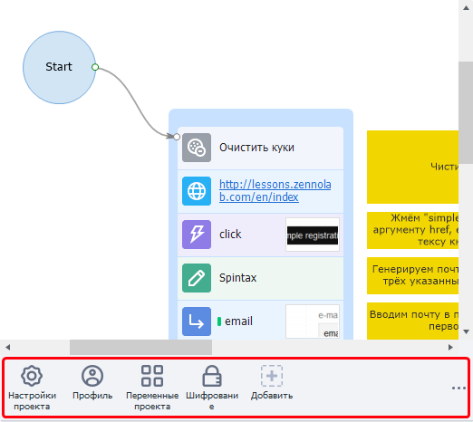
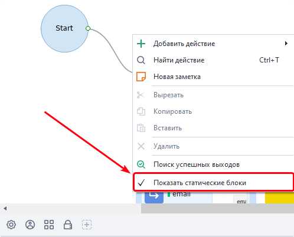
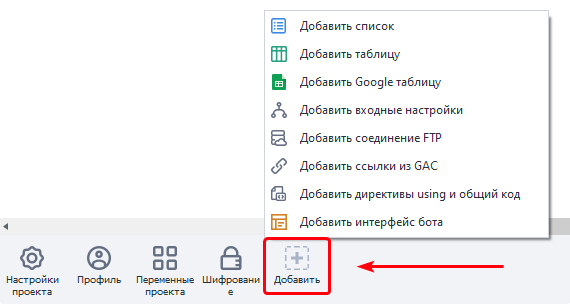
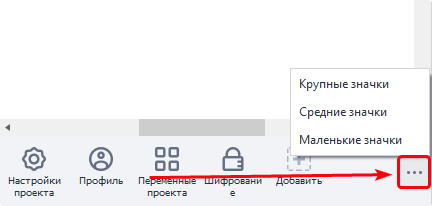
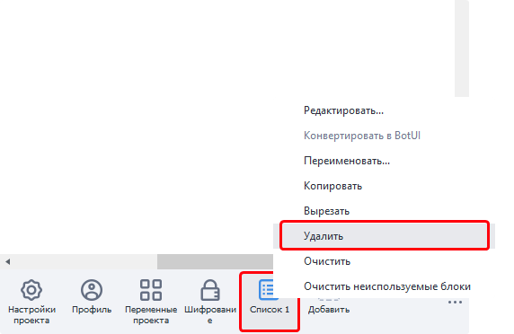

---
sidebar_position: 1
title: "Общие принципы работы"
description: ""
date: "2025-08-04"
converted: true
originalFile: "Общие принципы работы.txt"
targetUrl: "https://zennolab.atlassian.net/wiki/spaces/RU/pages/534315470"
---
:::info **Пожалуйста, ознакомьтесь с [*Правилами использования материалов на данном ресурсе*](../Disclaimer).**
:::

> 🔗 **[Оригинальная страница](https://zennolab.atlassian.net/wiki/spaces/RU/pages/534315470)** — Источник данного материала

_______________________________________________  
# Общие принципы работы

### Что такое статические блоки

В каждом проекте в нижней части есть специальное поле - панель статических блоков. Она содержит “статические блоки” - это элементы проекта, которые принадлежат сразу всему проекту и доступны из любой его части. В отличии от действий (кубиков), выполнение которых происходит последовательно во времени. 

Каждый статический блок отвечает за одно или несколько свойств проекта - это могут быть настройки проекта, настройки профиля в проекте, шифрование, а также списки и таблицы с данными.

При создании проекта в нем уже имеются несколько обязательных статических блоков (их нельзя удалить)

### Как показать панель статических блоков

:::warning Внимание
Если вы не видите панель статических блоков - в контекстном меню проекта выберите пункт “Показать статические блоки“
:::

### Как добавлять статические блоки

Щелкните ПКМ на кнопке “Добавить“, либо в конт. меню панели:

### Как изменить размер панели

Кнопка в правой части панели:

### Как удалить статический блок

ПКМ на статическом блоке → Удалить:

Если опция “Удалить“ неактивна, значит, удалить такой статический блок нельзя.