---
sidebar_position: 3
title: "Профиль"
description: ""
date: "2025-08-04"
converted: true
originalFile: "Профиль.txt"
targetUrl: "https://zennolab.atlassian.net/wiki/spaces/RU/pages/483426308"
---
:::info **Пожалуйста, ознакомьтесь с [*Правилами использования материалов на данном ресурсе*](../Disclaimer).**
:::

> 🔗 **[Оригинальная страница](https://zennolab.atlassian.net/wiki/spaces/RU/pages/483426308)** — Источник данного материала

_______________________________________________  
# Профиль

## Описание

Профиль - это виртуальная личность, данные которой генерируются при каждом новом запуске шаблона (в ProjectMaker генерация происходит во время нажатия кнопки *С начала; а в ZennoPoster - при каждом новом выполнении проекта). Подробные данные по профилю можно получить в [❗→ Окне профиля](https://zennolab.atlassian.net/wiki/spaces/RU/pages/735903758 "https://zennolab.atlassian.net/wiki/spaces/RU/pages/735903758")

При выполнении проекта в профиле сгенерируются все данные, которые будут использоваться для регистрации, в том числе данные браузера (язык, размер экрана, User Agent и десятки других).

Таким образом, профиль нужен для:

- Быстрой генерации данных личности, используемых при регистрации.
- Правильной генерации данных браузера, которые будут видны сервисам.
- Сохранения и загрузки Cookie (и всех остальных данных), используемых при регистрации. Иногда нужно зайти на сайт через несколько часов после регистрации, как бы с того же браузера и тем же человеком.
- Централизованного, удобного доступа ко всем данным личности и браузера при настройке проекта.

Мы рекомендуем организовывать логику проектов таким образом, чтобы избегать лишних внутренних циклов и переназначений отдельных настроек профиля в рамках одного выполнения проекта. То есть: проект стартовал, сгенерировался новый профиль, на сайте произвелись необходимые действия, проект завершился. Не нужно нагромождать проекты внутренними циклами и пытаться, например, зарегистрировать несколько аккаунтов, меняя что-то вручную в профиле. Логичнее проект завершить и выполнить его ещё несколько раз.

  

## Настройки генерации профиля для текущего проекта

Чтобы открыть параметры генерации профиля необходимо кликнуть по иконке *Профиль в [❗→ *Панеле статических блоков](https://zennolab.atlassian.net/wiki/spaces/RU/pages/534053179 "https://zennolab.atlassian.net/wiki/spaces/RU/pages/534053179") (находится под холстом с экшенами):

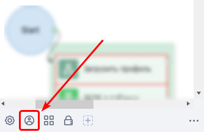

У меня не отображается Панель Статических Блоков. Что делать?

Включить/отключить данную область можно кликнув ПКМ в любом пустом месте холста с экшенами и выбрав соответствующую настройку из контекстного меню:

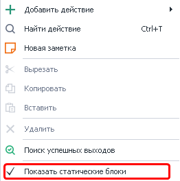

Откроется окно с настройками, на котором две вкладки *Пользователь и Браузер. 

  

### Вкладка пользователь

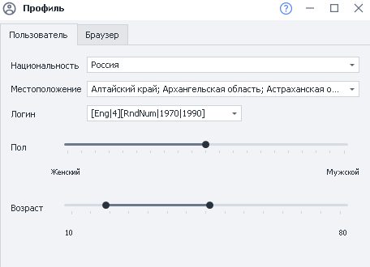

#### Национальность

:::info Информация
Национальность по умолчанию можно выставить в Настройках, во вкладке Профиль. Так же там можно выставить email и пароль от него.
:::

На данный момент (версия программы - 7.1.6.0) доступно 6 национальностей:

1. Россия
2. USA (США)
3. Germany (Германия)
4. France (Франция)
5. Spain (Испания)
6. United Kingdom (Великобритания)

#### Местоположение

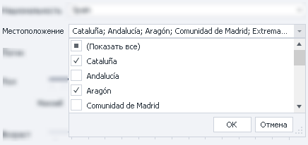

Выпадающий список с возможностью выбора нескольких значений. Содержимое данного списка зависит от выбранной страны:

- для России - это области, края, республики, некоторые большие города (Москва, Сочи и др.)
- для США - штаты
- для Германии - земли
- для Франции - регионы
- для Испании - автономные сообщества
- для Великобритании - страны, входящие в её состав

#### Логин

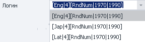

При генерации логина используется формула, состоящая из нескольких частей. По умолчанию в настройках уже сохранены несколько видов формул. Вы можете вписать сюда свою. 

Подробное описание формул

*На данный момент поддерживаются языки Eng - английский, Lat - латынь, Jap - японский.

То есть написав `[Eng|4]`, будет сгенерирован никнейм длиной в 4 английских слога, с вероятностью следования слогов такой же как в реальных словах. Поигравшись с формулой генерации, можно создать более сложные конструкции:

`[RndSym|[RndNum|0|4]|0123456789][Lat|3][RndSym|[RndNum|0|2]|-][Jap|1][RndText|2|D]`

где `[RndSym|[RndNum|0|4]|0123456789]` - в начале ника идет от 0 до трех цифр;

`[Lat|3]` 3 слога на латыни;

`[RndSym|[RndNum|0|2]|-]` возможно появление дефиса;

`[Jap|1]` один японский слог;

`[RndText|2|D]`
 потом случайные 2 буквы или цифры;

В результате будут сгенерированы ники:

> 053bomenca-iem  
> 7lialeme-nozr  
> 46atbemig-poex  
> simpvido-se8f  
> 3afosuxhif6  
> frigulimdeif  
> misssefu-yucn  
> 5grasacin-maew  
> trodalcelfu88  
> 6nasercia-risc  

#### Пол

Данным ползунком Вы устанавливаете с какой вероятностью будет сгенерирован тот или иной пол.

#### Возраст

С помощью этого ползунка Вы выставляете диапазон из которого будет генерироваться возраст для профиля.

### Вкладка Браузер

По умолчанию настройки скрыты, чтоб их запустить необходимо выбрать "Настроить вручную" из выпадающего списка

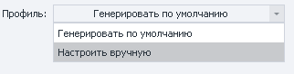

После активации настроек появится такое окно:

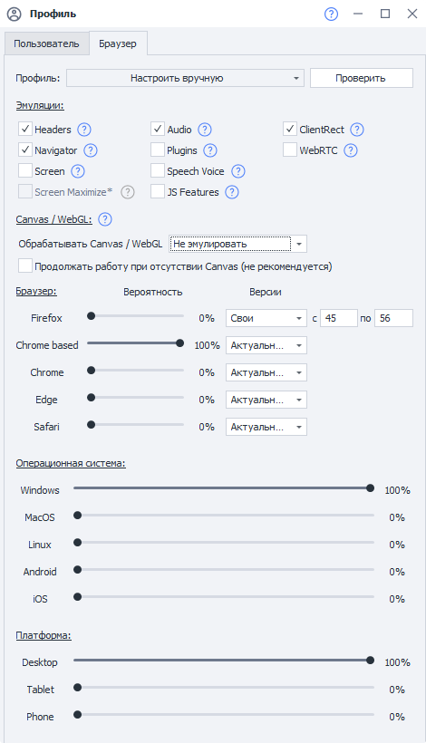

#### Проверить

В самом конце, после того как Вы выставили все параметры в нужное положение стоит нажать эту кнопку, чтоб проверить, что выставленные параметры корректны и подходят друг к другу.

  

#### Эмуляции

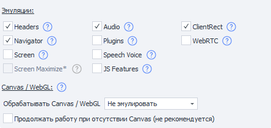

С помощью данных настроек Вы можете включать\отключать блоки из которых состоит [отпечаток браузера](https://ru.wikipedia.org/wiki/%D0%A6%D0%B8%D1%84%D1%80%D0%BE%D0%B2%D0%BE%D0%B9_%D0%BE%D1%82%D0%BF%D0%B5%D1%87%D0%B0%D1%82%D0%BE%D0%BA_%D1%83%D1%81%D1%82%D1%80%D0%BE%D0%B9%D1%81%D1%82%D0%B2%D0%B0 "https://ru.wikipedia.org/wiki/%D0%A6%D0%B8%D1%84%D1%80%D0%BE%D0%B2%D0%BE%D0%B9_%D0%BE%D1%82%D0%BF%D0%B5%D1%87%D0%B0%D1%82%D0%BE%D0%BA_%D1%83%D1%81%D1%82%D1%80%D0%BE%D0%B9%D1%81%D1%82%D0%B2%D0%B0"). При клике по знаку вопроса возле любой из настроек Вы будете перенаправлены на эту страницу к необходимой настройке.

##### Headers

Каждый браузер отсылает характерные ему [заголовки](https://developer.mozilla.org/en-US/docs/Web/HTTP/Headers "https://developer.mozilla.org/en-US/docs/Web/HTTP/Headers"), такие как Accept, Accept-Encoding, Accept-Charset, Accept-Language. Именно эти заголовки ZennoPoster позволяет изменять через действия работы с профилем, через C# код. Новый профиль гарантирует, что заголовки блока [Headers](https://developer.mozilla.org/en-US/docs/Web/HTTP/Headers "https://developer.mozilla.org/en-US/docs/Web/HTTP/Headers") правильно соотносятся с блоком [Navigator](https://developer.mozilla.org/ru/docs/Web/API/Navigator "https://developer.mozilla.org/ru/docs/Web/API/Navigator").

##### Navigator

Блок Navigator содержит абсолютно корректный набор полей с корректными значениями. Включив эмуляцию [Navigator](https://developer.mozilla.org/ru/docs/Web/API/Navigator "https://developer.mozilla.org/ru/docs/Web/API/Navigator"), будут изменяться не только значения полей, но и их видимость. То, что раньше приходилось делать большими сниппетами теперь делается в автоматическом режиме.

##### Screen

Разрешение экрана. Параметры объекта [Screen](https://developer.mozilla.org/ru/docs/Web/API/Screen "https://developer.mozilla.org/ru/docs/Web/API/Screen"), которые вы могли эмулировать через действия работы с профилем или через C# код теперь устанавливаются автоматически. При этом они соответствуют текущему [Navigator](https://developer.mozilla.org/ru/docs/Web/API/Navigator "https://developer.mozilla.org/ru/docs/Web/API/Navigator") и другим блокам.

##### Screen Maximize

:::info Информация
Доступно в ZennoPoster, начиная с версии 7.3.0.0
:::

Устанавливает размер окна соответственно сгенерированному размеру Screen. 

:::note На заметку
Для активации данной настройки сначала надо включить настройку Screen.
:::

:::warning Внимание
При использовании возможны проблемы с вёрсткой.
:::

Равносилен C# вызову метода `SetWindowSize`.

##### Plugins

Каждый браузер может иметь набор плагинов, этот набор различается от типа браузера, от операционной системы и платформы. Мы предоставляем вам уникальный набор плагинов. Больше не нужно думать какие плагины установить, они установятся автоматически.

##### Audio

ZennoPoster может эмулировать контекст и некоторые параметры audio окружения браузера. При включении блока [Audio](https://developer.mozilla.org/ru/docs/Web/API/AudioContext "https://developer.mozilla.org/ru/docs/Web/API/AudioContext") контекст и параметры будут эмулироваться автоматически.

##### Speech Voice

:::info Информация
Доступно в ZennoPoster, начиная с версии 7.3.0.0
:::

[Web Speech API](https://developer.mozilla.org/ru/docs/Web/API/Web_Speech_API "https://developer.mozilla.org/ru/docs/Web/API/Web_Speech_API") позволяет взаимодействовать с голосовыми интерфейсами для распознавания и синтеза речи. Speech Voice - это пресеты голосов, которые используются для генерации аудио представления информации.

##### Canvas / WebGL

Что такое Canvas и WebGL?

Canvas - это элемент HTML5, который предназначен для создания графики на веб-страницах.

WebGL — это API для рисования 3D графики в браузере. WebGL, как и Canvas может использоваться для получения браузерных отпечатков. Есть несколько методов получения отпечатков, один из них WebGL Image.

Снятие отпечатков происходит примерно по одному принципу: на странице сайта прорисовывается скрытое изображение из которого в дальнейшем получается хэш. На разных устройствах результат будет отличаться т.к. он зависит от комбинации железа, драйверов и браузера. Это различие и позволяет отслеживать пользователей.

До версии 7.7.7.0

[Canvas](https://developer.mozilla.org/ru/docs/Web/API/Canvas_API "https://developer.mozilla.org/ru/docs/Web/API/Canvas_API") имеет несколько возможных контекстов, [WebGL](https://developer.mozilla.org/en-US/docs/Web/API/WebGL_API "https://developer.mozilla.org/en-US/docs/Web/API/WebGL_API") имеет огромное количество параметров и расширений. Все это может быть эмулировано в ZennoPoster. И при включении блока Canvas / WebGL абсолютно все параметры и контексты будут эмулироваться автоматически.

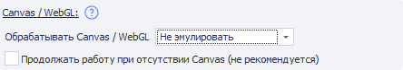

В версии 7.7.0.0 эмуляция Canvas/WebGL была значительно улучшена!

Теперь есть три варианта работы:

- *Не эмулировать* - будет использован один и тот же отпечаток браузера для всех создаваемых профилей.
- *Добавлять шум* - при включении данной настройки отпечаток будет новым для каждого профиля.
Минус данного режима в том, что будет получаться на 100% уникальный отпечаток, что не совсем естественно, т.к. у простых браузеров отпечатки очень редко, но повторяются (на 1000 пользователей может быть 5 (это примерное число, в реальности может быть как больше так и меньше) с одинаковыми отпечатками.
Для многих сайтов будет достаточно и данного режима.
- *Супер эмуляция* - сгенерированный в этом режиме отпечаток будет не на 100% уникальным. Это позволит Вам сливаться с толпой, поскольку во всём мире существует множество копий устройств.  
**ВНИМАНИЕ!** *Режим "Супер эмуляция" работает только на движке Chromium*

:::warning Внимание
Для работы WebGL в браузере, необходима активированная настройка в "Инстанс" > "Использовать GPU для ускорения отрисовки".
:::

**Продолжить работу при отсутствии Canvas (**не рекомендуется**)** - если данная настройка включена и не удалось сгенерировать Canvas, то проект продолжит работу. Если настрйка вЫключена, то работа шаблона будет завершена с ошибкой (если не удалось сгенерировать Canvas).

##### JS Features

Для определения браузера может использовать множество изощренных техник, например вызов функции toString() у любого объекта или функции в JS может многое рассказать о вашем браузере. Блок JS Features предназначен для включения защиты от различных техник определения браузера.

##### ClientRect

Каждое оборудование индивидуально, это сказывается в мельчайших деталях, таких как размеры элементов, при применении к ним различных стилей. Включение блока ClientRect защитит ваш браузер от отпечатков такого типа.

##### WebRTC

Любые устройства, камеры, наушники, микрофоны могут быть видны в вашем браузере с помощью [WebRTC](https://developer.mozilla.org/ru/docs/Web/API/WebRTC_API "https://developer.mozilla.org/ru/docs/Web/API/WebRTC_API"). Список ваших устройств также является надежным отпечатком браузера. Блок WebRTC предоставляет вам уникальный набор устройств для выбранной платформы, ОС и браузера.

* * *

#### Браузер

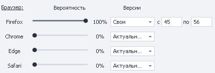

С помощью ползунков тут можно настроить вероятность генерации того или иного браузера.

:::warning Внимание
В данной настройке генерируется значения для строки User-Agent (строка, которая отправляется вместе с запросом и содержит в себе информацию о браузере, ОС и её разрядности, и другую информацию).Не стоит путать с Типом браузера на котором работает текущий проект и который можно изменить в Настройках проекта
:::

* * *

#### Операционная система и Платформа

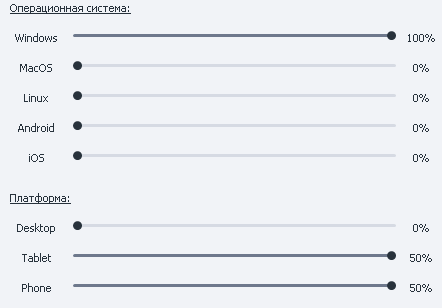

Благодаря данным настройкам Вы можете настроить какие (и с какой вероятностью) будут генерироваться ОС и платформы.

## Для чего это используется?

- Регистрация на сайтах, форумах, блогах, в социальных сетях и других местах

 - благодаря наличию *Профиля* в ProjectMaker Вам не надо ломать голову над тем, где взять имена, фамилии, индексы, города, логины, как генерировать User-Agent'ы и другие параметры. Всё это уже встроено в программу. Вы же можете сосредоточиться на решение более важных задач
- С помощью экшена [❗→ *Операции над профилем*](https://zennolab.atlassian.net/wiki/spaces/RU/pages/486539291 "https://zennolab.atlassian.net/wiki/spaces/RU/pages/486539291") Вы можете переназначить некоторые поля профиля. Так же данный экшен позволяет сохранять и загружать профиль, а это может быть полезно, чтоб не авторизовываться на сайте при каждом заходе: при первом заходе на сайта авторизуетесь, работаете с сайтом, а потом сохраняете профиль. При повторном заходе на сайт подгружаете ранее сохранённый профиль и Вы уже авторизованы, данные для входа вводить не надо (возможно это благодаря тому, что в профиле сохраняются Cookies браузера).

* * *

## Полезные ссылки

- [❗→ Окно профиля](https://zennolab.atlassian.net/wiki/spaces/RU/pages/735903758 "https://zennolab.atlassian.net/wiki/spaces/RU/pages/735903758")
- [❗→ Операции над профилем](https://zennolab.atlassian.net/wiki/spaces/RU/pages/486539291 "https://zennolab.atlassian.net/wiki/spaces/RU/pages/486539291")
- [❗→ Профиль (PM)](https://zennolab.atlassian.net/wiki/spaces/RU/pages/735608848 "https://zennolab.atlassian.net/wiki/spaces/RU/pages/735608848")