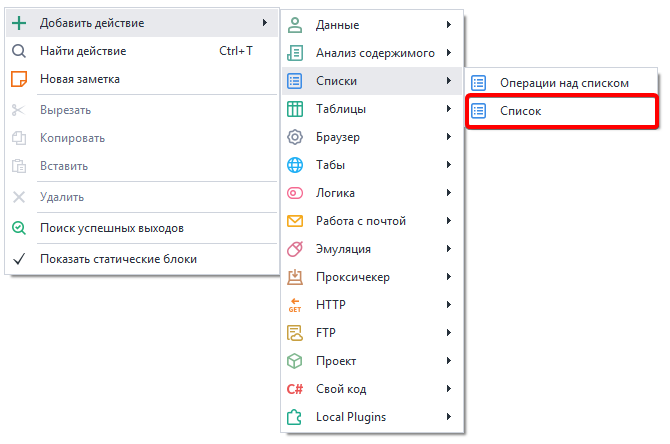
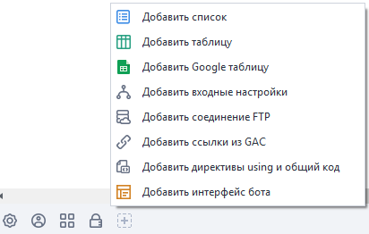
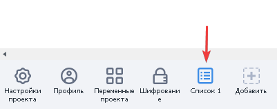
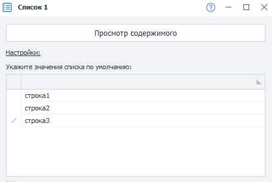
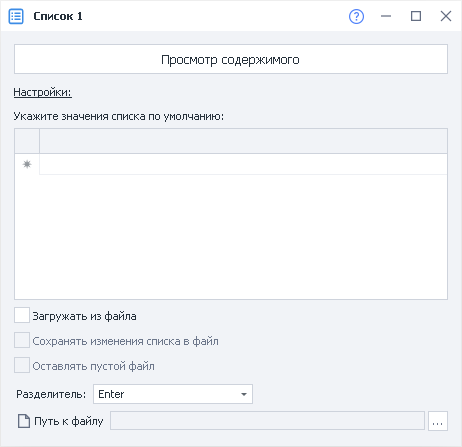
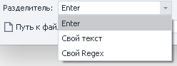
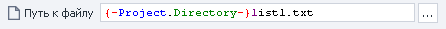
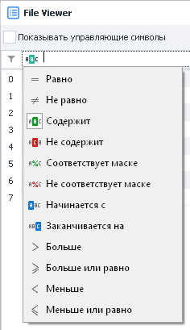
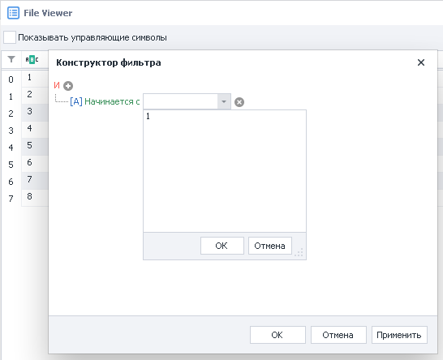

---
sidebar_position: 5
title: "Список"
description: ""
date: "2025-08-04"
converted: true
originalFile: "Список.txt"
targetUrl: "https://zennolab.atlassian.net/wiki/spaces/RU/pages/534053375"
---
:::info **Пожалуйста, ознакомьтесь с [*Правилами использования материалов на данном ресурсе*](../Disclaimer).**
:::

> 🔗 **[Оригинальная страница](https://zennolab.atlassian.net/wiki/spaces/RU/pages/534053375)** — Источник данного материала

_______________________________________________  
# Список

  

## Описание

Списки представляют собой упорядоченный набор строк. Позволяют получать данные из текстового документа, сохранять данные в файл, либо работать с набором строк в памяти без привязки к файлу. Подробная работа со списком описана в статье [❗→ Операции над списком](https://zennolab.atlassian.net/wiki/spaces/RU/pages/534085798 "https://zennolab.atlassian.net/wiki/spaces/RU/pages/534085798").

## Создание списка 

Создать новый список можно из контекстного меню Добавить действие → Списки → Список:

Или через [❗→ Панель статических блоков](https://zennolab.atlassian.net/wiki/spaces/RU/pages/534053179 "https://zennolab.atlassian.net/wiki/spaces/RU/pages/534053179") (клик по иконке “+” или ПКМ в области)

Либо воспользуйтесь [❗→ умным поиском](https://zennolab.atlassian.net/wiki/spaces/RU/pages/506200090/ProjectMaker+7#%D0%A3%D0%BC%D0%BD%D1%8B%D0%B9-%D0%BF%D0%BE%D0%B8%D1%81%D0%BA-%D0%B4%D0%B5%D0%B9%D1%81%D1%82%D0%B2%D0%B8%D0%B9 "https://zennolab.atlassian.net/wiki/spaces/RU/pages/506200090/ProjectMaker+7#%D0%A3%D0%BC%D0%BD%D1%8B%D0%B9-%D0%BF%D0%BE%D0%B8%D1%81%D0%BA-%D0%B4%D0%B5%D0%B9%D1%81%D1%82%D0%B2%D0%B8%D0%B9").

Созданный список отобразится на панели статических блоков:

При открытии списка в панели статических блоков появятся настройки списка, а так же превью содержимого списка. Если список привязан к файлу, то отобразится содержимое этого файла. Если привязки к файлу нет, то списку можно задать значения по умолчанию.

## Настройки списка

### Основные

#### Загружать из файла

Брать данные для списка из текстового файла формата .txt;

:::note На заметку
Если Вы НЕ загружаете список из файла, то у каждого потока будет своя, независимая копия списка.
:::

#### Сохранять изменения списка в файл

Результат работы со списком будет автоматически сохранён в привязанный текстовый файл;

:::note На заметку
Если Вы загружаете данные из файла, но не включили настройку Сохранять изменения списка в файл, то для каждого потока будет создана своя, локальная, копия списка на основе указанного файла. Изменения списка внутри потоков никак не отразятся на привязанном файле. Если же настройка Сохранять изменения списка в файл, включена, то все потоки будут работать с одной копией списка и все изменения будут сохраняться в привязанный файл.
:::

#### Оставлять пустой файл

Если все данные в списке закончатся, нужно ли оставить пустой файл или удалить его.

#### Разделитель

Указывает, что должно использоваться в качестве разделения строк списка. В качестве разделителя может использоваться “Enter“, любой свой текст или регулярное выражение.

#### Путь к файлу

В случае, если выбрано загружать список из файла, необходимо указать путь к текстовому документу в формате .txt. Данные из него загружаются в список при старте проекта.

:::note На заметку
Если путь к файлу заранее не известен и будет вычислен только во время выполнения проекта, то можно использовать экшен работы со списком и его функцию Привязать к файлу.
:::

### Просмотр содержимого

Позволяет полностью просмотреть содержимое всего списка. В этом разделе можно включить отображение управляющих символов, задать фильтр для поиска нужной строки, а так же воспользоваться конструктором фильтра. 

Подробная работа со списком описана в статье [❗→ Операции над списком](https://zennolab.atlassian.net/wiki/spaces/RU/pages/534085798 "https://zennolab.atlassian.net/wiki/spaces/RU/pages/534085798").