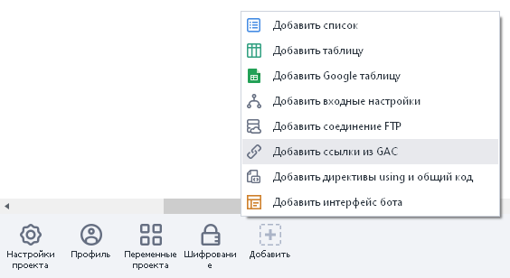
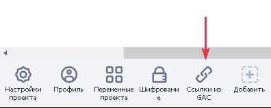
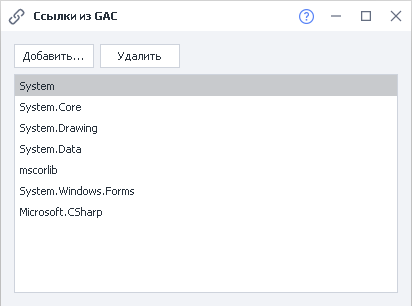
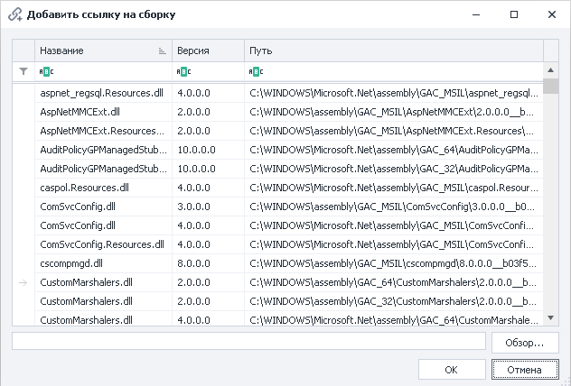
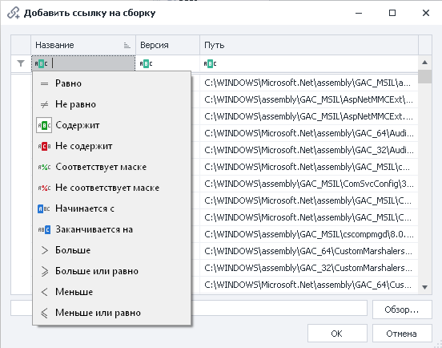
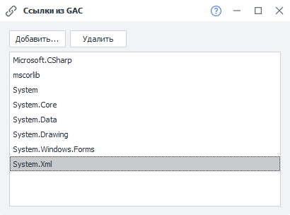

:::info **Пожалуйста, ознакомьтесь с [*Правилами использования материалов на данном ресурсе*](../Disclaimer).**
:::

> 🔗 **[Оригинальная страница](https://zennolab.atlassian.net/wiki/spaces/RU/pages/534315491/GAC)** — Источник данного материала

_______________________________________________  
# Ссылки из GAC

## Описание

При использовании C# снипетов вам доступны все возможности языка C#. Он включает в себя обширную библиотеку классов и методов которая покрывает большинство задач, которые могут у вас возникнуть. С описанием и возможностями классов библиотеки вы можете ознакомиться на странице [Библиотека классов платформы .NET Framework](http://msdn.microsoft.com/ru-ru/library/gg145045%28v=vs.110%29.aspx "http://msdn.microsoft.com/ru-ru/library/gg145045(v=vs.110).aspx")

Если вы не нашли класс решающий вашу задачу, вы можете подключить стороннюю библиотеку классов. Для этого на панель нужно добавить элемент **Ссылки из GAC** в котором подключить вашу библиотеку.

## Как использовать?

Если при использовании C# сниппетов вы не нашли класс решающий вашу задачу, вы можете подключить стороннюю библиотеку классов. Для этого на панель статических блоков нужно добавить элемент **Ссылки из GAC**.

На панели статических блоков отобразится новый элемент:

При открытии данного элемента появится окно, в котором перечислены подключенные в данный момент библиотеки.

С помощью кнопки “Добавить“ необходимо добавить свою библиотеку, выбрав из списка или загрузив из файла. 

Также можно задать фильтр для поиска нужных данных. 

После того как нужная библиотека добавлена, необходимо прописать новое пространство имён, используя блок [❗→ Директивы using и общий код](https://zennolab.atlassian.net/wiki/spaces/RU/pages/534086229/Using- "https://zennolab.atlassian.net/wiki/spaces/RU/pages/534086229/Using-").

При использовании стандартной библиотеки классов платформы .NET Framework или сторонней библиотеки, для доступа к классам минуя пространство имен и эстетичного вида вашего кода стоит использовать [❗→ Директивы using и общий код](https://zennolab.atlassian.net/wiki/spaces/RU/pages/534086229/Using- "https://zennolab.atlassian.net/wiki/spaces/RU/pages/534086229/Using-").