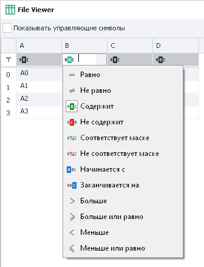

:::info **Пожалуйста, ознакомьтесь с [*Правилами использования материалов на данном ресурсе*](../Disclaimer).**
:::

> 🔗 **[Оригинальная страница](https://zennolab.atlassian.net/wiki/spaces/RU/pages/735903776)** — Источник данного материала

_______________________________________________  
# Таблица

## Описание

Таблицы представляют собой упорядоченный набор строк и столбцов. Позволяют получать данные из файла и сохранять данные в файлы в различных форматах, либо работать с данными в памяти без привязки к файлу. Подробная работа с таблицами описана в статье [❗→ Операции над таблицами](https://zennolab.atlassian.net/wiki/spaces/RU/pages/534052972 "https://zennolab.atlassian.net/wiki/spaces/RU/pages/534052972").

## Создание таблицы

Создать новую таблицу можно из контекстного меню **Добавить действие → Таблицы → таблица**:

Или 

Либо воспользуйтесь [❗→ умным поиском](https://zennolab.atlassian.net/wiki/spaces/RU/pages/506200090/ProjectMaker+7#%D0%A3%D0%BC%D0%BD%D1%8B%D0%B9-%D0%BF%D0%BE%D0%B8%D1%81%D0%BA-%D0%B4%D0%B5%D0%B9%D1%81%D1%82%D0%B2%D0%B8%D0%B9 "https://zennolab.atlassian.net/wiki/spaces/RU/pages/506200090/ProjectMaker+7#%D0%A3%D0%BC%D0%BD%D1%8B%D0%B9-%D0%BF%D0%BE%D0%B8%D1%81%D0%BA-%D0%B4%D0%B5%D0%B9%D1%81%D1%82%D0%B2%D0%B8%D0%B9").

Созданная таблица отобразится в [❗→ панели статических блоков](https://zennolab.atlassian.net/wiki/spaces/RU/pages/534053179 "https://zennolab.atlassian.net/wiki/spaces/RU/pages/534053179"):

## Настройки таблицы

### Основные

#### Загружать из файла

Брать данные для таблицы из файла;

:::note На заметку
Если Вы НЕ загружаете таблицу из файла, то у каждого потока будет своя, независимая копия таблицы.
:::

#### Сохранять изменения таблицы в файл

Результат работы с таблицей будет автоматически сохранён в привязанный файл;

:::note На заметку
Если Вы загружаете данные из файла, но не включили настройку Сохранять изменения таблицы в файл, то для каждого потока будет создана своя, локальная, копия таблицы на основе указанного файла. Изменения таблицы внутри потоков никак не отразятся на привязанном файле.Если же настройка Сохранять изменения таблицы в файл, включена, то все потоки будут работать с одной копией таблицы и все изменения будут сохраняться в привязанный файл.
:::

#### Оставлять пустой файл

Если все данные в таблице закончатся, нужно ли оставить пустой файл или удалить его.

#### Свой формат

Можно использовать как свой формат файла, так и выбрать один из готовых форматов таблиц.

Если выбран готовый формат файла, то можно выбрать дополнительные настройки для работы с этими форматами:

##### Первая строка заголовки

Использовать первую строку таблицы под заголовки;

##### Корректное отображение в Excel не латинских букв для .csv файлов

##### Разбирать тип данных (если возможно)

Определять тип данных в содержимом;

##### Разделитель для .csv формата

Выбрать символ разделителя “;“ или “,“

:::warning Внимание
Обратите внимание, что при привязке таблицы к файлам .csv, .xls, .xlsx, .xlsm, .ods, работа идёт только с первым листом документа
:::

#### Разделитель строк

Указывает, что должно использоваться в качестве разделения строк таблицы. В качестве разделителя может использоваться “Enter“, любой свой разделитель или несколько разделителей.

#### Разделитель столбцов

Указывает, что должно использоваться в качестве разделения столбцов таблицы. В качестве разделителя может использоваться символ “;“, символ табуляции “Tab“, любой свой разделитель или несколько разделителей.

#### Путь к файлу

В случае, если выбрано загружать таблицу из файла, необходимо указать путь к файлу таблицы. Данные из неё загружаются в таблицу при старте проекта. 

:::note На заметку
Если путь к файлу заранее не известен и будет вычислен только во время выполнения проекта, то можно использовать экшен работы с таблицами и его функцию Привязать к файлу.
:::

#### 
Просмотр содержимого

Позволяет полностью просмотреть содержимое всей таблицы. В этом разделе можно включить отображение управляющих символов, задать фильтр для поиска нужной строки и ячейки, а так же воспользоваться конструктором фильтра. 

Подробная работа с таблицей описана в статье [❗→ Операции над таблицей](https://zennolab.atlassian.net/wiki/spaces/RU/pages/534052972 "https://zennolab.atlassian.net/wiki/spaces/RU/pages/534052972").