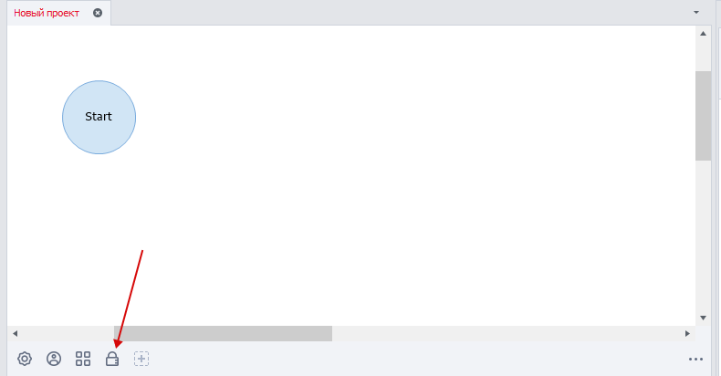
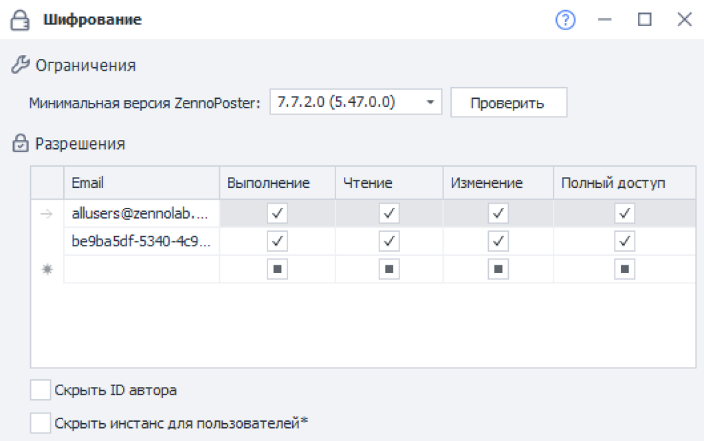
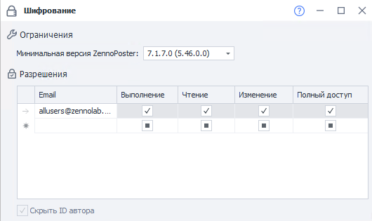

---
sidebar_position: 4
title: "Шифрование"
description: ""
date: "2025-08-04"
converted: true
originalFile: "Шифрование.txt"
targetUrl: "https://zennolab.atlassian.net/wiki/spaces/RU/pages/534315498"
---
:::info **Пожалуйста, ознакомьтесь с [*Правилами использования материалов на данном ресурсе*](../Disclaimer).**
:::

> 🔗 **[Оригинальная страница](https://zennolab.atlassian.net/wiki/spaces/RU/pages/534315498)** — Источник данного материала

_______________________________________________  
# Шифрование

## Описание

Шифрование позволяет защитить созданные Вами проекты от непредвиденного копирования и редактирования.

## Для чего используется?

- Защита проекта от копирования
- Для передачи шаблона другому пользователю, чтобы доступ к проекту был только у него

## Местонахождение

После создания проекта, на [❗→ панели статических блоков](https://zennolab.atlassian.net/wiki/spaces/RU/pages/534053179 "https://zennolab.atlassian.net/wiki/spaces/RU/pages/534053179") есть иконка замка, это и есть блок шифрования

## Описание полей

### Минимальная версия ZennoPoster

В данном выпадающем списке Вы можете выбрать минимальную версию, на которой можно будет запустить шаблон.

#### Кнопка "Проверить"

:::info Информация
Добавлено в ZennoPoster 7.2.1.0
:::

После клика по данной кнопке будет запущена проверка шаблона для оценки минимально-возможной версии для запуска. 

### Разрешения

#### Email

Поле для ввода идентификатора, имеет несколько форматов формат:

- support@zennolab.com - почта, к которой привязан ZennoPoster
- e927aabf-5ee3-4d3d-9ba7-e0f70537b923@zenno.club или e927aabf-5ee3-4d3d-9ba7-e0f70537b923@zennolab.com- можно получить в [Личном Кабинете](https://userarea.zennolab.com/lk/userarea/Profile.aspx "https://userarea.zennolab.com/lk/userarea/Profile.aspx").
- allusers@zennolab.com - распространяется на любого пользователя.

#### Выполнение

Возможность только выполнять проект

#### Чтение

Возможность просмотреть структуру проекта

#### Изменение

Возможность редактировать проект

#### Полный доступ

Всё вышеперечисленное, а также возможность выдать права другим пользователям.

### Скрыть ID автора

:::warning Внимание
При активации этой настройки автоматически будет установлена минимальная версия ZennoPoster 7.1.7.0.
:::

Если при передаче шаблона другим пользователям, Вы не хотите, чтобы они знали Ваш внутренний ID в системе ZennoLab'a, включите опцию **"Скрыть ID автора"** в блоке шифрования. 

Вот как будет выглядеть блок шифрования для других пользователей:

### Скрыть инстанс для пользователей

:::warning Внимание
При активации этой настройки автоматически будет установлена минимальная версия ZennoPoster 7.7.2.0.
:::

Если при передаче шаблона другим пользователям, Вы не хотите, чтобы при выполнении проекта был виден браузер, включите опцию **"Скрыть инстанс для пользователей"**.

Данная опция не влияет на выполнение проекта, она лишь скрывает отображение браузера в ZennoPoster и ProjectMaker и применяется для тех пользователей шаблона, у кого имеется только привелегия на *Выполнение. Скрытие происходит в:

- Превью инстансов в ZennoPoster.
- Показ инстанса по двойному клику в ZennoPoster.
- Окно браузера в ProjectMaker при выполнения проекта в качестве плагина или подпроекта.

Скрытие не распространяется на выполнение действия [❗→ Ожидание действий пользователя](https://zennolab.atlassian.net/wiki/spaces/RU/pages/2110259201).

  

## Подробнее про разрешения

**Выполнение, Чтение, Изменение, Полный доступ** - установка разрешения производится в порядке иерархической системы. При получении следующего доступа, предыдущий выдается автоматически. Так же и наоборот, если установлены галочки **"Выполнение"** и **"Чтение"** и Вы решите снять **"Выполнение"**, то чтение станет неактивным автоматически.

**📹 Здесь было видео**

  

## Пример использования

Допустим, Вы создали проект и хотите его передать другому пользователю, но хотите, чтобы он мог только использовать проект. Без доступа на просмотр и на редактирование шаблона.

Для этого необходимо указать его почту или идентификатор из [личного кабинета](https://userarea.zennolab.com/ "https://userarea.zennolab.com/") и выдать права на **"Выполнение"**.