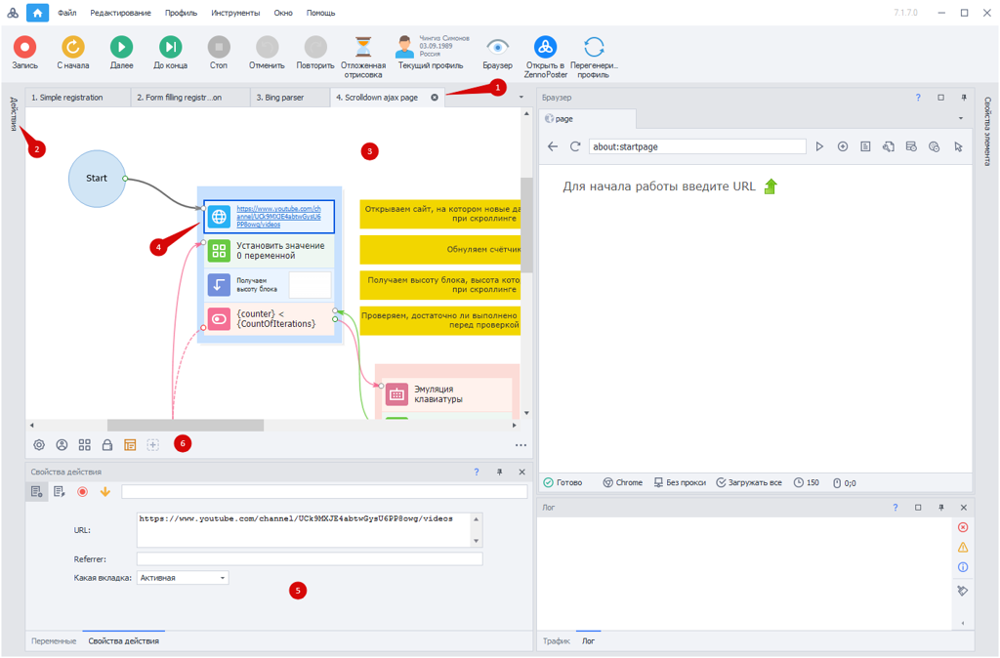
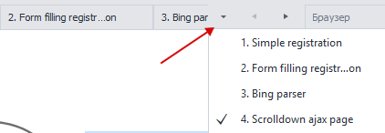
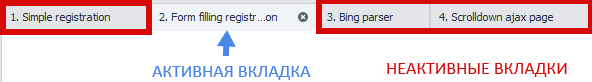
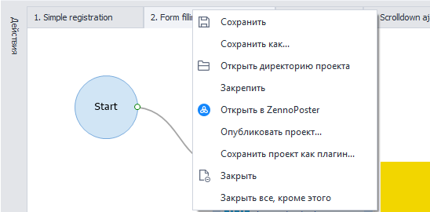
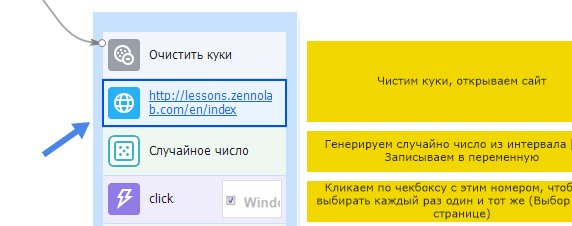
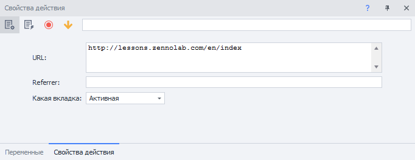
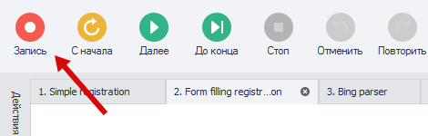

---
sidebar_position: 0
title: "Редактор проектов"
description: "Конвертировано из HTML в MDX"
date: "2025-07-24"
converted: true
originalFile: "Редактор проектов.txt"
targetUrl: "https://zennolab.atlassian.net/wiki/spaces/RU/pages/534052914"
---
:::info **Пожалуйста, ознакомьтесь с [*Правилами использования материалов на данном ресурсе*](../Disclaimer).**
:::

> 🔗 **[Оригинальная страница](https://zennolab.atlassian.net/wiki/spaces/RU/pages/534052914)** — Источник данного материала

_______________________________________________  

Редактор проектов в ProjectMaker - основное место для работы с проектами. 

Давайте посмотрим, из чего он состоит?

1. Панель открытых проектов
2. Панель действий
3. Текущий выбранный проект
4. Текущее выбранное действие
5. Свойства выбранного действия
6. Панель статических блоков проекта

## Панель открытых проектов

Когда вы открываете несколько проектов, все они располагаются в виде вкладок на панели редактора. Если вкладки не умещаются, вы можете воспользоваться специальным меню:

## Панель действий

:::tip Совет
Панель действий содержит в себе весь огромный функционал программы, это более сотни функций. Все доступные действия можно найти тут: Действия
:::

Посмотрите, как можно добавить действие в проект:

**📹 Здесь было видео**

Кроме того, панель действий можно закрепить, чтобы она не скрывалась.

## Текущий проект и выбранное действие

Определить то, в каком проекте Вы находитесь, можно, обратив внимание на состояние вкладок в панели открытых проектов.

Кроме того, вы можете вызвать контекстное меню и совершить некоторые действия с проектом. Для этого, необходимо нажать **правой кнопкой мыши** по вкладке проекта.

Выбранное Вам действие подсвечивается рамкой.

Для выбора определенного действия, по нему необходимо нажать **левой кнопкой мыши**.

## Свойства действия

В данном блоке Вы имеете возможность настроить каждое действие. После В этом поле отображается весь функционал выбранного действия. Подробнее можно узнать в разделе [❗→ Экшенов](https://zennolab.atlassian.net/wiki/spaces/RU/pages/486342706/ProjectMaker "https://zennolab.atlassian.net/wiki/spaces/RU/pages/486342706/ProjectMaker").

Также, можно открыть сразу несколько действий одновременно. Подробнее: [❗→ Открывать несколько настроек действий в режиме “…“](https://zennolab.atlassian.net/wiki/spaces/RU/pages/725385223#%D0%9E%D1%82%D0%BA%D1%80%D1%8B%D0%B2%D0%B0%D1%82%D1%8C-%D0%BD%D0%B5%D1%81%D0%BA%D0%BE%D0%BB%D1%8C%D0%BA%D0%BE-%D0%BD%D0%B0%D1%81%D1%82%D1%80%D0%BE%D0%B5%D0%BA-%D0%B4%D0%B5%D0%B9%D1%81%D1%82%D0%B2%D0%B8%D0%B9-%D0%B2-%D1%80%D0%B5%D0%B6%D0%B8%D0%BC%D0%B5-%E2%80%9C%E2%80%A6%E2%80%9C "https://zennolab.atlassian.net/wiki/spaces/RU/pages/725385223#%D0%9E%D1%82%D0%BA%D1%80%D1%8B%D0%B2%D0%B0%D1%82%D1%8C-%D0%BD%D0%B5%D1%81%D0%BA%D0%BE%D0%BB%D1%8C%D0%BA%D0%BE-%D0%BD%D0%B0%D1%81%D1%82%D1%80%D0%BE%D0%B5%D0%BA-%D0%B4%D0%B5%D0%B9%D1%81%D1%82%D0%B2%D0%B8%D0%B9-%D0%B2-%D1%80%D0%B5%D0%B6%D0%B8%D0%BC%D0%B5-%E2%80%9C%E2%80%A6%E2%80%9C") 

## Панель статических блоков

Здесь Вы можете добавить [❗→ Список](https://zennolab.atlassian.net/wiki/spaces/RU/pages/534053375), [❗→ Таблица](https://zennolab.atlassian.net/wiki/spaces/RU/pages/735903776), [❗→ Google таблица](https://zennolab.atlassian.net/wiki/spaces/RU/pages/724566092), [❗→ Входные настройки проекта](https://zennolab.atlassian.net/wiki/spaces/RU/pages/534020594), [❗→ Интерфейс бота](https://zennolab.atlassian.net/wiki/spaces/RU/pages/725352539), [❗→ Настройки FTP](https://zennolab.atlassian.net/wiki/spaces/RU/pages/534315484), [❗→ Ссылки из GAC](https://zennolab.atlassian.net/wiki/spaces/RU/pages/534315491), [❗→ Using-директивы и общий код](https://zennolab.atlassian.net/wiki/spaces/RU/pages/534086229).

Подробнее о ней Вы можете узнать в [❗→ этом разделе](/wiki/spaces/RU/pages/534315470 "/wiki/spaces/RU/pages/534315470").

## Окно браузера

Здесь отображается всё происходящее. Автоматизированные Вами клики, ввод теста и другие действия. Нажав на кнопку **Запись**, Вы можете записать любые действия, которые выполните в окне браузера. Необходимые экшены автоматически добавятся в проект.

