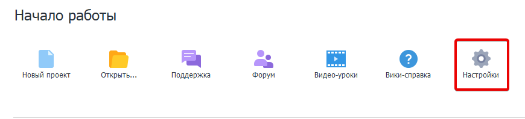
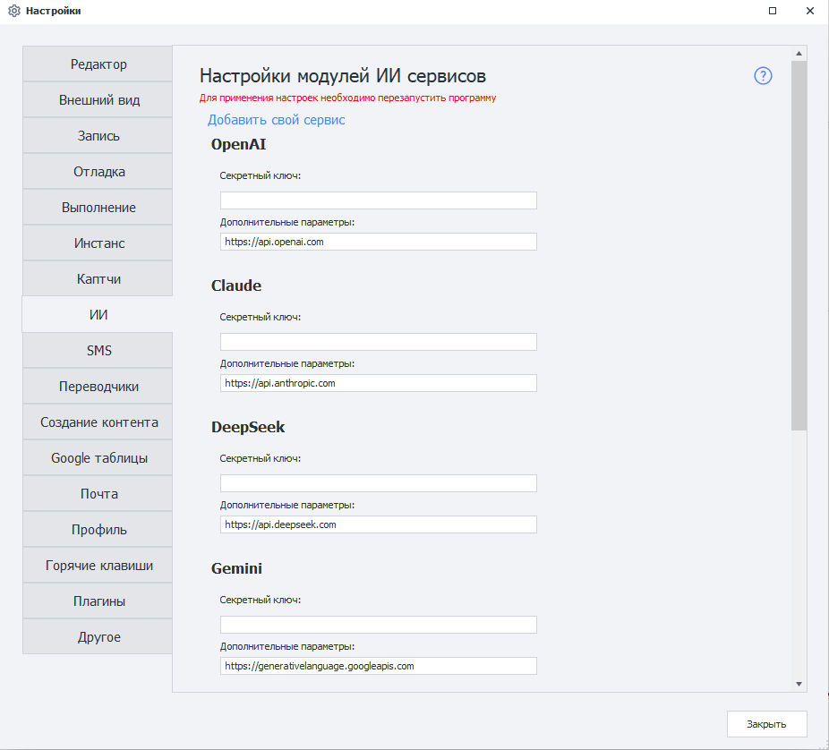
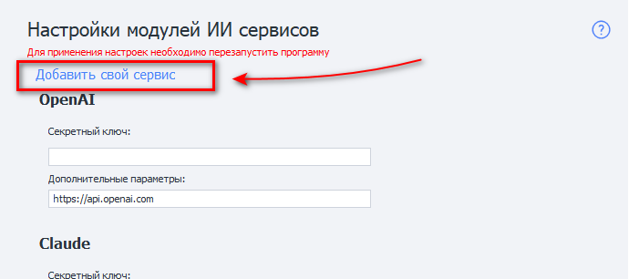
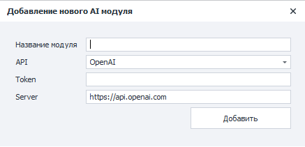
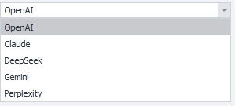

_______________________________________________
## Описание

**ИИ-сервисы** — это сервисы, предоставляющие доступ к языковым моделям и другим AI-инструментам через API. Они позволяют автоматически генерировать тексты, комментарии, описания, анализировать данные, переводить текст, писать код, обрабатывать изображения и выполнять многие другие задачи.

## Для чего это используется?

Современные AI-модели способны понимать текстовые запросы (prompt) и генерировать ответы, максимально приближенные к человеческому общению. Благодаря API-интеграции ZennoPoster может отправлять запросы в AI-сервисы и использовать полученные ответы в автоматизации.

Это может использоваться для:

- генерации комментариев, постов и описаний;
- рерайта и перевода текста;
- анализа контента;
- создания SEO-текстов;
- генерации кода;
- классификации и обработки данных;
- работы с изображениями и OCR;
- автоматизации общения и поддержки пользователей.

После подключения API-ключа вы сможете выбирать модель, настраивать параметры генерации и использовать AI прямо внутри проекта ZennoPoster.

## Как открыть это окно?

### ProjectMaker

- Через верхнее меню **Редактирование→Настройки→ИИ**.


- Через [❗→ Стартовую страницу](https://zennolab.atlassian.net/wiki/spaces/RU/pages/735608964 "https://zennolab.atlassian.net/wiki/spaces/RU/pages/735608964")



### Внешний вид окна настроек



## Как подключиться?

### Секретный ключ

Для работы с AI-сервисом необходим API ключ (Token) — уникальная строка символов, которая используется для авторизации запросов и идентификации вашего аккаунта в сервисе.

Пример API ключа:

```
sk-proj-8fKx2aBcD93kdPqLmN4...
```

Для получения API ключа перейдите на сайт выбранного AI-сервиса, зарегистрируйтесь и создайте ключ в личном кабинете или разделе для разработчиков.

API ключ необходим для:

- отправки запросов к AI-моделям;
- учёта использованных токенов;
- доступа к доступным моделям;
- тарификации и лимитов API.

:::warning Важно
- Храните API ключ в секрете.
- Не публикуйте его в открытом доступе.
- При компрометации ключ рекомендуется немедленно отозвать и создать новый.
:::

После добавления токена ZennoPoster сможет выполнять запросы к выбранному AI-сервису от вашего имени.

### Дополнительные параметры

URL адрес для приёма API-запросов. Установлен по умолчанию. Если не установлен, то его необходимо уточнить у разработчиков выбранного сервиса.

:::warning Внимание
Не меняйте без необходимости значение данного поля!
:::

### Доступные сервисы

- [api.openai.com](https://openai.com) — ChatGPT
- [api.anthropic.com](https://anthropic.com) — Claude
- [api.deepseek.com](https://deepseek.com) — DeepSeek
- [generativelanguage.googleapis.com](https://ai.google.dev) — Gemini
- [api.perplexity.ai](https://perplexity.ai) — Perplexity Sonar

## Добавление нового сервиса

Также можно добавить в программу пользовательский ИИ-сервис, на основе API популярных сервисов.

Для этого необходимо перейти на страницу **Настроек** и выбрать пункт **Добавить свой сервис**.



Перед Вами появится окно для ввода данных нового сервиса:



### Название модуля

Тут надо указать имя нового сервиса.

### API

Тут необходимо выбрать API на основе которого будет создан Ваш модуль.



### Token

Token ключ от сервиса.

То же, что и поле **Секретный ключ** для встроенных сервисов (описано выше).

### Server

URL адрес, куда будут отсылаться запросы.

### Работа с добавленным сервисом

После добавления сервиса Вы можете его выбрать в [❗→ экшене ИИ Агент](/zennoposter/ProjectMaker/Project-editor/Actions-in-ProjectMaker-Actions-Blocks/AI/AI_Agent) и работать с ним точно так же как и со встроенными LLM-провайдером.


### Удаление модуля

Чтобы убрать созданный модуль из программы необходимо удалить два файла:

- `c:\Users\USERNAME\AppData\Roaming\ZennoLab\Configs\ИмяМодуля.config.json`
- `c:\Users\USERNAME\AppData\Roaming\ZennoLab\CustomModules\Ai\ИмяМодуля.dll`

`USERNAME` - тут необходимо вставить имя Вашего пользователя в операционной системе

:::warning Внимание
ZennoPoster и ProjectMaker лучше выключить в момент удаления этих файлов.
:::

## Полезные ссылки

- [❗→ Экшен для работы с ИИ Агентом](/zennoposter/ProjectMaker/Project-editor/Actions-in-ProjectMaker-Actions-Blocks/AI/AI_Agent)
