---
sidebar_position: 2
title: "Внешний вид"
description: ""
date: "2025-08-25"
converted: true
originalFile: "Внешний вид.txt"
targetUrl: "https://zennolab.atlassian.net/wiki/spaces/RU/pages/735576065"
---
:::info **Пожалуйста, ознакомьтесь с [*Правилами использования материалов на данном ресурсе*](../Disclaimer).**
:::

> 🔗 **[Оригинальная страница](https://zennolab.atlassian.net/wiki/spaces/RU/pages/735576065)** — Источник данного материала

_______________________________________________  
# Внешний вид

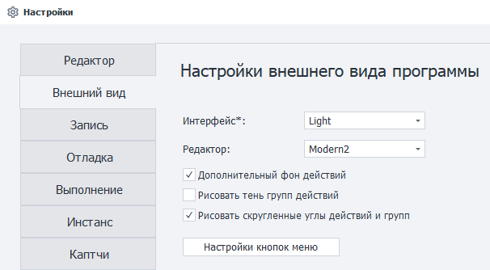

## Интерфейс

Выбор светлой или тёмной темы интерфейса программы.

### Интерфейс Light:

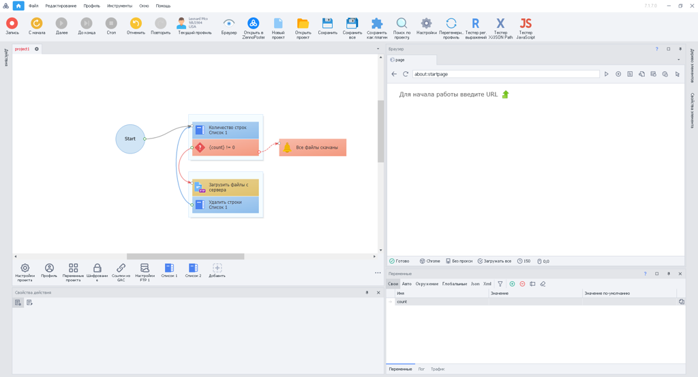

### Интерфейс Dark:

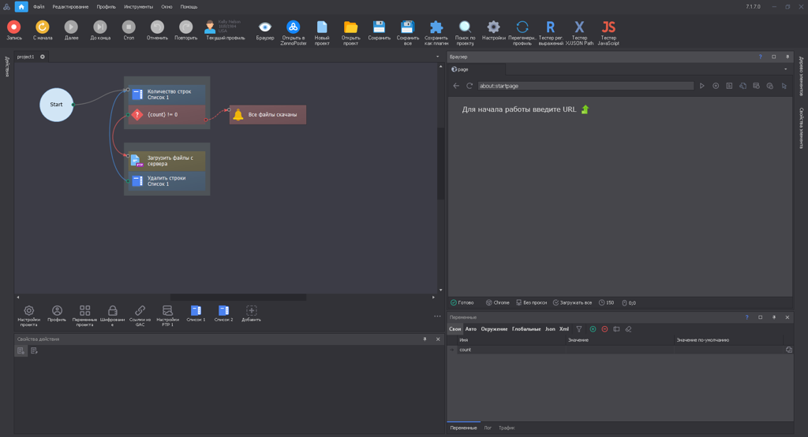

:::info Информация
Для изменения темы интерфейса необходимо перезапустить программу.
:::

  

## Редактор

Выбор темы оформления редактора. В зависимости от выбранной темы меняется внешний вид действий.

### Редактор Modern1:

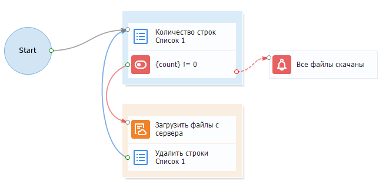

### Редактор Modern2:

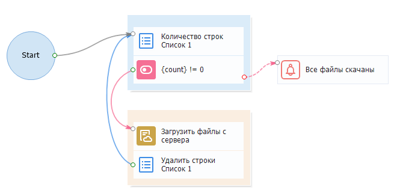

### Редактор Letter:

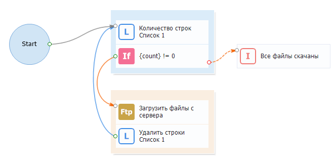

### Редактор Classic:

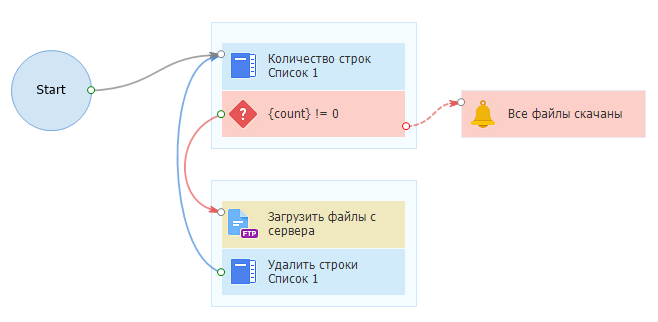

### Редактор Classic2:

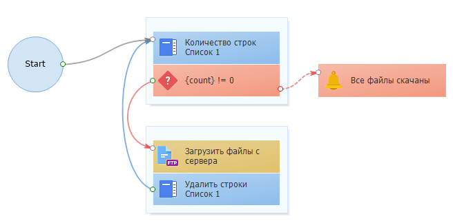

  

## Дополнительный фон действий

Вид с дополнительным фоном

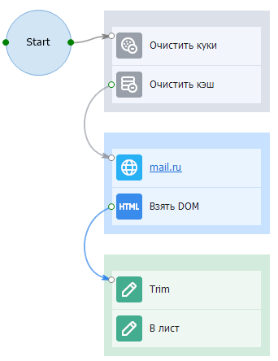

Вид без дополнительного фона

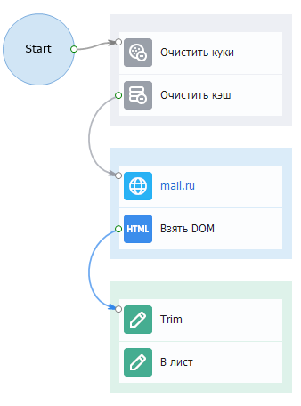

  

## Рисовать тень групп действий

:::warning Внимание
Включение данной настройки может замедлить скорость отрисовки!
:::

Настройка включена

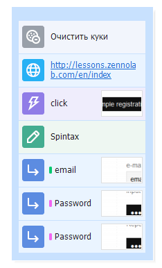

<mark id="06ec7f47-93ca-4339-9960-a3d675f15fe0" data-renderer-mark="true" data-mark-type="annotation" data-mark-annotation-type="inlineComment" aria-details="06ec7f47-93ca-4339-9960-a3d675f15fe0" data-mark-annotation-state="active" data-has-focus="false" data-is-hovered="false">Настройка выключена</mark>

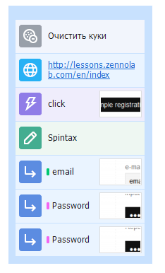

  

## Рисовать скруглённые углы у действий и групп

:::info Информация
Добавлено в 7.4.0.0
:::

При включении данной настройки углы экшенов и групп экшенов будут иметь скруглённую форму

Настройка включена

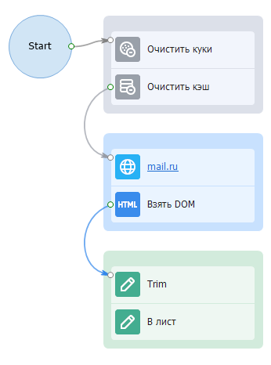

Настройка выключена

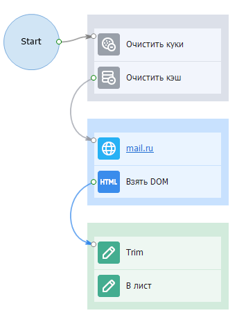

  

## Настройки кнопок меню

Содержит дополнительное меню, в котором можно выбрать отображаемые кнопки инструментов и разделов в главном меню программы. Кнопки меню позволяют получить быстрый доступ к необходимым функциям.

### Настройки кнопок инструментов

Какие кнопки инструментов показывать в главном меню.

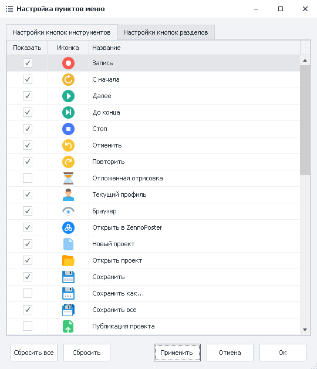

После выбора нужных кнопок инструментов, они появятся в панели инструментов:

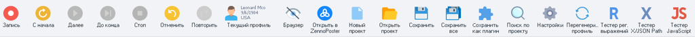

  

### Настройки кнопок разделов

Какие кнопки разделов показывать в главном меню.

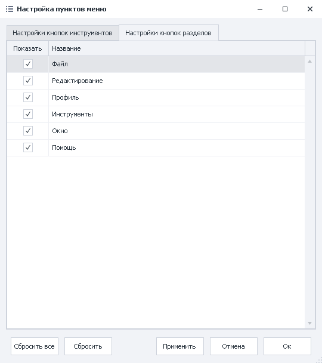

После выбора нужных кнопок разделов, они появятся в главном меню:

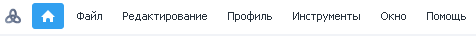

### Расстановка кнопок

Вы можете вручную настроить расположение кнопок в окнах *Настройки кнопок инструментов и *Настройки кнопок разделов. Для этого нужно нажать с помощью ЛКМ на необходимую кнопку и перетянуть её в желаемое место.

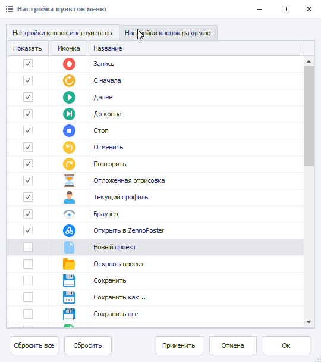

С помощью *Сбросить Вы можете вернуть кнопки в текущем активном окне в исходное состояние. 

*Сбросить всё вернёт в исходное состояние кнопки в обоих окнах.