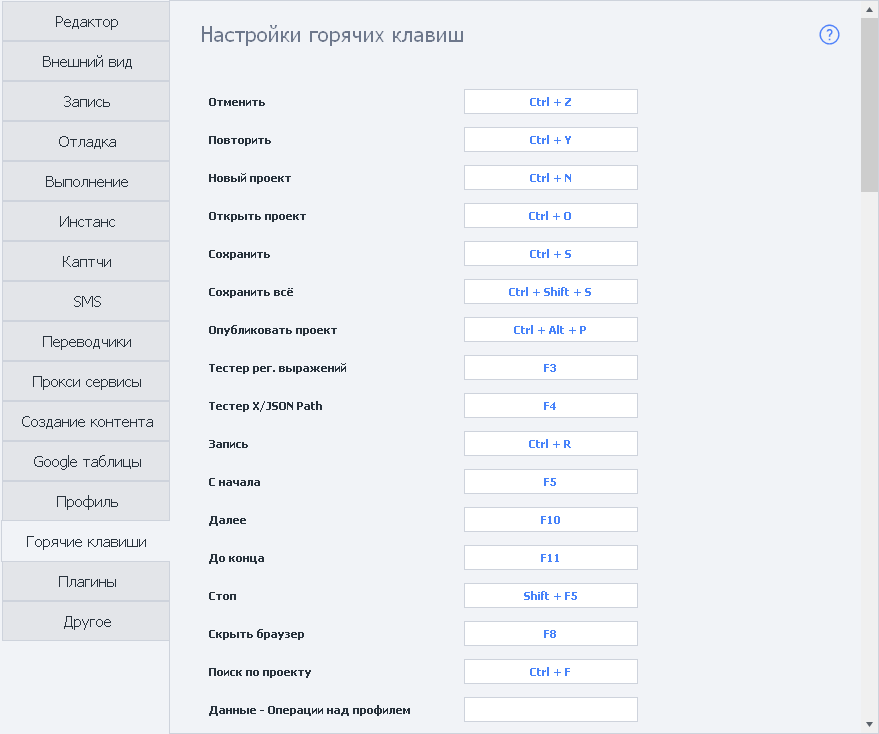

---
sidebar_position: 15
title: "Горячие клавиши"
description: ""
date: "2025-08-25"
converted: true
originalFile: "Горячие клавиши.txt"
targetUrl: "https://zennolab.atlassian.net/wiki/spaces/RU/pages/475332762"
---
:::info **Пожалуйста, ознакомьтесь с [*Правилами использования материалов на данном ресурсе*](../Disclaimer).**
:::

> 🔗 **[Оригинальная страница](https://zennolab.atlassian.net/wiki/spaces/RU/pages/475332762)** — Источник данного материала

_______________________________________________  
# Горячие клавиши

В настройках программы можно задать сочетания горячих клавиш для удобства работы.

## Клавиатурные сокращения

**Enter** или **Space** - открыть настройки действия  
**Esc** - закрыть настройки действия  
**Clrl + C** - скопировать выбранное действие  
**Ctrl + X** - вырезать выбранное действие  
**Ctrl + V** - вставить действие из буфера обмена в район указателя мыши  
**Delete** - удалить выбранное действие  
**Up** - переместить курсор вверх по группе или на предыдущее действие  
**Down** - переместить курсор вниз по группе или на следующее из успешного выхода действие  
**Left** - переместить курсор на первое входящее действие или вверх по группе  
**Right** - переместить курсор на следующее из успешного выхода действие или вниз по группе  
**Ctrl + Right** - переместить курсор на следующее из неудачного выхода действие  
**PageUp** - перейти на первое действие в группе  
**PageDown** - перейти на последнее действие в группе  
**Ctrl + Z** - отменить  
**Ctrl + Y** - повторить  
**Ctrl + N** - новый проект  
**Ctrl + O** - открыть проект  
**Ctrl + S** - сохранить текущий проект  
**Ctrl + Shift + S** - сохранить все открытые проекты  
**Ctrl + Alt + P** - опубликовать проект  
**F3** - открыть конструктор регулярных выражений  
**F4** - открыть тестер X/JSON Path  
**F8** - скрыть браузер  
**Ctrl + F** - поиск по проекту  
**Delete** - удаляет выделенное действие  

## Операции с мышью

**Двойной клик по действию** - открыть настройки  
**Зажатая средняя кнопка мыши** - перетаскивание полотна проекта  
**Ctrl + колесико мыши** - увеличить/уменьшить масштаб полотна  
**Двойной клик по пустому месту** - вернуть масштаб в 100%  
**Двойной клик по выходу (удачному/неудачному) затем двойной клик по входу** - создание связи  

## Горячие клавиши при отладке проекта

**Ctrl + R** - включить/отключить запись  
**F5** - запустить проект с начала  
**F10** - перейти к следующему действию  
**F11** - выполнять до точки останова  
**Shift + F5** - остановить отладку  

## Горячие клавиши при редактировании C# макроса

**Ctrl + C** - скопировать выделенное  
**Ctrl + X** - вырезать выделенное  
**Ctrl + V** - вставить выделенное  
**Ctrl + G** - перейти к строке номер n  
**Shift + Delete** - вырезать текущую строку  
**Ctrl + K** - закомментировать выделенные строки  
**Ctrl + U** - раскомментировать выделенные строки  