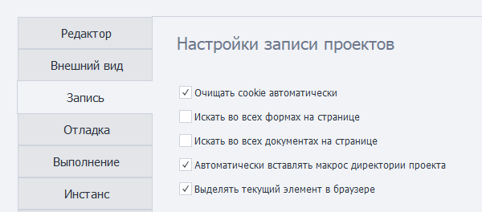
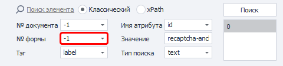
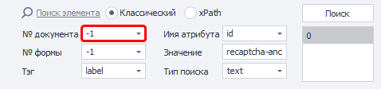
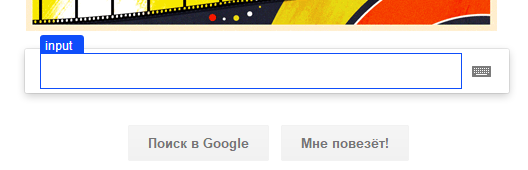

---
sidebar_position: 3
title: "Запись"
description: ""
date: "2025-08-25"
converted: true
originalFile: "Запись.txt"
targetUrl: "https://zennolab.atlassian.net/wiki/spaces/RU/pages/727777290"
---
:::info **Пожалуйста, ознакомьтесь с [*Правилами использования материалов на данном ресурсе*](../Disclaimer).**
:::

> 🔗 **[Оригинальная страница](https://zennolab.atlassian.net/wiki/spaces/RU/pages/727777290)** — Источник данного материала

_______________________________________________  
# Запись



## Настройки записи проектов

### Очищать cookie автоматически

Вначале проекта автоматически будет производиться очистка Сookie. Данная настройка является эквивалентом действия [❗→ Очистить Cookie](https://zennolab.atlassian.net/wiki/spaces/RU/pages/489324572 "https://zennolab.atlassian.net/wiki/spaces/RU/pages/489324572").

### Искать во всех формах на странице

Включает поиск элементов во всех формах на странице. Актуально для [❗→ конструктора действий](https://zennolab.atlassian.net/wiki/spaces/RU/pages/483426337 "https://zennolab.atlassian.net/wiki/spaces/RU/pages/483426337").




### Искать во всех документах на странице

Включает поиск элементов во всех документах на странице. Актуально для [❗→ конструктора действий](https://zennolab.atlassian.net/wiki/spaces/RU/pages/483426337 "https://zennolab.atlassian.net/wiki/spaces/RU/pages/483426337").




### Автоматически вставлять макрос директории проекта

При указании пути к файлу, макрос директории `{ -Project.Directory- }` проекта будет вставляться автоматически. Например, в свойствах списка или таблицы, при выборе файла с жесткого диска, если файл лежит в папке шаблона или ниже, в одной из подпапок.

### Выделять текущий элемент в браузере

:::info Информация
Для применения настройки необходимо перезапустить программу.
:::

Данная настройка отвечает за выделение HTML-элементов синей рамкой в окне браузера. 




Она модернизирует DOM-дерево страницы сайта, добавляя в конец:

```
<div id="zp_fr_hl_top_hl" style="visiblity:hidden"></div><div id="zp_fr_hl_left_hl" style="visiblity:hidden"></div><div id="zp_fr_hl_right_hl" style="visiblity:hidden"></div><div id="zp_fr_hl_bottom_hl" style="visiblity:hidden"></div><font id="zp_fr_hl_label" style="visiblity:hidden"></font>
```

:::note На заметку
Если Вы считаете, что подобная модификация деанонимизирует Вас, отключите её, сняв галочку.
:::