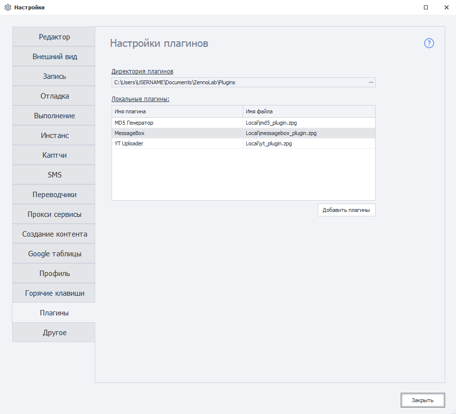
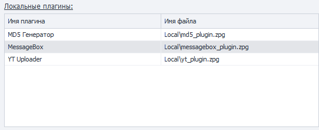
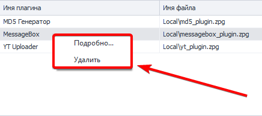
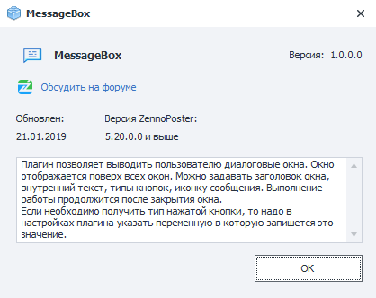

---
sidebar_position: 16
title: "Настройки. Плагины"
description: ""
date: "2025-08-25"
converted: true
originalFile: "Настройки. Плагины.txt"
targetUrl: "https://zennolab.atlassian.net/wiki/spaces/RU/pages/735379481"
---
:::info **Пожалуйста, ознакомьтесь с [*Правилами использования материалов на данном ресурсе*](../Disclaimer).**
:::

> 🔗 **[Оригинальная страница](https://zennolab.atlassian.net/wiki/spaces/RU/pages/735379481)** — Источник данного материала

_______________________________________________  
# Настройки. Плагины

:::note На заметку
В данной статье описываются настройки Плагинов. Статья с детальным описанием самих плагинов находится тут Плагины
:::

## Директория плагинов

Директория, в которую будут сохраняться установленные плагины.

:::warning Внимание
Если у Вас уже были установлены плагины и Вы изменили директорию их сохранения с помощью данной настройки, то старые плагины надо будет перенести в новую папку вручную.
:::

## Локальные плагины

В данной таблице отображены все установленные в ProjectMaker плагины.

### Имя плагина

Под этим именем плагин отображается в ProjectMaker

### Имя файла

Под этим именем плагин сохранён на компьютере

### Контекстное меню плагина

При клике ПКМ по плагину появится контекстное меню.

#### Подробно

При выборе этого пункта откроется окно с подробной информацией по плагину (при условии, что разработчик заполнил эту информацию) 

#### Удалить

С помощью данного пункта меню Вы можете удалить плагин из программы.

## Добавить плагин

После клика по кнопке “Добавить плагин” появится стандартное окно выбора файлов. 

Можно выделить сразу несколько файлов и установить их все сразу. Если будет попытка добавить плагин имя файла которого совпадает с уже установленным, то появится окно с перечислением плагинов, которые не удалось установить. После добавления плагины сразу же готовы к работе.