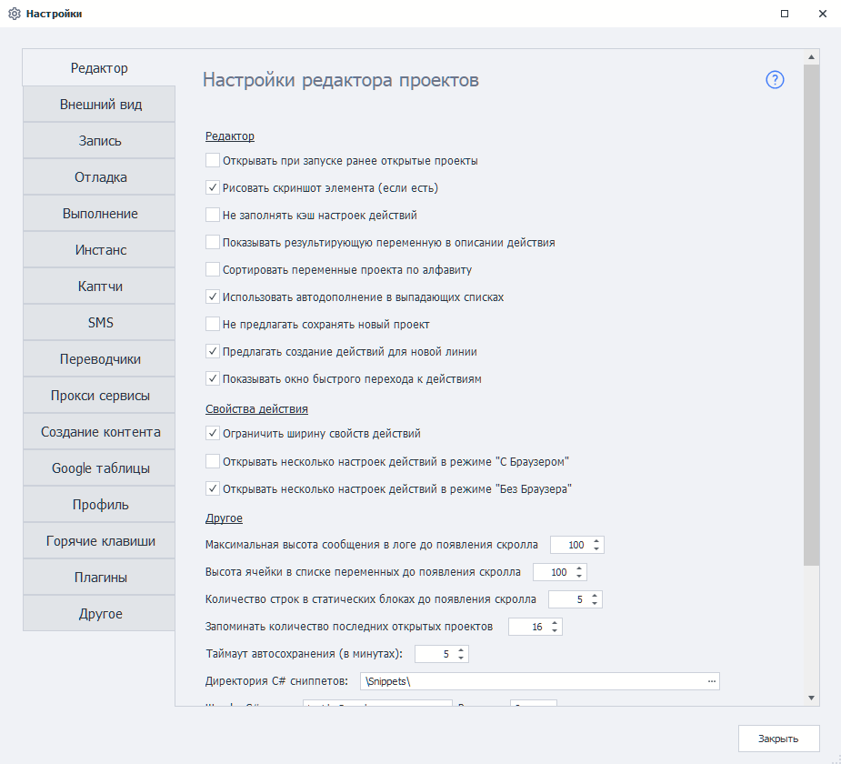

---
sidebar_position: 0
title: "Настройки ProjectMaker"
description: ""
date: "2025-08-25"
converted: true
originalFile: "Настройки ProjectMaker.txt"
targetUrl: "https://zennolab.atlassian.net/wiki/spaces/RU/pages/475300064/ProjectMaker"
---
:::info **Пожалуйста, ознакомьтесь с [*Правилами использования материалов на данном ресурсе*](../Disclaimer).**
:::

> 🔗 **[Оригинальная страница](https://zennolab.atlassian.net/wiki/spaces/RU/pages/475300064/ProjectMaker)** — Источник данного материала

_______________________________________________  
# 🔧 Настройки ProjectMaker

Настройки ProjectMaker позволяют оптимизировать процесс записи Вашего проекта, настроить логи, отладить выполнение проекта, и многое другое

- [❗→ Редактор](/wiki/spaces/RU/pages/725385223)
 - [❗→ Внешний вид](/wiki/spaces/RU/pages/735576065)
 - [❗→ Запись](/wiki/spaces/RU/pages/727777290)
 - [❗→ Отладка](/wiki/spaces/RU/pages/725352498)
 - [❗→ Выполнение (PM)](/wiki/spaces/RU/pages/727777297/PM)
 - [❗→ Инстанс (PM)](/wiki/spaces/RU/pages/735608841/PM)
 - [❗→ Капчи (PM)](/wiki/spaces/RU/pages/735772673/PM)
 - [❗→ SMS-сервисы (PM)](/wiki/spaces/RU/pages/735576080/SMS-+PM)
 - [❗→ Переводчики (PM)](/wiki/spaces/RU/pages/725352505/PM)
 - [❗→ Прокси-сервисы (PM)](/wiki/spaces/RU/pages/725319756/-+PM)
 - [❗→ Создание контента (PM)](/wiki/spaces/RU/pages/724566056/PM)
 - [❗→ Google таблицы (PM)](/wiki/spaces/RU/pages/735576090/Google+PM)
 - [❗→ Почта (PM)](/wiki/spaces/RU/pages/2096660481/PM)
 - [❗→ Профиль (PM)](/wiki/spaces/RU/pages/735608848/PM)
 - [❗→ Горячие клавиши](/wiki/spaces/RU/pages/475332762)
 - [❗→ Настройки. Плагины](/wiki/spaces/RU/pages/735379481)
 - [❗→ Другие настройки (PM)](/wiki/spaces/RU/pages/735608855/PM)

Настройки **Выполнения**, **Инстанса**, **Каптч**, **Spintax** и **Другие** дублируют [❗→ настройки ZennoPoster](https://zennolab.atlassian.net/wiki/spaces/RU/pages/494764084/ZennoPoster "https://zennolab.atlassian.net/wiki/spaces/RU/pages/494764084/ZennoPoster").