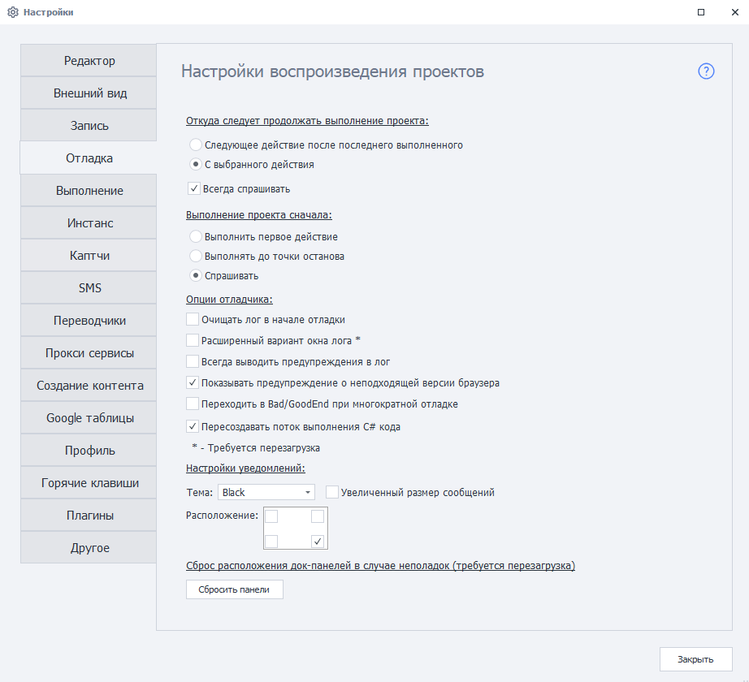

---
sidebar_position: 4
title: "Отладка"
description: ""
date: "2025-08-25"
converted: true
originalFile: "Отладка.txt"
targetUrl: "https://zennolab.atlassian.net/wiki/spaces/RU/pages/725352498"
---
:::info **Пожалуйста, ознакомьтесь с [*Правилами использования материалов на данном ресурсе*](../Disclaimer).**
:::

> 🔗 **[Оригинальная страница](https://zennolab.atlassian.net/wiki/spaces/RU/pages/725352498)** — Источник данного материала

_______________________________________________  
# Отладка

## Откуда следует продолжать выполнение проекта

Данная настройка повлияет на то, как будет вести себя проект при клике по кнопке *Далее и *До конца.

### Следующее действие после последнего выполненного

Проект продолжит выполняться со следующего действия после последнего выполненного.

### С выбранного действия

Проект будет выполняться с выделенного пользователем действия в схеме проекта.

### Всегда спрашивать

Запрашивать выбор у пользователя.

  

## Выполнение проекта сначала

Данная настройка задаёт поведение проекта при клике по кнопке [❗→ *С начала](https://zennolab.atlassian.net/wiki/spaces/RU/pages/494731265#%D0%A1-%D0%BD%D0%B0%D1%87%D0%B0%D0%BB%D0%B0 "https://zennolab.atlassian.net/wiki/spaces/RU/pages/494731265#%D0%A1-%D0%BD%D0%B0%D1%87%D0%B0%D0%BB%D0%B0").

### Выполнить первое действие

При выборе данной опции после нажатия в проекте кнопки *С начала фокус проекта сместится на первый экшен.

### Выполнять до точки останова 

При запуске выполнения проекта сначала, выполнятся действия до первой [❗→ точки остановки](https://zennolab.atlassian.net/wiki/spaces/RU/pages/494731280#%D0%A2%D0%BE%D1%87%D0%BA%D0%B0-%D0%BE%D1%81%D1%82%D0%B0%D0%BD%D0%BE%D0%B2%D0%B0 "https://zennolab.atlassian.net/wiki/spaces/RU/pages/494731280#%D0%A2%D0%BE%D1%87%D0%BA%D0%B0-%D0%BE%D1%81%D1%82%D0%B0%D0%BD%D0%BE%D0%B2%D0%B0"), либо до конца, если в проекте нет точек остановки.

### Спрашивать 

При запуске выполнения проекта сначала, порядок выполнения будет запрашиваться у пользователя.

  

## Опции отладчика

### Отложенная отрисовка процесса выполнения

Включает отрисовку выполнения действий в реальном времени. Полезно использовать эту настройку при отладке длинных проектов и проектов с циклами.

:::warning Внимание
Данная настройка исключена из программы начиная с версии 7.1.7.0
:::

### Очищать лог в начале отладки

При каждом запуске отладки проекта (нажатии кнопки *С начала) лог будет очищен.

### Расширенный вариант окна лога

Лог будет отображаться в окне с дополнительными опциями и возможностью копирования текста. Более подробно о функциях Расширенного лога можно прочитать [❗→ в этой статье](https://zennolab.atlassian.net/wiki/spaces/RU/pages/725352532#%D0%A0%D0%B0%D1%81%D1%88%D0%B8%D1%80%D0%B5%D0%BD%D0%BD%D1%8B%D0%B9-%D0%B2%D0%B0%D1%80%D0%B8%D0%B0%D0%BD%D1%82-%D0%BB%D0%BE%D0%B3%D0%B0 "https://zennolab.atlassian.net/wiki/spaces/RU/pages/725352532#%D0%A0%D0%B0%D1%81%D1%88%D0%B8%D1%80%D0%B5%D0%BD%D0%BD%D1%8B%D0%B9-%D0%B2%D0%B0%D1%80%D0%B8%D0%B0%D0%BD%D1%82-%D0%BB%D0%BE%D0%B3%D0%B0").

### Всегда выводить предупреждения в лог

При включении данной настройки в лог ZennoPoster и ProjectMaker будут выводиться дополнительные предупреждения.

Например: 

- [❗→ экшен if](https://zennolab.atlassian.net/wiki/spaces/RU/pages/534315151/...+...+IF "https://zennolab.atlassian.net/wiki/spaces/RU/pages/534315151/...+...+IF") вышел по красной ветке, и даже если его красный выход соединён с другим [❗→ экшеном](https://zennolab.atlassian.net/wiki/spaces/RU/pages/486342706/ProjectMaker "https://zennolab.atlassian.net/wiki/spaces/RU/pages/486342706/ProjectMaker"), в лог попадёт сообщение: “*Выполнение логического оператора If Результат: false” (только в ProjectMaker)
- если экшены [❗→ Установка](https://zennolab.atlassian.net/wiki/spaces/RU/pages/534315117 "https://zennolab.atlassian.net/wiki/spaces/RU/pages/534315117"), [❗→ Взятие значения](https://zennolab.atlassian.net/wiki/spaces/RU/pages/534315124 "https://zennolab.atlassian.net/wiki/spaces/RU/pages/534315124"), [❗→ Выполнить событие](https://zennolab.atlassian.net/wiki/spaces/RU/pages/534020211 "https://zennolab.atlassian.net/wiki/spaces/RU/pages/534020211") и др. не найдут элемент для взаимодействия, в логе появится запись: “*Выполнение действия HtmlElement Не найден HTML элемент, по условиям поиска“ (ZennoPoster и ProjectMaker)

:::note На заметку
Требуется перезагрузка.
:::

### Показывать предупреждение о неподходящей версии браузера

Данное предупреждение может появиться, например, когда используется [❗→ Проект в проекте](https://zennolab.atlassian.net/wiki/spaces/RU/pages/489291822 "https://zennolab.atlassian.net/wiki/spaces/RU/pages/489291822") и во вложенном проекте используется отличный от основного шаблона [❗→ Тип браузера](https://zennolab.atlassian.net/wiki/spaces/RU/pages/534315477#%D0%A2%D0%B8%D0%BF-%D0%B1%D1%80%D0%B0%D1%83%D0%B7%D0%B5%D1%80%D0%B0 "https://zennolab.atlassian.net/wiki/spaces/RU/pages/534315477#%D0%A2%D0%B8%D0%BF-%D0%B1%D1%80%D0%B0%D1%83%D0%B7%D0%B5%D1%80%D0%B0").

Пример: во вложенном проекте используется движок Firefox45, а в основном - Firefox52. При выполнении (и если включена данная опция) в лог будет выводиться сообщение "*Выполнение действия ProjectInProject Текущий браузер Firefox52 не подходит для вложенного проекта, требуется Firefox45. Возможна некорректная работа вложенного проекта."

### Переходить в Bad/GoodEnd при многократной отладке

:::info Информация
Добавлено в 7.3.0.0
:::

Если ** данная опция включена, то каждый раз, когда экшен будет завершаться с ошибкой (и он не будет соединён с другим экшеном по красной ветке) выполнение будет перебрасываться в [❗→ BadEnd](https://zennolab.atlassian.net/wiki/spaces/RU/pages/534020265/Bad+End "https://zennolab.atlassian.net/wiki/spaces/RU/pages/534020265/Bad+End"). Или выполнение будет переходить в [❗→ GoodEnd](https://zennolab.atlassian.net/wiki/spaces/RU/pages/534085881/Good+End "https://zennolab.atlassian.net/wiki/spaces/RU/pages/534085881/Good+End") если экшен завершился успехом, не соединён с другим экшеном по зелёной ветке и после него в текущей группе нет экшенов.

Если же данная опция выключена, то выполнение может только один раз за запуск попасть в Bad/GoodEnd. В следующий раз это будет возможно только после перезапуска проекта с помощью кнопки *С начала.

### Пересоздавать поток выполнения C# кода

:::info Информация
Добавлено в 7.3.1.0
:::

Данная настройка в некоторых случаях может помочь избежать утечек памяти в ProjectMaker на процессорах AMD при выполнении C# кода (баг находится в .NET Framework). Не предусматривает использование ThreadStatic.

:::caution Важно
Если Вы используете в своих шаблонах C# и ThreadStatic, то данную настройку необходимо выключить.
:::

  

## Настройки уведомлений

Данная настройка актуальна для [❗→ оповещений](https://zennolab.atlassian.net/wiki/spaces/RU/pages/534053050/ "https://zennolab.atlassian.net/wiki/spaces/RU/pages/534053050/"), выводящихся на рабочем столе.

**Тема** - выбор цветового оформления уведомлений.

**Увеличенный размер сообщений** - уведомления будут отображаться в увеличенном виде.

**Расположение** - выбор области отображения уведомлений в окне программы.

  

## Сброс расположения док-панелей в случае неполадок

**Сбросить панели** - восстанавливает отображение окон программы.

:::note На заметку
Так же сбросить настройки окон можно, если сменить интерфейс через настройку Окно=&gt;Режим интерфейса
:::