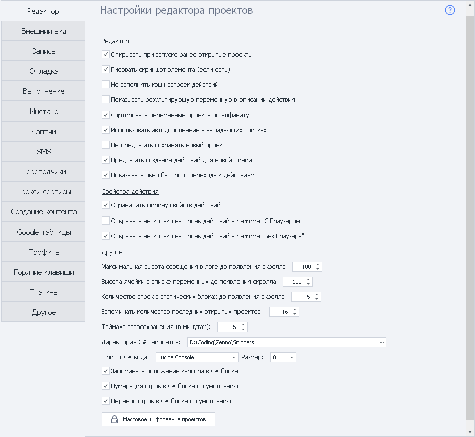
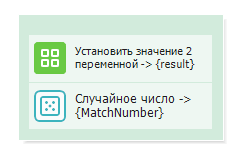
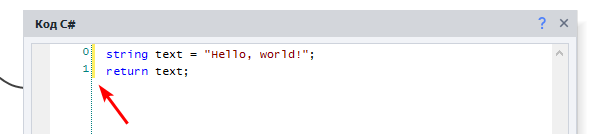
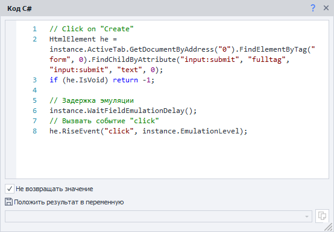
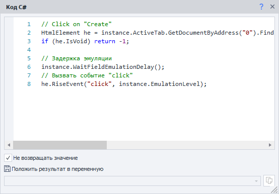

---
sidebar_position: 1
title: "Редактор"
description: ""
date: "2025-08-25"
converted: true
originalFile: "Редактор.txt"
targetUrl: "https://zennolab.atlassian.net/wiki/spaces/RU/pages/725385223"
---
:::info **Пожалуйста, ознакомьтесь с [*Правилами использования материалов на данном ресурсе*](../Disclaimer).**
:::

> 🔗 **[Оригинальная страница](https://zennolab.atlassian.net/wiki/spaces/RU/pages/725385223)** — Источник данного материала

_______________________________________________  
# Редактор

## Настройки редактора проектов

### Открывать при запуске ранее открытые проекты

Открываются все проекты, которые были открыты перед последним закрытием программы.

### Рисовать скриншот элемента (если есть)

На блоке действия отрисовывается скриншот соответствующего элемента. Увеличивает вес шаблона, но помогает лучше в нём ориентироваться.

### Не заполнять кэш настроек действий

Отключает заполнение кэша настроек действий для ускорения запуска программы.

### Показывать результирующую переменную в описании действия

В комментарии некоторых блоков действия, где подразумевается возврат результата в переменную, будет отображаться `название действия → {переменная}`

### Сортировать переменные проекта по алфавиту

Переменные будут расположены в алфавитном порядке.

### Использовать автодополнение в выпадающих списках

При вводе названия переменной или списка/таблицы в выпадающем списке, сработает автонабор. Он позволит не писать всё название целиком и быстро заполнить поле.

:::info Информация
Требуется перезагрузка
:::

### Не предлагать сохранять новый проект

Убирает диалог сохранения для новых проектов после нажатия [❗→ кнопки "С начала"](https://zennolab.atlassian.net/wiki/spaces/RU/pages/494731265#%D0%A1-%D0%BD%D0%B0%D1%87%D0%B0%D0%BB%D0%B0 "https://zennolab.atlassian.net/wiki/spaces/RU/pages/494731265#%D0%A1-%D0%BD%D0%B0%D1%87%D0%B0%D0%BB%D0%B0").

### Предлагать создание действий для новой линии

Автоматически выводить список действий для добавления при создании новой линии от кубика.

### Показывать окно быстрого перехода к действиям

При наведении на точки крепления линий выводится окно быстрого перехода к действиям.

## Свойства действия

### Ограничить ширину свойств действий

Управляйте сеткой окна «Свойства действия», сделав её фиксированной или резиновой при которой содержимое будет подстраиваться под ширину окна.

### Открывать несколько настроек действий в режиме “…“

Позволяет открывать сразу несколько настроек действий рядом с кубиком. По умолчанию включено только в режиме «Без браузера».

## Другое

### Максимальная высота сообщения в логе до появления скролла

Высота записи в логе до прокрутки.

### Высота ячейки в списке переменных до появления скролла

Высота ячейки в окне Переменные до появления прокрутки.

### Количество строк в статических блоках до появления скролла

Количество строк в разделе статических блоков до появления прокрутки.

### Запоминать количество последних открытых проектов

Позволяет регулировать количество последних открытых проектов на [❗→ стартовой странице](https://zennolab.atlassian.net/wiki/spaces/RU/pages/735608964 "https://zennolab.atlassian.net/wiki/spaces/RU/pages/735608964").

### Таймаут автосохранения

Время, через которое проект будет автоматически сохраняться (задается в минутах).

### Директория C# сниппетов

Директория, из которой можно автоматически подгружать [❗→ C# сниппеты](https://zennolab.atlassian.net/wiki/spaces/RU/pages/492011596/ "https://zennolab.atlassian.net/wiki/spaces/RU/pages/492011596/") в программу.

Директория по умолчанию - `c:\Users\USERNAME\AppData\Roaming\ZennoLab\ZennoPoster\7\Snippets\` (вместо `USERNAME` надо подставить имя пользователя, из под которого Вы работаете)

### Шрифт C# кода

Шрифт, используемый в [❗→ C# блоке](https://zennolab.atlassian.net/wiki/spaces/RU/pages/492011596/ "https://zennolab.atlassian.net/wiki/spaces/RU/pages/492011596/"). По умолчанию используется Lucida Console, 8-й размер.

### Запоминать положение курсора в C# блоке

Код открывается на той строке, где закончили редактирование. При выключенной настройке запоминается место последнего редактирования.

### Нумерация строк в C# блоке по умолчанию

Включает автоматическую нумерацию строк в [❗→ C# блоке](https://zennolab.atlassian.net/wiki/spaces/RU/pages/492011596/ "https://zennolab.atlassian.net/wiki/spaces/RU/pages/492011596/").

### Перенос строк в C# блоке по умолчанию

Включает автоматический перенос строк в окне свойств действий [❗→ C# кода](https://zennolab.atlassian.net/wiki/spaces/RU/pages/492011596/ "https://zennolab.atlassian.net/wiki/spaces/RU/pages/492011596/"), если строка не помещается в текущее окно.

Ниже можно увидеть пример одного и того же окна с включенной и выключенной настройкой переноса строк.

Настройка включена

Настройка выключена

### Массовое шифрование проектов

Данная опция позволяет [❗→ зашифровать](http://zennolab.atlassian.net/wiki/spaces/RU/pages/534315498 "http://zennolab.atlassian.net/wiki/spaces/RU/pages/534315498") все открытые проекты.