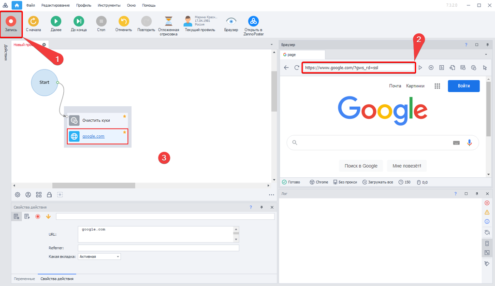
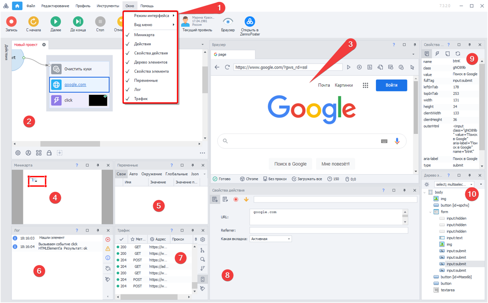
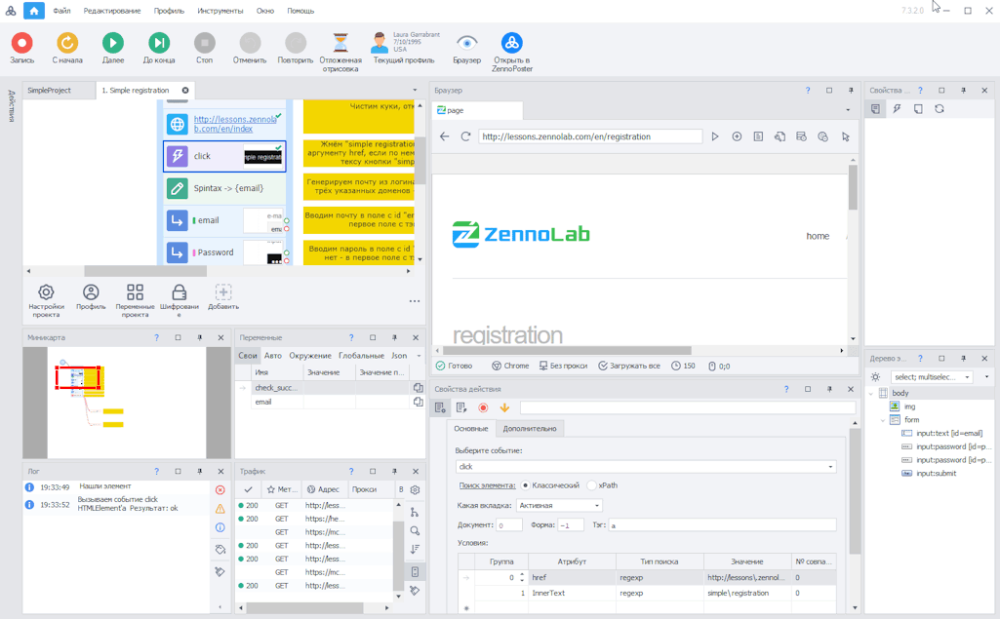
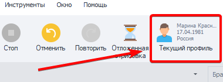
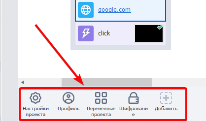
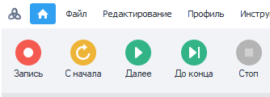

---
sidebar_position: 2
title: "Создание проекта"
description: ""
date: "2025-07-20"
converted: true
originalFile: "Создание проекта.txt"
targetUrl: "https://zennolab.atlassian.net/wiki/spaces/RU/pages/925728769"
---
import DisclaimerNotice from '@site/src/components/DisclaimerNotice';

<DisclaimerNotice />

> 🔗 **[Оригинальная страница](https://zennolab.atlassian.net/wiki/spaces/RU/pages/925728769)** — Источник данного материала

_______________________________________________  
## Начало работы
После запуска программы открывается [Стартовая страница](../Start_Page), где необходимо выбрать одно из действий: нажать **«Новый проект»** или **«Открыть существующий»**. После этого откроется основная рабочая область, содержащая ключевые окна для создания и редактирования проекта.

Чтобы начать запись, нажмите кнопку **[1]** (см. скриншот ниже). Далее вы можете ввести адрес сайта в адресную строку браузера **[2]**, с которым планируете работать, и выполнять необходимые действия прямо в браузере — они будут автоматически записываться в проект.

Также вы можете добавлять экшены вручную: для этого кликните правой кнопкой мыши по любому пустому месту в проекте **[3]** и выберите нужное действие.  

|  |
| :--: |
| Окна здесь расположены согласно настройке: *Окно → Режим интерфейса → Стандартный* |
_______________________________________________ 
## Основные окна

В основном рабочем окне программы можно разместить **9 функциональных окон**. Их можно перетаскивать и изменять в размерах в зависимости от необходимости. Часть окон также можно закрыть, если они используются редко. Восстановить закрытые окна затем можно через меню **[1]**.

### Окно проекта [2]
В данном окне при записи появляются экшены, когда вы совершаете какие-либо действия в **браузере [3]**. Вы можете также создавать новые экшены вручную (правый клик мыши). Их можно перетаскивать, объединять в группы и соединять логическими связями, выстраивая последовательность для выполнения проекта.

### Браузер [3]
В данном окне можно открывать различные сайты и записывать пошагово действия путем нажатия ссылок, заполнения текстовых полей и т.д. Вверху данного окна имеются пиктограммы навигации, остановки загрузки страницы, управление вкладками, опции очистки кэша и куков + инструмент просмотра исходного кода, DOM и текста страницы.

### [Миникарта](../Program-interface/Minimap_Window) [4]
Перетаскивая рамку по схематичному отображению вашего проекта, вы можете легко изменять фокус в самом окне проекта. Это актуально при создании больших шаблонов.

### Переменные [5]
В данном окне отображаются текущие значения переменных проекта. Во время отладки можно наблюдать и анализировать их значения.

### [Лог](../Program-interface/Log_Window) [6]
При отладке в логе появляются сообщение об успешно выполненных действиях и о возникших ошибках. Это помогает исправить и доработать проект до готового вида.

### [Окно трафика](../Program-interface/Traffic_Window) [7] 
В данном окне будут отображены все запросы, которые сделает браузер ProjectMaker. А также запросы сделанные с помощью экшенов [HTTP запросов](../Project-editor/Actions-in-ProjectMaker-Actions-Blocks/Http/HTTP-request).

### Свойства действия [8]
Это окно появляется при выделении того или иного экшена в **Окне проекта [1]**. Тут можно заполнить и изменить настройки его работы.

### Свойства элемента [9]
Если активирован режим **«Следовать за курсором»** (ПКМ в окне браузера), то при наведении курсора на тот или иной элемент страницы вы сможете посмотреть его свойства.  

> Также свойства элементов будут отображаться при работе с [**Конструктором действий**](../Browser_Window/Action_Constructor_and_XPath_Search) и **Деревом элементов [10]**.

### [Дерево элементов](../Program-interface/Element_Tree_Window) [10]
Если элемент не удаётся сразу идентифицировать в браузере, его можно найти в окне дерева элементов. Это окно отображает код страницы в наглядном виде с иерархической древовидной структурой, что позволяет легко ориентироваться в элементах страницы и быстро находить нужный элемент.
_______________________________________________
## Данные проекта
### Текущие данные профиля
При отладке вы можете ознакомиться с используемыми параметрами профиля, кликнув на соответствующую иконку.  

 

### Настройки проекта
Управлять параметрами проекта можно с помощью настроек из [Панели статических блоков](../Project-editor/Static_blocks/General_Principles_of_Operation). 

## Взаимодействие браузера и проекта
Проект и браузер синхронизируются в режиме реального времени, что позволяет выполнять отладку с любой точки шаблона. При возникновении ошибки на одном из этапов вы можете сразу изменить параметры соответствующего экшена и тут же проверить его работу с обновлёнными настройками.

При необходимости проект можно продолжить записывать в любой момент — для этого достаточно нажать кнопку **«Запись»** в верхнем меню.  

Используя кнопки отладки, вы можете запускать выполнение проекта с начала, пошагово или до точки останова. Кроме того, выделив любой экшен, можно протестировать его выполнение на текущей странице браузера без полного прогона проекта.