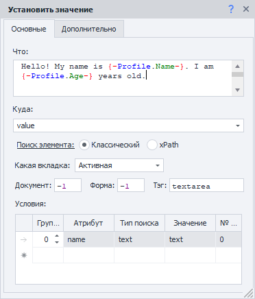
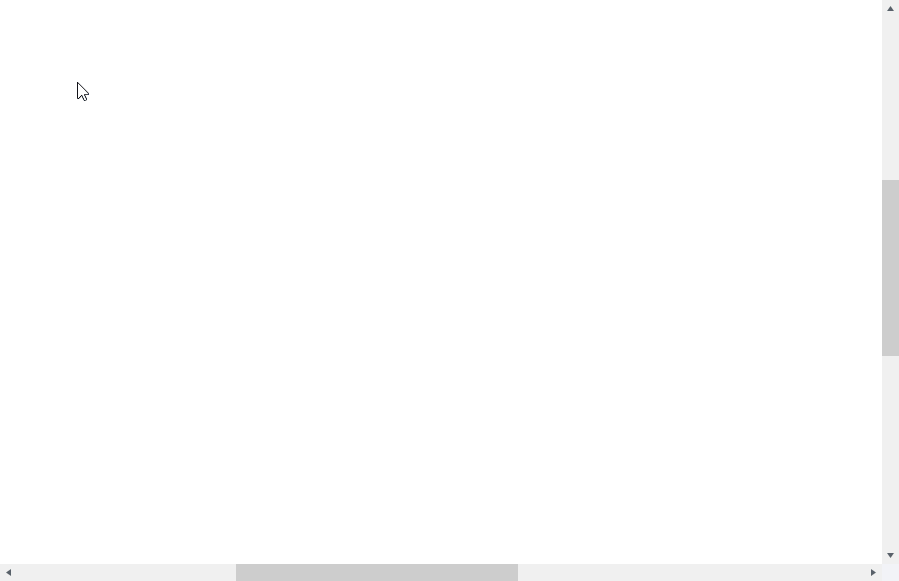
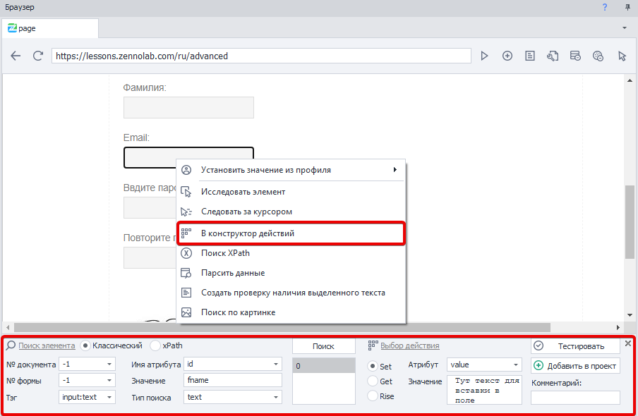
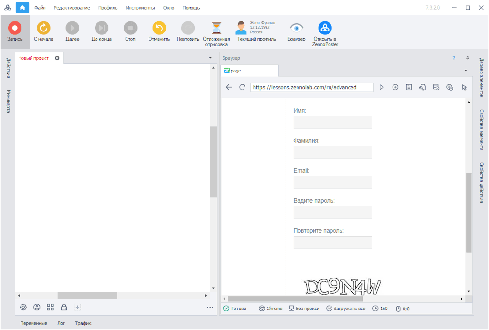

---
sidebar_position: 3
title: "Заполнение полей и форм"
description: ""
date: "2025-07-20"
converted: true
originalFile: "Заполнение полей и форм.txt"
targetUrl: "https://zennolab.atlassian.net/wiki/spaces/RU/pages/534053331"
---
import DisclaimerNotice from '@site/src/components/DisclaimerNotice';

<DisclaimerNotice />

> 🔗 **[Оригинальная страница](https://zennolab.atlassian.net/wiki/spaces/RU/pages/534053331)** — Источник данного материала

_______________________________________________  
## Описание.
Одним из самых частых действий, пожалуй, является установка значений в поля ввода. Чаще всего для этого используется экшен [Установка значения](../Project-editor/Actions-in-ProjectMaker-Actions-Blocks/Tabs/Setting_Value).  

> Помимо него можно использовать [Эмуляцию клавиатуры](../Project-editor/Actions-in-ProjectMaker-Actions-Blocks/Emulation/Keyboard_Emulation).

С помощью этих экшенов можно вводить как простой текст, так и текст из переменных. 

| Так могут выглядеть настройки экшена установки значения   | 
| :-----------: | 
|      |

### Добавление экшена *Установки значения* 
> Есть несколько способов:

#### Вручную  
Через контекстное меню, заполнив все настройки

#### Через [*Конструктор действий*](../Browser_Window/Action_Constructor_and_XPath_Search)

#### Включить *Запись* и начать заполнять поля 
Тогда ZennoPoster автоматически создаст экшен с необходимыми данными

