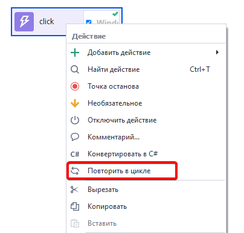
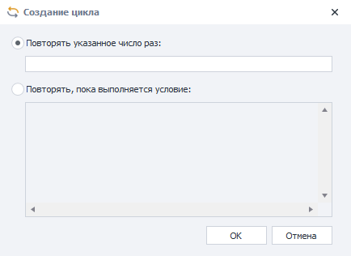
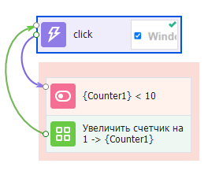
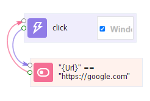
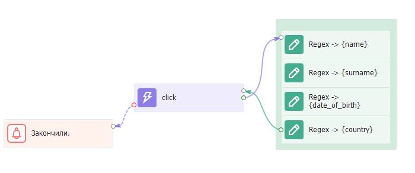

---
sidebar_position: 2
title: "Циклы"
description: ""
date: "2025-07-20"
converted: true
originalFile: "Циклы.txt"
targetUrl: "https://zennolab.atlassian.net/wiki/spaces/RU/pages/489259031"
---
import DisclaimerNotice from '@site/src/components/DisclaimerNotice';

<DisclaimerNotice />

> 🔗 **[Оригинальная страница](https://zennolab.atlassian.net/wiki/spaces/RU/pages/489259031)** — Источник данного материала

_______________________________________________  
## Описание
Цикл — это действие, или группа действий, которые выполняются либо указанное количество раз, либо до наступления определённого события.

:::info Рекомендуем не использовать циклы часто
Так как это сложная конструкция, в которой может возникнуть ряд непредвиденных ошибок.
:::

## Cоздание цикла
### Автоматическое
Создать цикл в ZennoPoster достаточно просто  для этого надо кликнуть ПКМ по экшену (или группе экшенов) и выбрать из контекстного меню пункт **Повторить в цикле**. 

После клика появится окно выбора условия для выхода из цикла:

#### Повторять указанное число раз
При выборе этого пункта в поле ввода надо будет ввести желаемое число повторений. После клика по кнопке **ОК** будут созданы:  
- *переменная-счётчик*,  
- *экшен сравнения с указанным числом*,  
- *экшен увеличения значения счётчика*.

#### Повторять, пока выполняется условие
Цикл будет продолжаться пока введённое условие возвращает `True`. После нажатия на **ОК** данные из этого поля будут перенесены в [экшен IF](../../Project-editor/Actions-in-ProjectMaker-Actions-Blocks/Logic/IF_Condition). Поэтому в нём нужно соблюдать те же правила построения выражений, что и в стандартном экшене.  

|  |
| :--: |
| Пока текущий URL равен https://google.com будет происходить клик. |

### Ручное создание цикла
Создавать циклы можно и вручную. 

**Рассмотрим на примере:** необходимо достать данные из сайта, у которого много страниц. Для перехода на следующую страницу необходимо кликнуть по кнопке **Далее**, поэтому если этой кнопки нет, то страницы кончились.  

В данном случае условием выхода будет ошибка при клике по кнопке **Далее** — экшен не находит элемент и завершается ошибкой.

## Советы по использованию
- **Не используйте вечные циклы.** 
- **Добавляйте счётчик в свои циклы**. 
- **Не зацикливайте свои шаблоны**. 

## Полезные ссылки:

- [❗→ Экшен IF](https://zennolab.atlassian.net/wiki/spaces/RU/pages/534315151/...+...+IF "https://zennolab.atlassian.net/wiki/spaces/RU/pages/534315151/...+...+IF")
- [❗→ Пауза](/wiki/spaces/RU/pages/534053057 "/wiki/spaces/RU/pages/534053057")