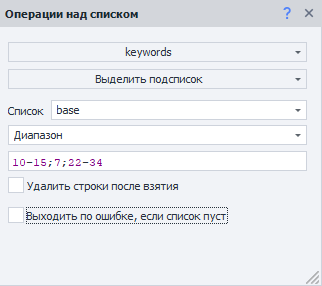
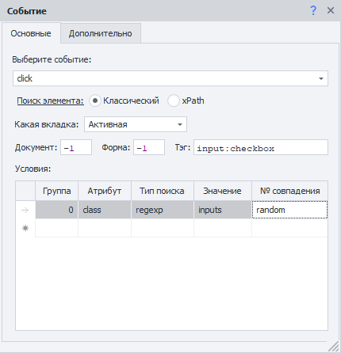
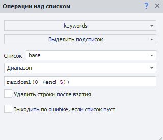

---
sidebar_position: 1
title: "Диапазоны значений"
description: ""
date: "2025-07-20"
converted: true
originalFile: "Диапазоны значений.txt"
targetUrl: "https://zennolab.atlassian.net/wiki/spaces/RU/pages/488964137"
---
import DisclaimerNotice from '@site/src/components/DisclaimerNotice';

<DisclaimerNotice />

> 🔗 **[Оригинальная страница](https://zennolab.atlassian.net/wiki/spaces/RU/pages/488964137)** — Источник данного материала

_______________________________________________  
## Описание
Довольно часто при настройке проекта встречаются места, где нужно указать номер совпадения при поиске, номер строки, номер ячейки и т.д. И не всегда в таких случаях можно указать конкретный номер. **Диапазоны** пригодятся для настройки более гибкой нумерации подобных перечислений.

:::tip Дальнейшие примеры применимы не только к спискам
А для всех случаев, где нужно указать какой-либо номер.
:::

### Где используются диапазоны?
- Интервал строк. Например, с пятой по седьмую и т.д.;
- Нужно взять последнюю строку, не зная общее количество строк;
- Получить случайную строку;
- Несколько случайных строк;
- Несколько случайных строк из указанного интервала;
- Выбрать чётные или нечётные строки из указанного интервала;
- Случайные строки из чётных или нечётных строк из указанного интервала;
- Номер совпадения при выполнении экшенов:  
    - [Выполнить событие](../../Project-editor/Actions-in-ProjectMaker-Actions-Blocks/Tabs/Perform_Event),  
    - [Установка значений](../../Project-editor/Actions-in-ProjectMaker-Actions-Blocks/Tabs/Setting_Value),  
    - [Взятие значений](../../Project-editor/Actions-in-ProjectMaker-Actions-Blocks/Tabs/Getting_Value).
_______________________________________________ 
## Принцип работы
### Взять строки из одного или нескольких интервалов
Если нужно взять строки с пятой по седьмую, к примеру, тогда пишем в *номере строки* так:

`4-6` *(на 1 меньше, т.к. нумерация строк начинается с 0)*.

Можно указать несколько интервалов через знаки `;` или `,` например: `10-15;7;22-34`

### Выбрать случайный элемент
Бывают ситуации, когда на странице несколько одинаковых элементов, и нужно взаимодействовать с любым из них — не важно каким. 

Например, при регистрации надо указать операционную систему: предоставляется выбор из нескольких вариантов. Чтоб кликнуть по случайному, необходимо в качестве номера совпадения указать слово `random` 

### Длина списка неизвестна, но нужно взять его до конца
Конец списка обозначается ключевым словом `end`

Просто пишите интервал, например: `10-end`, и возьмутся строки от **11** до конца файла.

### Взять все строки из списка
Взять все строки можно указав номер строки `all`.

### Взять случайную строку или несколько случайных строк из интервала
Для этого в номере строки пишете слово `random` и указываете количество строк, а затем в скобках, из каких строк брать.  

#### Примеры:
- `random1(1,12-15,35-end)` — взять **одну** строку из указанных,
- `random15(1,12-15,35-end)` — взять **15** строк из указанных,
- `randomAll(1,12-15,35-end)` — взять **все** строки из указанных в случайном порядке.  
> *`randomAll` доступен в ZennoPoster версии выше 5.9.3.*

### Исключающие диапазоны
Иногда требуется не учитывать последние варианты.

Например, нужно исключить последние 5 строк и взять 1 случайный элемент. Это будет выглядеть вот так:

`random1(0-(end-5))`

> *Исключающие диапазоны доступны в ZennoPoster версии 5.9.3 и выше.*

### Получение только чётных значений
- `even(1,12-15,35-end)` или `even1(1,12-15,35-end)` — получить **первое** *чётное* значения из диапазона;   
- `even5(1,12-15,35-end)` — получить **5 первых** *чётных* значений из диапазона;  
- `evenAll(1,12-15,35-end)` — получить **все** *чётные* значения из диапазона;

> *Оператор even доступен в ZennoPoster версии 5.9.3 и выше*.

### Получение только нечётных значений
- `odd(1,12-15,35-end)` или `odd1(1,12-15,35-end)` — получить **первое** *нечётное* значения из диапазона;  
- `odd5(1,12-15,35-end)` — получить **5 первых** *нечётных* значений из диапазона;  
- `oddAll(1,12-15,35-end)` — получить **все** *нечётные* значения из диапазона

> *Оператор odd доступен в ZennoPoster версии 5.9.3 и выше.*

### Комбинирование операторов
Операторы `random`, `even` и `odd` можно комбинировать.

`randomAll(evenAll(1,12-15,35-end))` — взять **все** *чётные* строки в случайном порядке из диапазона.

> *Комбинирование операторов доступно в ZennoPoster версии 5.9.3 и выше.*

## Полезные ссылки
- [❗→ Операции над таблицами](/wiki/spaces/RU/pages/534052972 "/wiki/spaces/RU/pages/534052972")
- [❗→ Операции над списком](/wiki/spaces/RU/pages/534085798 "/wiki/spaces/RU/pages/534085798")
- [❗→ Установка значения](/wiki/spaces/RU/pages/534315117 "/wiki/spaces/RU/pages/534315117")
- [❗→ Получение значения](/wiki/spaces/RU/pages/534315124 "/wiki/spaces/RU/pages/534315124")