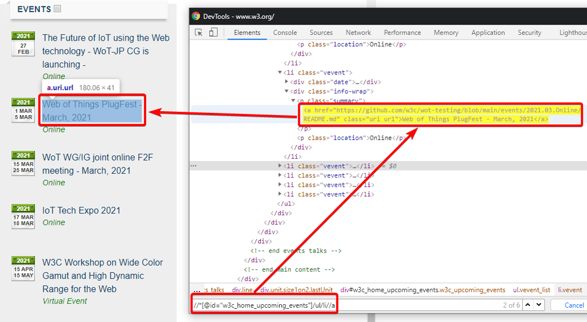

---
sidebar_position: 3
title: "XPath"
description: ""
date: "2025-07-20"
converted: true
originalFile: "XPath.txt"
targetUrl: "https://zennolab.atlassian.net/wiki/spaces/RU/pages/862093419/XPath"
---
:::info **Пожалуйста, ознакомьтесь с [*Правилами использования материалов на данном ресурсе*](../Disclaimer).**
:::

> 🔗 **[Оригинальная страница](https://zennolab.atlassian.net/wiki/spaces/RU/pages/862093419/XPath)** — Источник данного материала

_______________________________________________  
# XPath

Это гибкий и мощный язык запросов к элементам xml или (x)html документа и xslt преобразований по DOM, который является стандартом консорциума [W3C](https://ru.wikipedia.org/wiki/W3C "https://ru.wikipedia.org/wiki/W3C").

## Для чего нужен XPath в ZennoPoster?

- Для парсинга данных с сайтов (экшен [❗→ Парсить данные](/wiki/spaces/RU/pages/534053279 "/wiki/spaces/RU/pages/534053279"))
- Для поиска и взаимодействия с элементами на веб-странице

 - [❗→ Выполнить действие](/wiki/spaces/RU/pages/534020211 "/wiki/spaces/RU/pages/534020211")
 - [❗→ Установить значение](/wiki/spaces/RU/pages/534315117 "/wiki/spaces/RU/pages/534315117")
 - [❗→ Взять значение](/wiki/spaces/RU/pages/534315124 "/wiki/spaces/RU/pages/534315124")
- Можно использовать в [❗→ Конструкторе действий](https://zennolab.atlassian.net/wiki/spaces/RU/pages/483426337/XPath "https://zennolab.atlassian.net/wiki/spaces/RU/pages/483426337/XPath").

С помощью XPath Вы можете реализовать более универсальный и устойчивый к изменениям вёрстки сайта алгоритм поиска данных в сравнении с [❗→ регулярными выражениями](/wiki/spaces/RU/pages/534086111 "/wiki/spaces/RU/pages/534086111").
Данный язык запросов позволяет значительно упростить логику парсеров и тем самым ускорить их разработку.

## Тестирование запросов при их составлении

- В ZennoPoster встроен [❗→ Тестер X\Json Path](https://zennolab.atlassian.net/wiki/spaces/RU/pages/534315390/X+JSON+Path "https://zennolab.atlassian.net/wiki/spaces/RU/pages/534315390/X+JSON+Path") с помощью которого Вы можете протестировать составленное выражение.
- Так же составить и протестировать XPath выражение можно в окне [❗→ Инcтрументов web-разработчика (DevTools)](https://zennolab.atlassian.net/wiki/spaces/RU/pages/1331134465/web-+DevTools "https://zennolab.atlassian.net/wiki/spaces/RU/pages/1331134465/web-+DevTools"): откройте окно DevTools, нажмите ctrl+f для вызова строки поиска и введите в неё XPath выражение:

Например, чтобы получить названия мероприятий на сайте http://w3.org, мы можем использовать следующее выражение:

`//*[@id="w3c_home_upcoming_events"]/ul/li//a`

## Базовый синтаксис

### **Пути**

| **Выражение** | **Описание** |
| --- | --- |
| **.** | текущий контекст |
| **.//** | рекурсивный спуск (на ноль или более уровней от текущего контекста) |
| **/html/body** | абсолютный путь |
| **a** | относительный путь |
| **//\*** | все в текущем контексте |
| **li/\/a** | ссылки, являющиеся «внуками» для li |
| **//a\|//button** | ссылки и кнопки (объединение двух множеств узлов) |

### **Отношения**

| **Выражение** | **Описание** |
| --- | --- |
| **a/i/parent::p** | непосредственный родитель &lt;p&gt; |
| **p/ancestor::**\ | все родители |
| **p/following-sibling::**\ | все следующие братья |
| **p/preceding-sibling::**\ | все предыдущие братья |
| **p/following::**\ | все следующие элементы кроме потомков |
| **p/preceding::**\ | все предыдущие элементы кроме предков |
| **p/descendant-or-self::**\ | контекстный узел и все его потомки |
| **p/ancestor-or-self::**\ | контекстный узел и все его предки |

### **Получение узлов**

| **Выражение** | **Описание** |
| --- | --- |
| **/div/text()** | получить текстовые узлы |
| **/div/text()[1]** | получить первый текстовый узел |

### **Позиция элемента**

| **Выражение** | **Описание** |
| --- | --- |
| **a[1]** | первый элемент |
| **a[last()]** | последний элемент |
| **a[2]** | вторая ссылка |
| **a[position() &lt;= 3]** | первые 3 ссылки |
| **ul[li[1]=”OK”]** | список (UL), первый элемент которого содержит значение 'OK' |
| **tr[position() mod 2 = 1]** | не четные элементы |
| **tr[position() mod 2 = 0]** | четные элементы |
| **p/text()[2]** | второй текстовый узел |

**Атрибуты и фильтры**
**[]** - указывает на фильтрацию элементов

| **Выражение** | **Описание** |
| --- | --- |
| **input[@type=”text”]** | тег &lt;input&gt; у которого атрибут type равен text |
| **input[@class='OK']** | тег &lt;input&gt; у которого атрибут class равен OK |
| **p[not(@\)]** | параграфы без атрибутов |
| **\[@style]** | все элементы с атрибутом style |
| **a[. = “OK”]** | ссылки со значением «OK» |
| **a/@id** | идентификаторы ссылок |
| **a/@**\ | все атрибуты ссылок |
| <ul><li>
<strong data-renderer-mark="true">a[@id and @rel]</strong>
</li><li>
<strong data-renderer-mark="true">a[@id][@rel]</strong>
</li></ul> | ссылки, которые содержат атрибуты id и rel |
| **a[i or b]** | ссылки содержат элемент &lt;i&gt; или &lt;b&gt; |

### **Функции**
Базовые функции Xpath - http://www.w3.org/TR/xpath/#corelib

| **Функция** | **Описание** | **Пример** |
| --- | --- | --- |
| **name()** | Возвращает имя элемента | [name()='a'] |
| **string(val)** | Получить значение атрибута | string(a[1]/@id) |
| **substring(val, from, to)** | Вырезать часть строки | substring(@id, 1, 6) |
| **substring-before(val, to)** | Вернуть часть строки **val** перед строкой **to** | substring-before('12-May-1998', '-') = '12' |
| **substring-after(val, from)** | Вернуть часть строки **val** после строки **to** | substring-after('12-May-1998', '-') = 'May-1998' |
| **string-length()** | Возвращает число символов в строке | [string-length(text()) &gt; 5] |
| **count()** | Возвращает количество элементов | |
| **concat()** | Принимает на вход две или более строки и возвращает конкатенацию (строковое сложение) своих аргументов. | |
| **normalize-space()** | Аналог Trim | [normalize-space(text())='SEARCH'] |
| **starts-with()** | Начинается с | [starts-with(text(), 'SEARCH')] |
| **contains()** | Содержит | [contains(name(), 'SEARCH')] |
| **translate(val, from, to)** | Производит замену символов первого своего строкового аргумента, которые присутствуют во втором аргументе на соответствующие символы третьего аргумента. | translate(«bar»,«abc»,«ABC») |

### **Группирование**

| **Выражение** | **Описание** |
| --- | --- |
| **(table/tbody/tr)[last()]** | последняя строка &lt;tr&gt; из всех таблиц |
| **(//h1\|//h2)[contains(text(), 'Text')]** | заголовок первого или второго уровня, который содержит «Text» |
| **a[//tr/@data-id=@data-id]** | все ссылки у которых атрибут data-id совпадает с этим же атрибутом у строки таблицы |

### Полезные ссылки

https://ru.wikipedia.org/wiki/XPath
https://www.w3schools.com/xml/xpath_syntax.asp