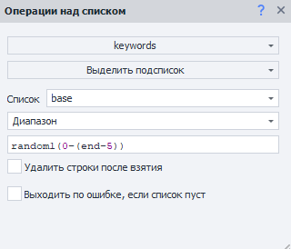

:::info **Пожалуйста, ознакомьтесь с [*Правилами использования материалов на данном ресурсе*](../Disclaimer).**
:::

> 🔗 **[Оригинальная страница](https://zennolab.atlassian.net/wiki/spaces/RU/pages/488964137)** — Источник данного материала

_______________________________________________  
# Диапазоны значений

## Что такое диапазоны

Довольно часто при настройке проекта Вы встретите места, где нужно указать номер совпадения при поиске, номер строки, номер ячейки и т.д. Причём, не всегда в таких случаях можно указать конкретный номер. Диапазоны помогут Вам настроить более гибкую нумерацию таких перечислений.

Далее будут примеры для списка, но помните, что эти примеры применимы для всех случаев, где нужно указать какой-либо номер.

  

## В каких случаях применяются диапазоны:

- Нужно взять интервал строк. Например, с пятой по седьмую и т.д.;
- Нужно взять последнюю строку не зная общее количество строк;
- Нужно взять случайную строку;
- Нужно взять несколько случайных строк;
- Нужно взять несколько случайных строк из указанного интервала;
- Нужно взять чётные / нечётные строки из указанного интервала;
- Нужно взять случайные строки из чётных / нечётных строк из указанного интервала.
- Так же диапазоны можно использовать в качестве номера совпадения при выполнении экшенов [❗→ Выполнить событие](/wiki/spaces/RU/pages/534020211 "/wiki/spaces/RU/pages/534020211"), [❗→ Установка значений](/wiki/spaces/RU/pages/534315117 "/wiki/spaces/RU/pages/534315117"), [❗→ Взятие значений](/wiki/spaces/RU/pages/534315124 "/wiki/spaces/RU/pages/534315124")

  

## Взять строки из одного или нескольких интервалов

Если нужно взять строки с пятой по седьмую, например, то пишется в номере строки так:

**4-6** (на 1 меньше, т.к. нумерация строк начинается с 0).

Можно указать несколько интервалов через знак '**;**' или '**,**': например, **10-15;7;22-34**

  

## Выбрать случайный элемент

Бывают ситуации, когда на странице несколько одинаковых элементов и Вам нужно взаимодействовать с любым из них, не важно каким. 

Например при регистрации надо указать операционную систему и предоставляется выбор из нескольких вариантов. Чтоб кликнуть по случайному, необходимо в качестве номера совпадения указать слово **random** 

  

## Длина списка неизвестна, но нужно взять его до конца

Конец списка обозначается ключевым словом **end**.

Просто пишите интервал, например: **10-end** и возьмутся строки от **11** до конца файла.

  

## Взять все строки из списка

Взять все строки можно указав номер строки **all**.

  

## Взять случайную строку или несколько случайных строк из интервала

Для этого в номере строки пишете слово random, затем, сколько строк нужно, затем, в скобках, из каких строк брать.

Например:

**random1(1,12-15,35-end)** - чтобы взять **одну**строку из указанных,

или

**random15(1,12-15,35-end)** - чтобы взять **15**строк из указанных,

или

**randomAll(1,12-15,35-end)** - чтобы взять **все** строки из указанных в случайном порядке (randomAll доступен в ZennoPoster версии выше 5.9.3).

  

## Исключающие диапазоны

Иногда требуется не учитывать последние варианты.

Например нужно исключить последние 5 строк и взять 1 случайный элемент, это будет выглядеть вот так:

**random1(0-(end-5))**

Исключающие диапазоны доступны в ZennoPoster версии 5.9.3 и выше.

  

## Получение только чётных значений

Чтобы получить первое чётное значения из диапазона, следует написать:

**even(1,12-15,35-end)** или **even1(1,12-15,35-end)**

Чтобы получить 5 первых чётных значений из диапазона, следует написать:

**even5(1,12-15,35-end)**

Чтобы получить все чётные значения из диапазона, следует написать:

**evenAll(1,12-15,35-end)**

Оператор even доступен в ZennoPoster версии 5.9.3 и выше.

  

## Получение только нечётных значений

Чтобы получить первое нечётное значения из диапазона, следует написать:

**odd(1,12-15,35-end)** или **odd1(1,12-15,35-end)**

Чтобы получить 5 первых нечётных значений из диапазона, следует написать:

**odd5(1,12-15,35-end)**

Чтобы получить все нечётные значения из диапазона, следует написать:

**oddAll(1,12-15,35-end)**

Оператор odd доступен в ZennoPoster версии 5.9.3 и выше.

  

## Комбинирование операторов

Операторы random, even, odd можно комбинировать.

Например, чтобы взять все чётные строки в случайном порядке из диапазона, следует написать:

**randomAll(evenAll(1,12-15,35-end))**

Комбинирование операторов доступно в ZennoPoster версии 5.9.3 и выше.

  

## Полезные ссылки

- [❗→ Операции над таблицами](/wiki/spaces/RU/pages/534052972 "/wiki/spaces/RU/pages/534052972")
- [❗→ Операции над списком](/wiki/spaces/RU/pages/534085798 "/wiki/spaces/RU/pages/534085798")
- [❗→ Установка значения](/wiki/spaces/RU/pages/534315117 "/wiki/spaces/RU/pages/534315117")
- [❗→ Получение значения](/wiki/spaces/RU/pages/534315124 "/wiki/spaces/RU/pages/534315124")