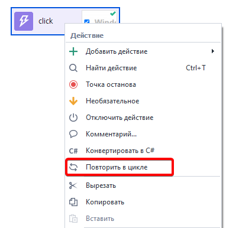
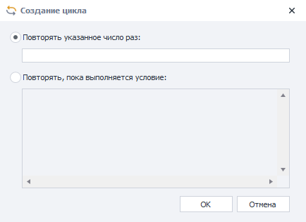
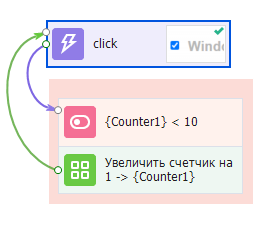
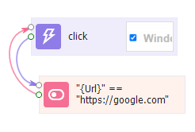
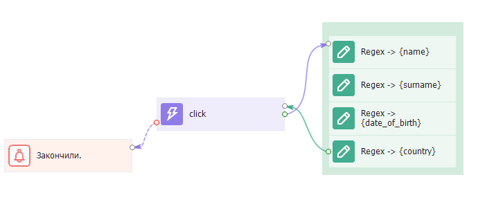

---
sidebar_position: 2
title: "Циклы"
description: ""
date: "2025-07-20"
converted: true
originalFile: "Циклы.txt"
targetUrl: "https://zennolab.atlassian.net/wiki/spaces/RU/pages/489259031"
---
:::info **Пожалуйста, ознакомьтесь с [*Правилами использования материалов на данном ресурсе*](../Disclaimer).**
:::

> 🔗 **[Оригинальная страница](https://zennolab.atlassian.net/wiki/spaces/RU/pages/489259031)** — Источник данного материала

_______________________________________________  
# Циклы

Цикл - это действие, или группа действий, которые выполняются либо указанное количество раз, либо до наступления определённого события.

:::info Информация
Вообще, рекомендуем использовать циклы не очень часто, т.к. это сложная конструкция и в ней может возникнуть ряд непредвиденных для Вас ошибок (особенно если Вы не разбираетесь в программировании).
:::

## Cоздание

### Автоматическое

Создать цикл в ZennoPoster достаточно просто: для этого надо кликнуть ПКМ по экшену (или группе экшенов) и выбрать из контекстного меню пункт *Повторить в цикле: 

После клика появится окно выбора выхода из цикла:

#### Повторять указанное число раз

При выборе этого пункта в поле ввода надо будет ввести желаемое число повторений и после клика по кнопке ОК будут созданы - переменная-счётчик, экшен сравнения счётчика с указанным Вами числом и экшен увеличения значения счётчика.

#### Повторять, пока выполняется условие

В поле ввода Вы вносите необходимое условия и пока оно будет возвращать True, цикл будет продолжаться. После клика по ОК данные из этого поля будут перенесены в [❗→ экшен IF](https://zennolab.atlassian.net/wiki/spaces/RU/pages/534315151/...+...+IF "https://zennolab.atlassian.net/wiki/spaces/RU/pages/534315151/...+...+IF"), поэтому в нём нужно соблюдать те же правила построения выражений, что и в стандартном экшене.

|  |
| :--: |
| Пока текущий URL равен https://google.com будет происходить клик. |

### Ручное создание цикла

Выше были рассмотрены варианты автоматического создание циклов, но Вы можете это делать и вручную.

Рассмотрим на примере: необходимо достать данные из сайта, у сайта много страниц и для перехода на следующую страницу необходимо кликнуть по кнопке *Далее, если страницы кончились, то этой кнопки нет.

В данном случае условием выхода будет ошибка при [❗→ клике по кнопке *Далее](/wiki/spaces/RU/pages/534020211 "/wiki/spaces/RU/pages/534020211") (когда экшен не находит элемент, он завершается ошибкой).

## Советы по использованию

- **Не используйте вечные циклы!** 

 - Добавляйте счётчик в свои циклы. К примеру Вам необходимо дождаться появления элемента на странице и Вы сделали вечный цикл, который его ожидает. Но в какой-то момент сайт меняет структуру и Ваш шаблон зависает так как никогда не дождётся появления необходимого элемента.
- **Не зацикливайте свои шаблоны!** Это может привести к разного рода ошибкам!

## Полезные ссылки:

- [❗→ Экшен IF](https://zennolab.atlassian.net/wiki/spaces/RU/pages/534315151/...+...+IF "https://zennolab.atlassian.net/wiki/spaces/RU/pages/534315151/...+...+IF")
- [❗→ Пауза](/wiki/spaces/RU/pages/534053057 "/wiki/spaces/RU/pages/534053057")