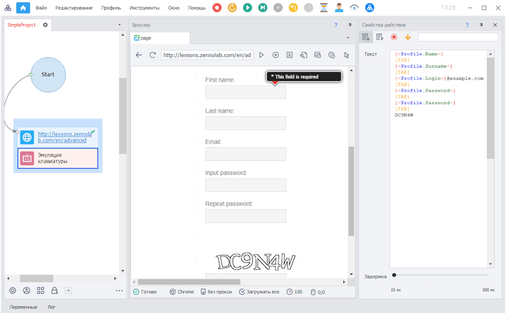

---
sidebar_position: 4
title: "Эмуляция мыши и клавиатуры"
description: ""
date: "2025-07-20"
converted: true
originalFile: "Эмуляция мыши и клавиатуры.txt"
targetUrl: "https://zennolab.atlassian.net/wiki/spaces/RU/pages/489291804"
---
import DisclaimerNotice from '@site/src/components/DisclaimerNotice';

<DisclaimerNotice />

> 🔗 **[Оригинальная страница](https://zennolab.atlassian.net/wiki/spaces/RU/pages/489291804)** — Источник данного материала

_______________________________________________  
## Описание
> **Для чего используется эмуляция?**  

- Послать клики мыши в указанные координаты на web странице;
- Эмулировать нажатие клавиш, например, `Escape` или `Enter`;
- Против защиты от ботов, которая отслеживает, нажимаются ли клавиши при заполнении полей ввода.

### Принцип работы
#### [Эмуляция клика мыши](../Project-editor/Actions-in-ProjectMaker-Actions-Blocks/Emulation/Mouse_Emulation)
В этом режиме необходимо задать область координат, внутри которой будет выполнен клик, а также выбрать кнопку мыши, которой он будет произведён.  

Дополнительно можно указать тип распределения точки клика:
- **Нормальное** — клики с большей вероятностью выполняются ближе к центру выбранной области;
- **Равномерное** — точка клика выбирается случайно и равномерно по всей заданной области.  

#### [Эмуляция ввода текста с клавиатуры](../Project-editor/Actions-in-ProjectMaker-Actions-Blocks/Emulation/Keyboard_Emulation)
Потребуется ввести сам текст и указать время задержки между нажатием.  

Для эмуляции нажатия специальных клавиш используйте `Ctrl`+`Space` в поле ввода текста. Затем в открывшемся списке выберите нужную кнопку.  

#### Настройка эмуляции.
При заполнении полей, а также при кликах по кнопкам и ссылкам эмуляция включена по умолчанию. В [настройках проекта](../Project-editor/Static_blocks/Project_Settings) можно централизованно задать уровень эмуляции для всех экшенов, которые **заполняют поля на веб-странице** или **выполняют клики по кнопкам и ссылкам**.  

При этом каждый экшен имеет собственную настройку эмуляции, которая при необходимости может переопределять глобальные параметры проекта.  

В экшене эмуляции клавиатуры можно использовать:
- обычный текст;
- переменные проекта;
- специальные клавиши и комбинации клавиш, например:
    - `{TAB}`,  
    - `{ENTER}`,  
    - `{BACKSPACE}`,  
    - `{CTRL}` и другие.  

> Чтобы просмотреть полный список доступных специальных клавиш, нажмите `Ctrl` + `Пробел` в поле ввода текста.

## C# методы движения виртуальной мыши:
- [**`FullEmulationMouseMoveToHtmlElement`**](https://help.zennolab.com/en/v5/zennoposter/5.10.4.1/webframe.html#topic384.html "https://help.zennolab.com/en/v5/zennoposter/5.10.4.1/webframe.html#topic384.html") —  переместить виртуальную мышь к элементу из текущего положения виртуальной мыши;
- [**`FullEmulationMouseMove`**](https://help.zennolab.com/en/v5/zennoposter/5.10.4.1/webframe.html#topic382.html "https://help.zennolab.com/en/v5/zennoposter/5.10.4.1/webframe.html#topic382.html") — переместить виртуальную мышь к координатам из текущего положения виртуальной мыши;
- [**`FullEmulationMouseClick`**](https://help.zennolab.com/en/v5/zennoposter/5.10.4.1/webframe.html#topic381.html "https://help.zennolab.com/en/v5/zennoposter/5.10.4.1/webframe.html#topic381.html") — кликнуть мышкой в текущем положении виртуальной мыши;
- [**`FullEmulationMouseMoveAboveHtmlElement`**](https://help.zennolab.com/en/v5/zennoposter/5.10.4.1/webframe.html#topic383.html "https://help.zennolab.com/en/v5/zennoposter/5.10.4.1/webframe.html#topic383.html") — эмуляция чтения элемента;
- Свойство [**`FullEmulationMouseCurrentPosition`**](https://help.zennolab.com/en/v5/zennoposter/5.10.4.1/webframe.html#topic413.html "https://help.zennolab.com/en/v5/zennoposter/5.10.4.1/webframe.html#topic413.html") — возвращает текущую позицию виртуальной мыши.
- Метод [**`FullEmulationMouseSetOptions`**](https://help.zennolab.com/en/v5/zennoposter/5.10.4.1/webframe.html#topic385.html "https://help.zennolab.com/en/v5/zennoposter/5.10.4.1/webframe.html#topic385.html") — устанавливает параметры эмуляции мыши, метод нужно вызывать после каждого вызова метода Navigate, метод доступен начиная с версии 5.10.4.1.