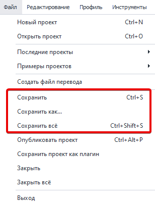
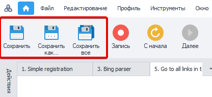
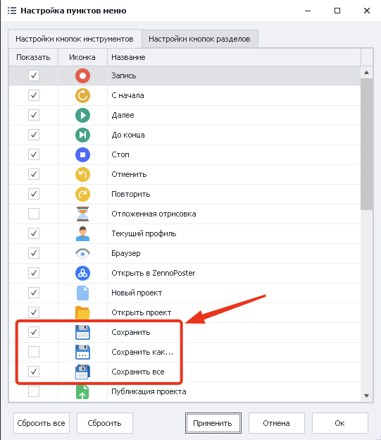
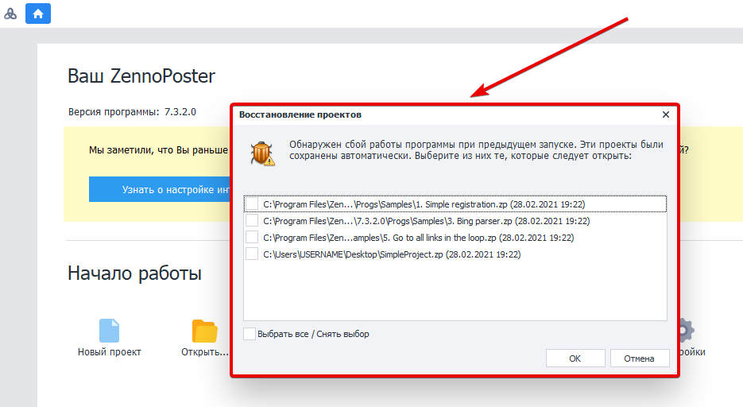
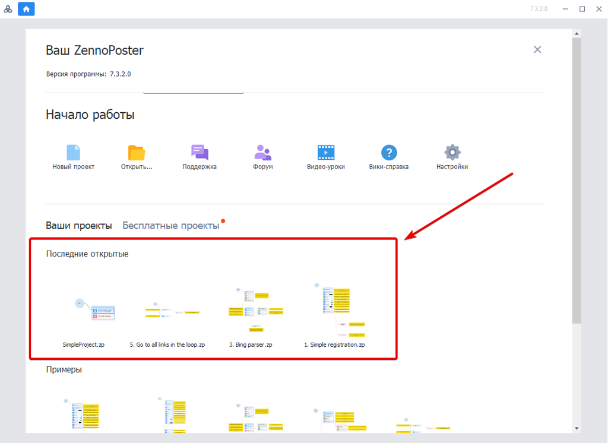

---
sidebar_position: 8
title: "Сохранение проекта"
description: ""
date: "2025-07-20"
converted: true
originalFile: "Сохранение проекта.txt"
targetUrl: "https://zennolab.atlassian.net/wiki/spaces/RU/pages/486342692"
---
import DisclaimerNotice from '@site/src/components/DisclaimerNotice';

<DisclaimerNotice />

> 🔗 **[Оригинальная страница](https://zennolab.atlassian.net/wiki/spaces/RU/pages/486342692)** — Источник данного материала

_______________________________________________  
## Сохранение
Вы можете сохранять проекты несколькими способами:
- через `Ctrl`+`S`
- с помощью верхнего меню:

- с помощью кнопок на панели инструментов: 

:::tip Предварительно их нужно добавить через настройки

:::

При создании больших проектов рекомендуем периодически сохраняться вручную во избежание потери данных при зависании программы *(особенно на слабых машинах)*.
_______________________________________________ 
## Бэкапы проекта
Автоматическое сохранение проектов происходит **раз в 5 минут**. Если текущий проект не был сохранён, то при следующем запуске программа предложит восстановить его из бэкапа. Таким образом, можно свести к минимуму потерю данных даже при некорректном завершении софта.

_______________________________________________ 
## Загрузка
Загружать проекты можно как из самого ProjectMaker, так и по двойному клику на файле в проводнике Windows.

Последние проекты, над которыми вы работали, удобно отображаются при старте программы:

_______________________________________________
