---
sidebar_position: 11
title: "Настройка подключения Google Таблиц"
description: ""
date: "2025-07-20"
converted: true
originalFile: "Настройка подключения Google Таблиц.txt"
targetUrl: "https://zennolab.atlassian.net/wiki/spaces/RU/pages/1667727363/Google"
---
import DisclaimerNotice from '@site/src/components/DisclaimerNotice';

<DisclaimerNotice />

> 🔗 **[Оригинальная страница](https://zennolab.atlassian.net/wiki/spaces/RU/pages/1667727363/Google)** — Источник данного материала

_______________________________________________  
## Описание
В этой статье мы разберём, какие действия нужно выполнить для начала работы с [Google-таблицами](../Project-editor/Actions-in-ProjectMaker-Actions-Blocks/Tables/Operations_on_Google_Sheets).

## Создание нового приложения

- Войдите в свой Google аккаунт или создайте [новый](https://support.google.com/accounts/answer/27441?hl=ru "https://support.google.com/accounts/answer/27441?hl=ru").
_______________________________________________ 


- Зайдите в [Google Cloud Platform](https://console.developers.google.com/?hl=ru "https://console.developers.google.com/?hl=ru"). При первом заходе на сайт надо будет:
    - выбрать страну (1)
    - прочитать правила использования сервисов и принять их, если вы согласны (2)
    - *(опционально) согласиться на рассылку по email (3)*
    - в конце нажать **AGREE AND CONTINUE** (4)
_______________________________________________ 
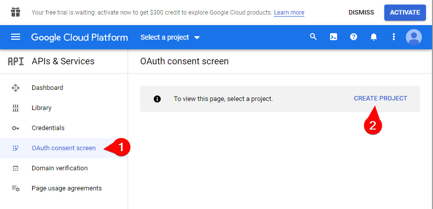

- Далее выберите раздел **OAuth consent screen** (1) и нажмите **CREATE PROJECT** (2). Будет создан новый проект.
_______________________________________________ 
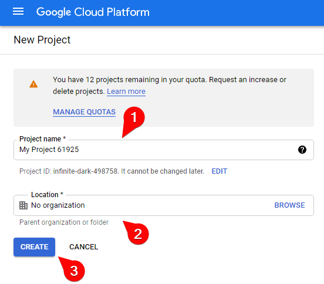

- Введите любое название проекта в поле **Project name** (1) *(только на английском языке)* и укажите **Location** (2), а после нажмите **CREATE** (3).
_______________________________________________  
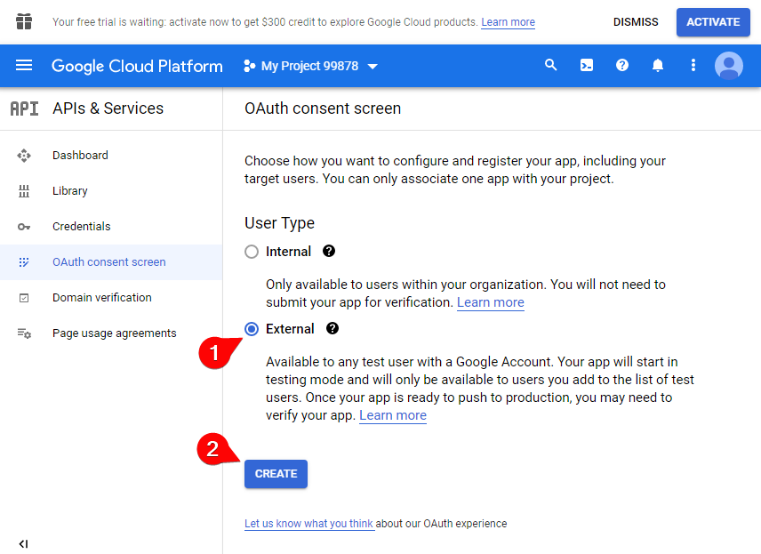

- В текущем окне выберите **External** (1) и нажмите **CREATE** (2)
_______________________________________________ 
  

- Здесь же надо ввести любое имя приложения в поле **App name** (1) и выбрать email в списке **User support email** (2)
_______________________________________________ 


- Прокрутите страницу в самый низ и ещё раз введите свой email (3) и нажмите **SAVE AND CONTINUE** (4)
_______________________________________________ 
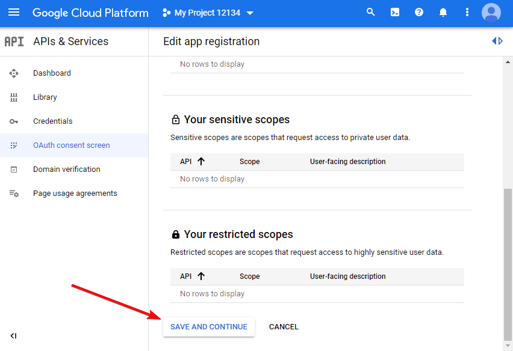

- В окне **Scopes** просто проматываем страницу в самый низ и нажимаем **SAVE AND CONTINUE**.
_______________________________________________ 
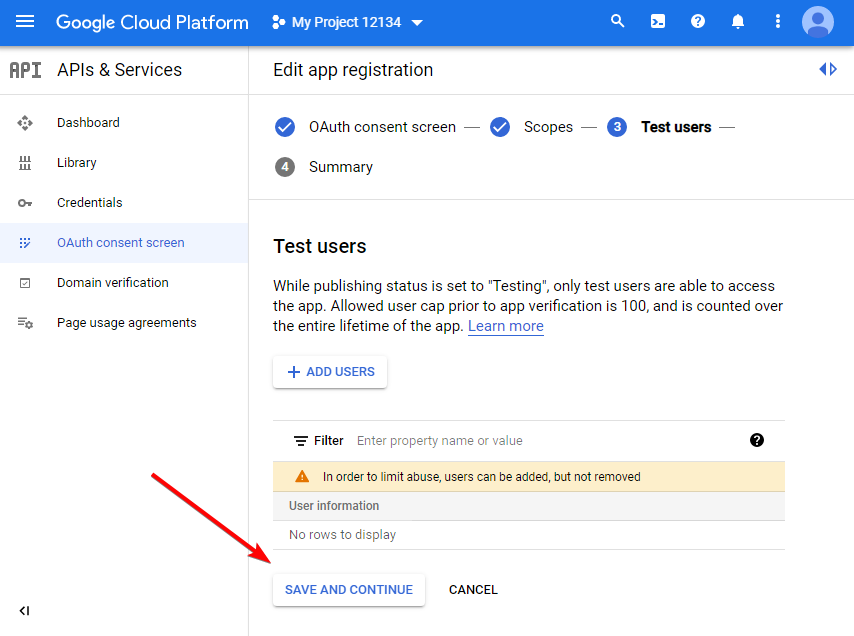

- В окне Test users тоже пролистываем вниз и нажимаем **SAVE AND CONTINUE**.
_______________________________________________ 


- В окне **Summary** пролистываем вниз и нажимаем **BACK TO DASHBOARD**.
_______________________________________________ 
## Публикация проекта
### Testing mode
> В этом режиме каждые 7 дней необходимо переавторизоваться в приложении.  

Можно оставить приложение в тестовом режиме. Тогда оно будет доступно только для аккаунта-создателя и пользователей, которые добавлены в список **Test Users**.

**Добавление пользователей**:  
- на вкладке **OAuth consent screen** пролистайте чуть вниз и в разделе **Test users** нажмите кнопку **ADD USERS**.
- в открывшемся окне добавьте email адрес необходимого аккаунта и нажмите кнопку **SAVE**.


:::warning Количество тестовых пользователей ограничено
Их может быть не больше **100**.   

**После добавления пользователя в список тестеров удалить его оттуда уже нельзя!**
:::

### Publish App
Вместо режима тестирования вы можете опубликовать приложение. Тогда оно будет доступно всем пользователям у которых есть Google аккаунт.

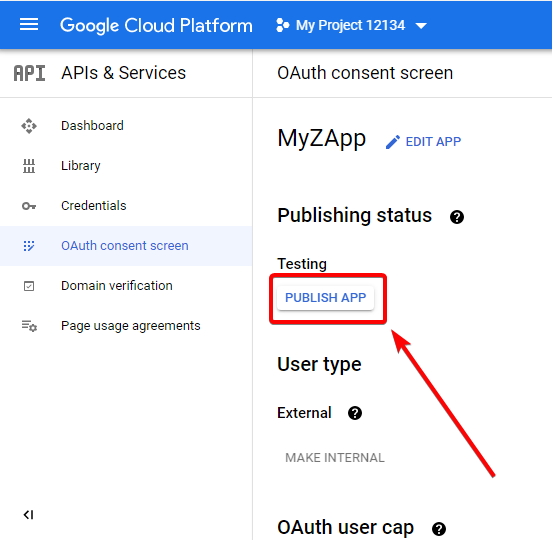

- Далее **CONFIRM** во всплывающем окне

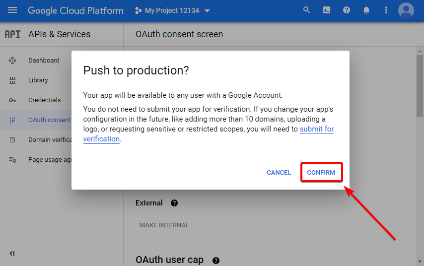
_______________________________________________ 
## Создание учётных данных
- В разделе **Credentials** (1) нажмите **CREATE CREDENTIALS** (2) и выберите пункт **OAuth client ID** (3)


- Выберите пункт **Desktop app** в выпадающем списке **Application type** (1) и нажмите **CREATE** (2)


- Откроется новое окно **OAuth client created**, в нём нажмите **OK**.


- После этого кликните по названию только что созданного приложения или по значку его редактирования.  


- И наконец в открывшемся окне скачиваем API-ключ в виде файла. Для этого нажмимаем кнопку **DOWNLOAD JSON**.

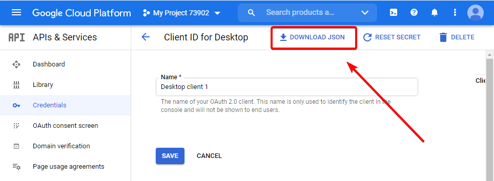
_______________________________________________ 
## Включение использования API Google Sheets и Drive
:::warning Очень важно включить оба API
Иначе программа будет работать некорректно.
:::

**Для корректной работы Google-таблиц осталось совсем не много!**

- Включаем **Google Sheets API** по [этой ссылке](https://console.developers.google.com/apis/library/sheets.googleapis.com "https://console.developers.google.com/apis/library/sheets.googleapis.com").
- Выбираем наш проект (1) и жмём **ENABLE** (2).

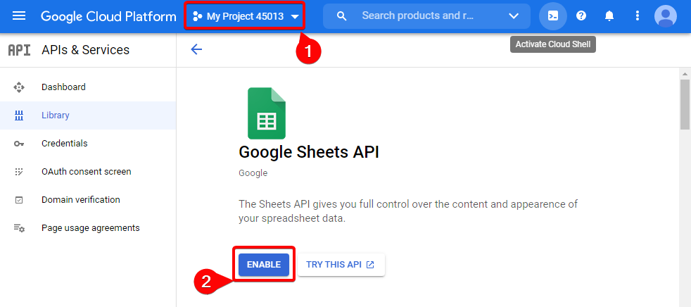

- Теперь включаем **Google Drive API** [здесь](https://console.developers.google.com/apis/library/drive.googleapis.com "https://console.developers.google.com/apis/library/drive.googleapis.com").
- И снова выбираем наш проект (1) и жмём **ENABLE** (2).

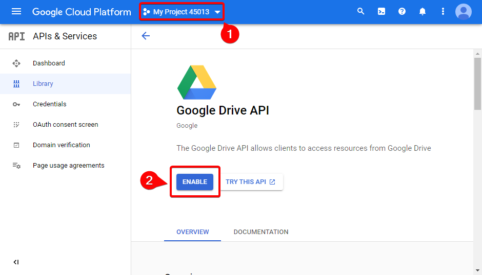
_______________________________________________ 
## Работа с API
### Добавление ключа в программу
:::tip Таблицы в *ProjectMaker* и *ZennoPoster* подключаются отдельно 
:::

- Откройте [настройки Google таблиц](../ProjectMaker%20Settings/Google_Sheets_PM):  
**Редактирование → Настройки → Google таблицы**
- Нажмите `…` и выберите файл учётных данных (1), затем нажмите **Подключить** (2).

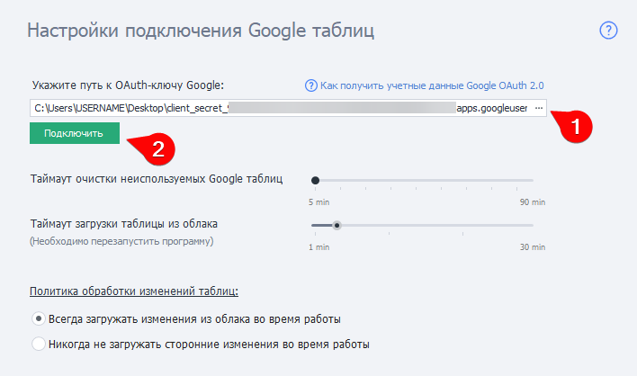

:::info Файл должен иметь расширение `.json`
:::

- После этого откроется окно браузера, где необходимо будет войти в аккаунт Google, в котором вы создавали ключ.
- Так как приложение новое, то может появиться окно с предупреждением.    

| | 
| :-----------: | 
| Необходимо выбрать **Дополнительные настройки** (1) и **Перейти на страницу *Ваше приложение*** (2), поскольку вы ему доверяете.     |

- После этого разрешите доступ для приложения к данным вашего аккаунта, чтобы можно было читать и записывать таблицы.

| 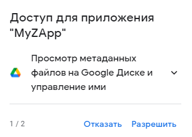| 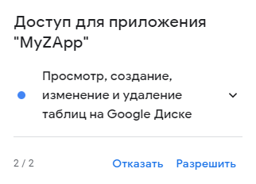 |
| ----------- | ----------- |

- Затем снова:

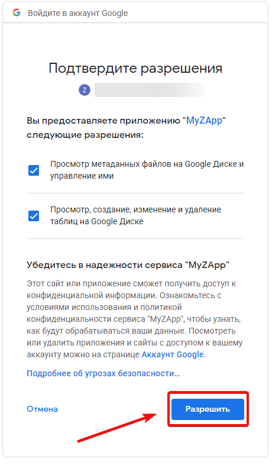

- После этого в браузере появится надпись ***Received verification code. You may now close this window***, означающая что всё было сделано правильно! Можете закрыть эту вкладку браузера.
_______________________________________________ 
### Лимиты запросов к API
#### Какие есть ограничения?
Есть [ограничения на количество запросов](https://developers.google.com/analytics/devguides/config/mgmt/v3/limits-quotas?hl=ru "https://developers.google.com/analytics/devguides/config/mgmt/v3/limits-quotas?hl=ru"): 50 000 запросов в сутки на один проект и 10 запросов в секунду на один IP-адрес (эти лимиты актуальны на май 2021 года).

#### Где можно увидеть текущее количество сделанных запросов?
Эта информация доступна в [Dashboard'е Google Cloud Platform](https://console.cloud.google.com/apis/dashboard?hl=ru "https://console.cloud.google.com/apis/dashboard?hl=ru") (не забудьте выбрать правильный проект).

#### Как увеличить лимиты?
[Запрос дополнительной квоты](https://developers.google.com/analytics/devguides/config/mgmt/v3/limits-quotas?hl=ru#additional_quota "https://developers.google.com/analytics/devguides/config/mgmt/v3/limits-quotas?hl=ru#additional_quota").

#### Как ZennoPoster расходует лимиты?
На количество запросов, в упрощенном виде, влияют два фактора — изменялась ли таблица и включена ли загрузка сторонних изменений.

Если загрузка сторонних изменений включена, то каждую минуту будет отправляться запрос к Drive API для сравнения версий таблиц. 

При изменении самой таблицы используются разные виды запросов — в целом до 5 запросов на таблицу в минуту. То есть, если активно меняются 10 таблиц, то будет максимум около 60 запросов в минуту (Sheets API + Drive API).
_______________________________________________
### Ошибка `403: access\_denied`
#### Подробный текст ошибки:  
```
The developer hasn’t given you access to this app.  
It’s currently being tested and it hasn’t been verified by Google.  
If you think you should have access, contact the developer
```
#### Решение:  
Созданное вами приложение для доступа к Google API находится в тестовом режиме. А аккаунт, с которого вы пытаетесь авторизоваться, не является создателем этого приложения и не находится в списке тестовых пользователей.  

Как опубликовать приложение или добавить пользователя в список тестовых можно прочесть в этой же статье, в подразделе **Testing mode**.

  

## Полезные ссылки

- [❗→ Операции над Google-таблицами](/wiki/spaces/RU/pages/509411347 "/wiki/spaces/RU/pages/509411347")
- [❗→ Google таблицы (PM)](/wiki/spaces/RU/pages/735576090 "/wiki/spaces/RU/pages/735576090")
- [❗→ Многопоточная работа с Google-таблицами (Версия 7.1.7.0 и выше)](/wiki/spaces/RU/pages/851673094 "/wiki/spaces/RU/pages/851673094")