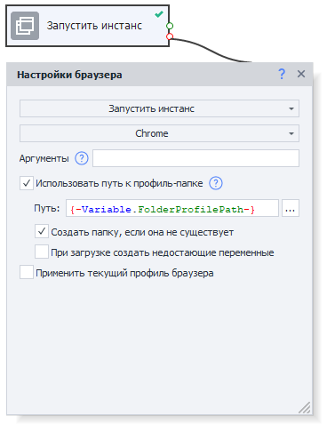
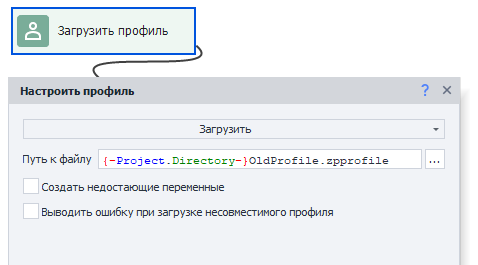
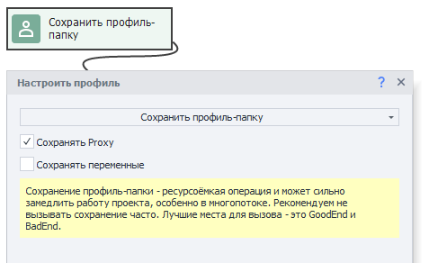
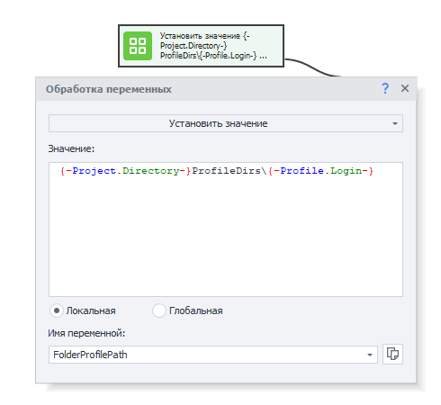
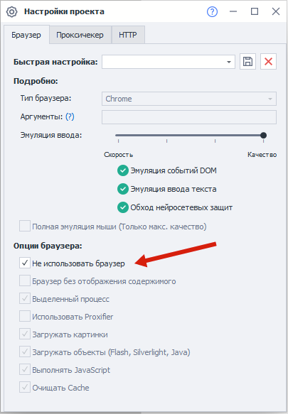
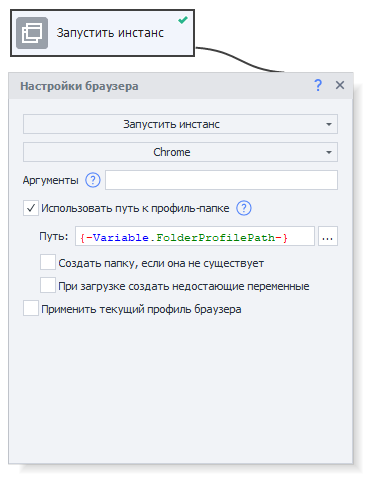
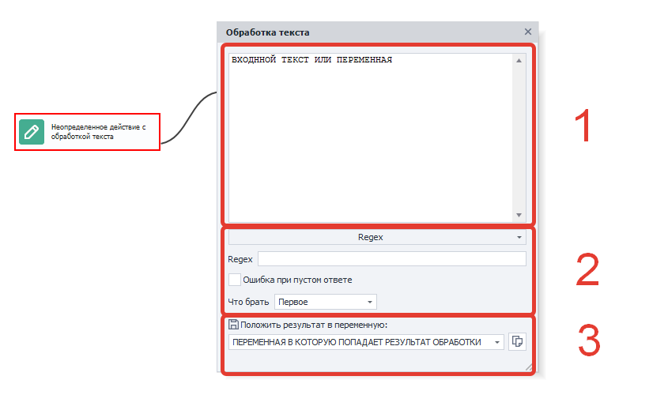
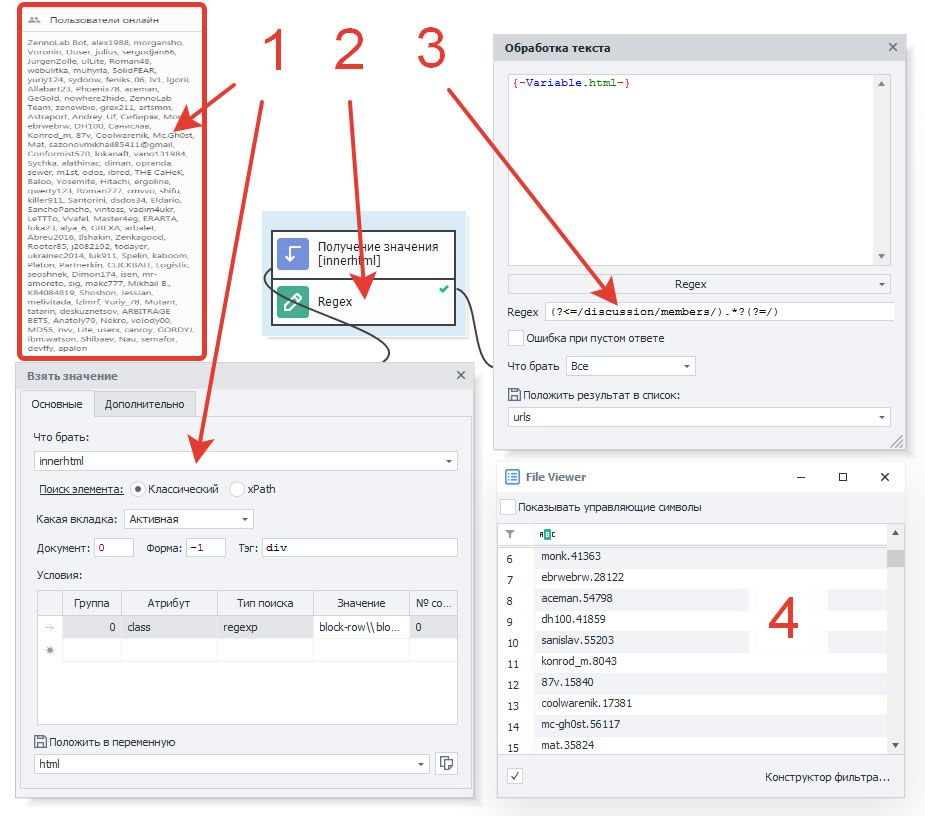

---
sidebar_position: 9
title: "Использование профиль-папки"
description: ""
date: "2025-07-20"
converted: true
originalFile: "Использование профиль-папки.txt"
targetUrl: "https://zennolab.atlassian.net/wiki/spaces/RU/pages/1251475485/-"
---
import DisclaimerNotice from '@site/src/components/DisclaimerNotice';

<DisclaimerNotice />

> 🔗 **[Оригинальная страница](https://zennolab.atlassian.net/wiki/spaces/RU/pages/1251475485/-)** — Источник данного материала

_______________________________________________  
## Описание
:::info Доступно в версии ZennoPoster 7.3.1.0 и выше.
:::

**Профиль-папка** — это альтернативный способ сохранения профиля, отличающийся от привычного сохранения в файл.

:::warning Профиль-папка привязана к вашему Zennolab ID
Данные профиль-папки привязаны и зашифрованы по Zennolab ID учётной записи, под которой они были созданы.

Профиль-папку **нельзя передавать другим пользователям** — на чужом аккаунте она **не заработает**, даже если скопировать папку на другой компьютер.

Профиль-папка сохраняет работоспособность только в **вашем ZennoPoster/ZennoBox**, авторизованном под тем же Zennolab ID из **вашего личного кабинета** ZennoLab.
:::
_______________________________________________
## Преимущества
### Целостность профиля
При сохранении профилей в файл в случае ошибок инстанса данные могли повреждаться, из-за чего профиль становился некорректным. Использование профиль-папки позволяет избежать подобных проблем.  

При запуске проекта вы создаёте инстанс браузера и указываете для него конкретную профиль-папку. В процессе работы инстанс автоматически сохраняет часть данных в эту папку — аналогично тому, как это делает обычный браузер.  

Даже если во время работы инстанс будет повреждён или завершится с ошибкой, все сохранённые данные останутся в профиль-папке и смогут быть использованы при следующем запуске.  

**Автоматически сохраняются следующие данные:**  
- **Cookie**
- **Local Storage**
- **HSTS Super Cookie**
- **Indexed DB**
- **Всё, что относится к профилю**:  
    - *имя/фамилия*,  
    - *email*,  
    - *password*  
    - *и прочее*.
- **Всё, что относится к браузер-профилю**:  
    - *UserAgent*,  
    - *Accept*,  
    - *Accept-Language*,  
    - *шрифты и плагины*,  
    - *часовой пояс и геопозиция*,  
    - *WebRTC*.

Единственные вещи, которые не сохраняются автоматически — это **Proxy** и **Переменные**. Для их сохранения нужно вызывать специальный экшен.

### Быстрая загрузка и сохранение
При длительной работе с профиль-файлом его размер мог значительно увеличиваться, что приводило к росту времени загрузки и сохранения.  

А вот **профиль-папка** хранит данные в нескольких отдельных файлах и при записи обновляет только необходимые из них. За счёт этого операции выполняются значительно быстрее и стабильнее.

:::warning Профиль-папку нельзя загрузить через экшен «Операции над профилем»
Для её использования необходимо в начале проекта запустить инстанс с указанием нужной профиль-папки. Далее инстанс будет *привязан* к ней во время работы. 
:::
_______________________________________________
## Конвертация профиль-файлов старого формата
### Демо-проект:
[**Конвертируем старые профили в новые**](./assets/Using_a_Profile_Folder/convert.zp)

### Разберём проект по шагам
1. **Выбираем путь, где будут храниться профиль-папки.**  
Например, вместе с вашим проектом: `{ -Project.Directory- }ProfileDirs\`
  
> К нему также необходимо добавить уникальное имя профиль-папки, как и для профиль-файла.

2. **Запускаем инстанс с пустой профиль-папкой.**  
Он привяжется к ранее указанному пути профиль-папки.

3. **Теперь подгружаем профиль из файла.**  
Он сразу загрузится в инстанс, который уже привязан к профиль-папке.

4. **Сохраняем профиль-папку.**  
Таким образом мы сохраним данные, которые загрузили из профиль-файла.  

_______________________________________________
## «Нагуливание» профиля
:::tip Нагуливание
Это постепенное придание аккаунту «живого» и естественного вида за счёт типичной активности. По итогу он должен выглядеть как профиль реального человека, а не созданный «под задачу».
:::

### Демо-проект:
[**Нагуливаем профиль**](./assets/Using_a_Profile_Folder/warming.zp)

### Разберём проект по шагам
1. **Подготовим путь, где будут храниться профиль-папки.**  
Например, вместе с вашим проектом: `{ -Project.Directory- }ProfileDirs\`  

2. **Запускаем инстанс с пустой профиль-папкой.**  
Он привяжется к ранее указанному пути профиль-папки.

3. Выбираем **Chrome** и ставим галку на **Использовать путь к профиль-папке**.  
4. Также обязательно включаем **Создать папку, если она не существует**. Иначе отсутствие необходимых файлов в папке будет трактоваться как ошибка, и произойдет выход по красной ветке.  
5. Теперь через **Нагулять профиль** в автоматическом режиме выполняем действия, которые нужны для придания профилю естественного вида.
6. **Сохраняем профиль-папку.**

| Если нужно сохранить переменные или прокси  | Если НЕ сохранять переменные или прокси |
| ----------- | ----------- |
| Выполняем действие **Сохранить профиль-папку** и указываем галочками нужные параметры    | Тогда дополнительный кубик добавлять не нужно. Профиль-папка сохранится автоматически при перезагрузке инстанса, закрытии программы или при окончании исполнения проекта.     |

:::tip Не рекомендуем часто использовать экшен *Сохранить профиль-папку*.
Лучше ограничить его использование в Bad или Good end.
:::
_______________________________________________
## Использование нагулянного профиля
### Демо-проект:
[**Используем профиль**](./assets/Using_a_Profile_Folder/using.zp)

### Разберём проект по шагам
1. **Настраиваем безбраузерный проект.**  
В настройках вашего проекта отметьте, что проект не использует браузер. Это нужно для того, чтобы не тратить ресурсы на запуск дефолтного браузера при старте. 

2. **Запускаем инстанс с профиль-папкой.**  
Укажите путь, где лежит ваша уникальная профиль-папка. Настройка «**Создать папку, если она не существует**» должна быть выключена.  

3. **Используем профиль по назначению.**  
Совершаем действия, для которых был создан и настроен профиль.
_______________________________________________
## Рекомендации
### Привязка к Zennolab ID
Подробнее об этом ограничении — в блоке предупреждения в начале статьи. Ограничение одинаково для ZennoPoster и ZennoBox. Передача профиль-папки другому пользователю или попытка открыть её под другим Zennolab ID не сработают.

### Одна папка — один инстанс
Обратите внимание, что в конкретной профиль-папке в любой момент времени может быть запущен только один инстанс браузера. Попытка запустить два (или более) инстанса в одной и той же профиль-папке приведет к выходу по красной ветке.

### Отладка в ProjectMaker
Даже если завершить работу браузера с помощью экшена **Настройки браузера → Запустить инстанс → Без браузера**, то ProjectMaker всё-равно не *отпустит* профиль-папку. Связано это с особенностями реализации работы инстанса внутри ProjectMaker.

Чтобы освободить ресурсы профиль-папки во время отладки, нужно запустить инстанс с другим типом браузера, например Firefox 45.
_______________________________________________
## Полезные ссылки

- [❗→ Установки браузера](/wiki/spaces/RU/pages/489324572 "/wiki/spaces/RU/pages/489324572")