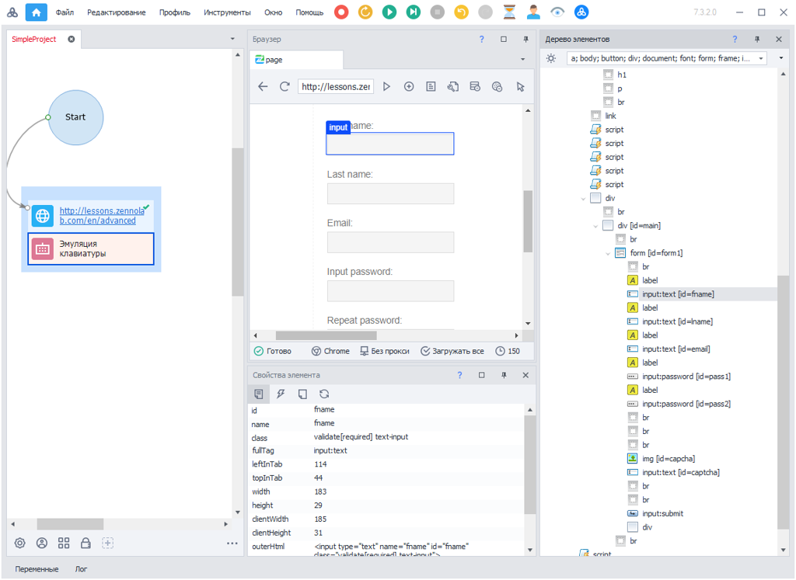
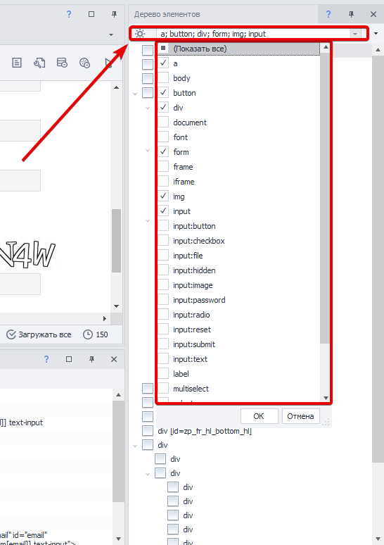
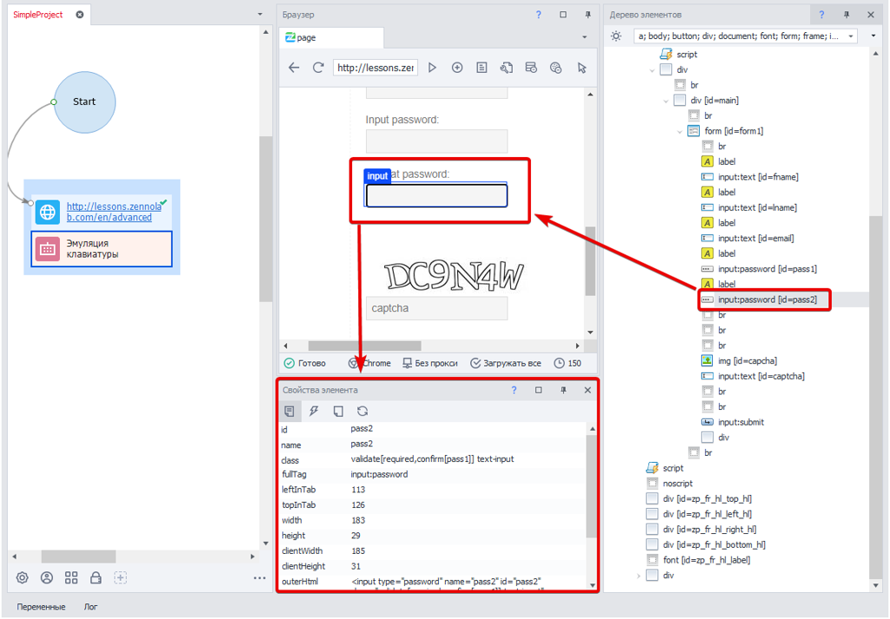

---
sidebar_position: 5
title: "Работа с элементами веб-страниц"
description: ""
date: "2025-07-20"
converted: true
originalFile: "Работа с элементами веб-страниц.txt"
targetUrl: "https://zennolab.atlassian.net/wiki/spaces/RU/pages/486408229/-"
---
import DisclaimerNotice from '@site/src/components/DisclaimerNotice';

<DisclaimerNotice />

> 🔗 **[Оригинальная страница](https://zennolab.atlassian.net/wiki/spaces/RU/pages/486408229/-)** — Источник данного материала

_______________________________________________  
## Дерево элементов
Когда не удаётся подобраться к нужному элементу с помощью **Конструктора действий**, можно открыть [**Окно дерева элементов**](../Program-interface/Element_Tree_Window) и попробовать найти элемент там.  

В данном окне элементы имеют древовидную структуру. 

Используя визуальное расположение элементов в дереве, вы можете найти близлежащие и вложенные элементы. Правым кликом мыши на элементе в дереве можно отправить его данные сразу в конструктор.

Фильтр позволяет выделить только те HTML-элементы, которые вас интересуют:

_______________________________________________
## Свойства элемента
Выделяя тот или иной элемент в дереве можно сразу посмотреть его свойства в соответствующем окне. При этом он будет подсвечен рамкой в браузере.

Эти свойства можно использовать в **Конструкторе действий** для создания экшенов.

При активации режима **Следовать за курсором** свойства элемента и его позиция в дереве обновляются в режиме реального времени.