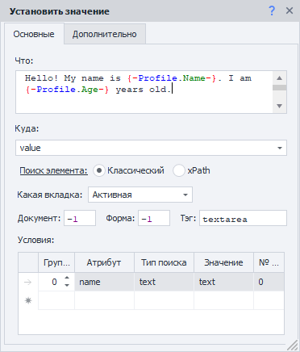
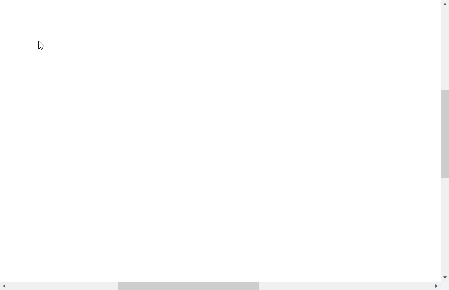
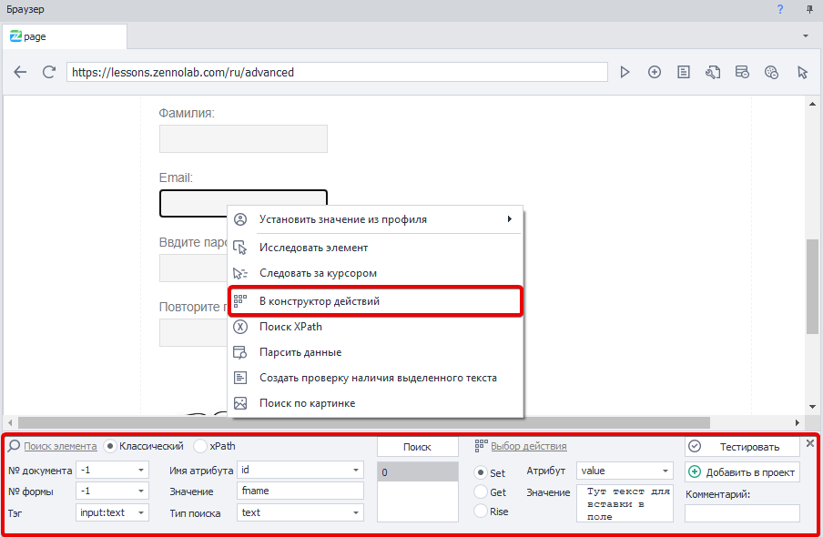
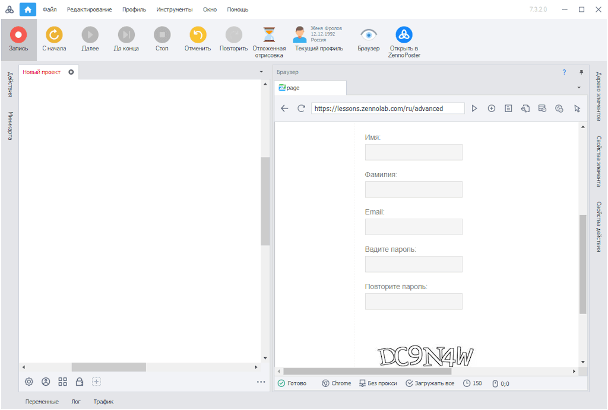

---
sidebar_position: 3
title: "Заполнение полей и форм"
description: ""
date: "2025-07-20"
converted: true
originalFile: "Заполнение полей и форм.txt"
targetUrl: "https://zennolab.atlassian.net/wiki/spaces/RU/pages/534053331"
---
:::info **Пожалуйста, ознакомьтесь с [*Правилами использования материалов на данном ресурсе*](../Disclaimer).**
:::

> 🔗 **[Оригинальная страница](https://zennolab.atlassian.net/wiki/spaces/RU/pages/534053331)** — Источник данного материала

_______________________________________________  
# Заполнение полей и форм

Одним из самых частых действий, пожалуй, является установка значений в поля ввода. Чаще всего для этого используется экшен [❗→ Установка значения](/wiki/spaces/RU/pages/534315117 "/wiki/spaces/RU/pages/534315117"). Помимо него можно использовать [❗→ Эмуляцию клавиатуры](/wiki/spaces/RU/pages/735608949 "/wiki/spaces/RU/pages/735608949").

С помощью этих экшенов можно вводить как простой текст, так и текст из [❗→ переменных](/wiki/spaces/RU/pages/486309922 "/wiki/spaces/RU/pages/486309922"). 

Пример того, как могут выглядеть настройки экшена установки значения:

Добавить экшен установки значения Вы можете несколькими способами:

- вручную, добавив его в проект через контекстное меню и заполнив все настройки;

- через [❗→ конструктор действий](https://zennolab.atlassian.net/wiki/spaces/RU/pages/483426337/XPath "https://zennolab.atlassian.net/wiki/spaces/RU/pages/483426337/XPath");

- включить *Запись и начать заполнять поля. ZennoPoster автоматически создаст экшен с необходимыми данными:

