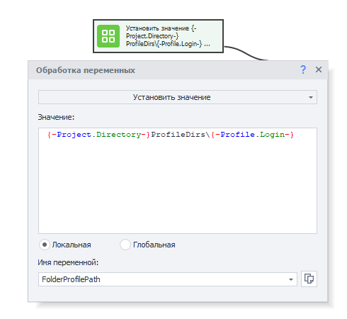
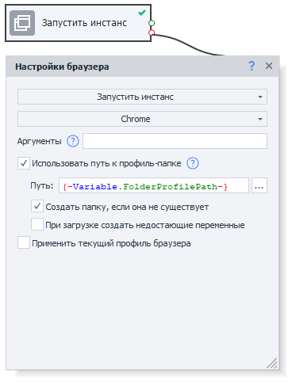
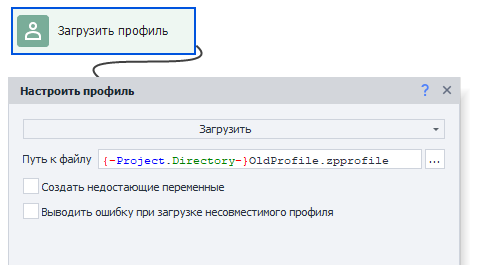
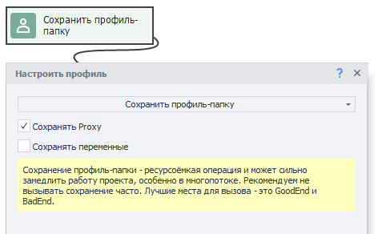
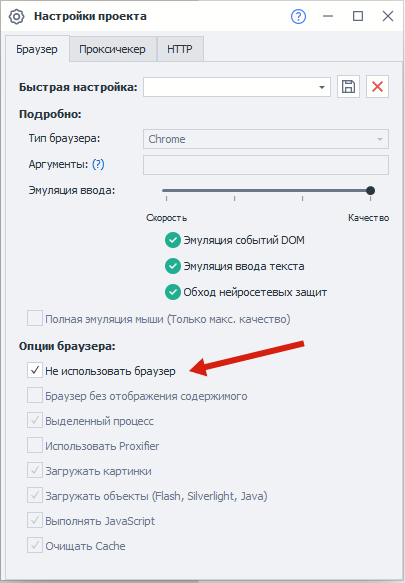
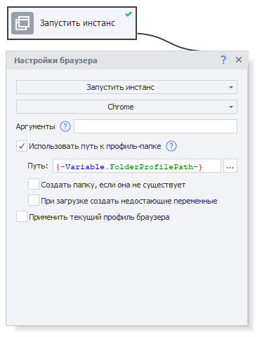
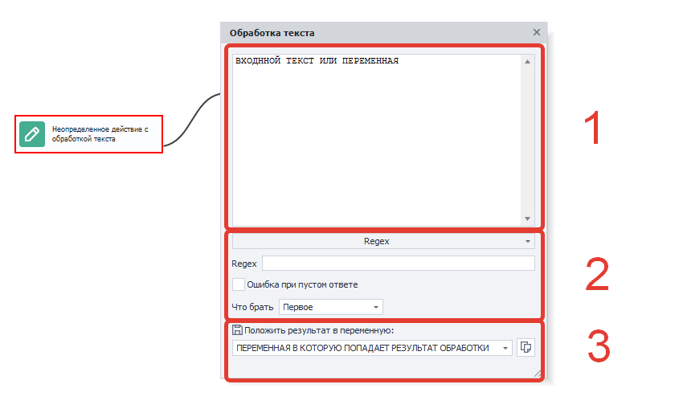
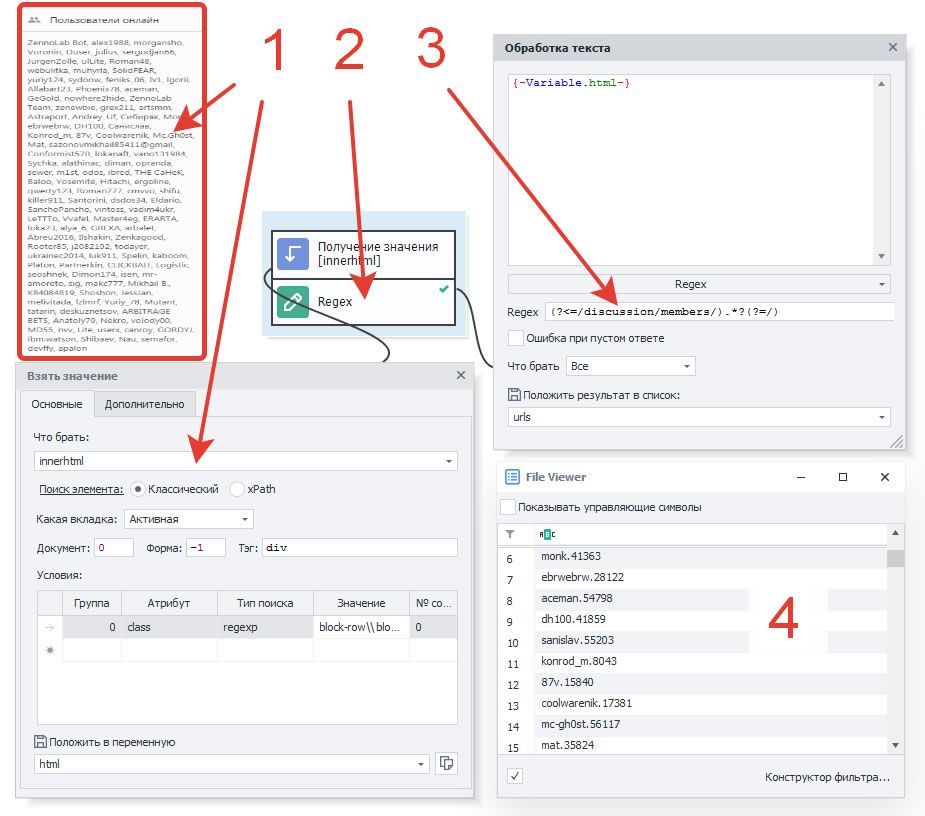

---
sidebar_position: 9
title: "Использование профиль-папки"
description: ""
date: "2025-07-20"
converted: true
originalFile: "Использование профиль-папки.txt"
targetUrl: "https://zennolab.atlassian.net/wiki/spaces/RU/pages/1251475485/-"
---
:::info **Пожалуйста, ознакомьтесь с [*Правилами использования материалов на данном ресурсе*](../Disclaimer).**
:::

> 🔗 **[Оригинальная страница](https://zennolab.atlassian.net/wiki/spaces/RU/pages/1251475485/-)** — Источник данного материала

_______________________________________________  
# Использование профиль-папки

## Описание

:::info Информация
Доступно в версии ZennoPoster 7.3.1.0 и выше.
:::

**Профиль-папка** - это альтернативный способ сохранения профиля, отличающийся от привычного сохранения профиля в файл. Она нацелена решить такие проблемы, как:

### Целостность профиля

При сохранении в файл, в случае ошибок инстанса, профили могли оказаться “битыми”. Профиль-папка должна решить эти проблемы - при старте проекта вы запускаете инстанс и указываете ему использование определенной профиль-папки. Во время работы инстанс сохраняет часть данных в профиль-папку без вашего участия, как это делает обычный браузер. И если инстанс испортится, данные останутся в папке. Автоматически сохраняются такие данные инстанса, как:

1. *Cookie
2. *Local Storage
3. *HSTS Super Cookie
4. *Indexed DB
5. *Всё, что относится к профилю (имя/фамилия, email, password и т.д.).
6. *Всё, что относится к браузер-профилю (UserAgent, Accept, Accept-Language). Теперь к браузер-профилю также относятся шрифты, плагины, часовой пояс, геопозиция и WebRTC, поэтому их сохранение так же происходит автоматически.

Единственные вещи, не сохраняемые автоматически - это Proxy и переменные (для их сохранения нужно вызывать специальный экшен, см. [❗→ Нагуливание профиля](https://zennolab.atlassian.net/wiki/spaces/RU/pages/1251475485/-#1.-%D0%9D%D0%B0%D0%B3%D1%83%D0%BB%D0%B8%D0%B2%D0%B0%D0%BD%D0%B8%D0%B5-%D0%BF%D1%80%D0%BE%D1%84%D0%B8%D0%BB%D1%8F "https://zennolab.atlassian.net/wiki/spaces/RU/pages/1251475485/-#1.-%D0%9D%D0%B0%D0%B3%D1%83%D0%BB%D0%B8%D0%B2%D0%B0%D0%BD%D0%B8%D0%B5-%D0%BF%D1%80%D0%BE%D1%84%D0%B8%D0%BB%D1%8F"))

### Быстрая загрузка и сохранение

При работе с файлом, при длительном использовании, размер файла мог увеличиваться, что приводило к увеличению времени загрузки и сохранения. Профиль-папка хранит данные в нескольких файлах, и в момент записи затрагивает только нужные из них. Это работает намного быстрее.

:::warning Внимание
В отличии от профиль-файла, профиль-папку нельзя загрузить при помощи действия “Операции над профилем“. Чтобы использовать профиль-папку, необходимо в начале проекта запустить инстанс с указанием нужной профиль-папки, и далее инстанс будет как-бы “привязан” к этой профиль-папке во время работы. Подробнее см. примеры ниже.
:::

  

## Как сконвертировать профиль-файлы старого формата в новый формат профиль-папки?

Демо-проект:

❗→ Open конвертируем-старые-профили-в-новые.zp

❗→ конвертируем-старые-профили-в-новые.zp

1. **Подготовить путь, где будут храниться профиль-папки.** Например, в папке с вашим проектом: 

`{ -Project.Directory- }ProfileDirs\`

 + к нему необходимо добавить уникальное имя профиль-папки, так же как вы это делали с профиль-файлом.

2. **Запустите инстанс с пустой профиль-папкой.** Ваш инстанс привяжется к данному пути профиль-папки.

3. **Загрузите профиль из файла.** Ваш профиль-файл загрузится в инстанс (который уже привязан к профиль-папке)

4. **Сохраните профиль-папку.** Так данные из инстанса сохранятся в профиль-папку (те, что мы загрузили из файла)

  

## Как использовать профиль-папку?

Использование профиль-папки решает примерно те же задачи, что и раньше. Ниже указаны некоторые из них:

### Нагуливание профиля

Демо-проект:

❗→ Open нагуливаем-профиль.zp

❗→ нагуливаем-профиль.zp

1. **Подготовить путь, где будут храниться профиль-папки.** Например, в папке с вашим проектом: 

`{ -Project.Directory- }ProfileDirs\`
2. Open image-20210228-174212.png

 **Запустите инстанс с пустой профиль-папкой.** Ваш инстанс привяжется к данному пути профиль-папки.

 Требуется выбрать “Chrome” и поставить галку “Использовать путь к профиль-папке”. Обязательно должна стоять галка “Создать папку, если она не существует”, иначе отсутствие необходимых файлов в папке будет трактоваться как ошибка, и произойдет выход по красной ветке.
3. **Нагулять профиль.** Выполняете действия, которые нужны для нагуливания.
4. **Сохранение профиль-папки.**

 1. Если сохранять переменные/прокси не требуется, то специальный кубик добавлять не нужно. Профиль-папка сохранится автоматически при перезагрузке инстанса, закрытии программы или при окончании исполнения проекта.
 2. Если необходимо сохранить переменные/прокси, то следует выполнить кубик “Сохранить профиль-папку” и указать галочками нужные параметры:

:::info Информация
Не рекомендуется частое использование действия “Сохранить профиль-папку“. Лучше ограничить его использование в Bad end / Good end.
:::

### Использование “нагулянных” профиль-папок

Демо-проект:

❗→ Open используем-профиль.zp

❗→ используем-профиль.zp

1. **Настройте безбраузерный проект.** В настройках вашего проекта отметьте, что проект безбраузерный. Это нужно для того, чтобы не тратить ресурсы на запуск дефолтного браузера при старте проекта. 

2. **Запустите инстанс с профиль-папкой.** Укажите путь, где лежит ваша уникальная профиль-папка. Галка “Создать папку, если она не существует” должна быть снята.

3. **Используйте.** Совершите необходимые действия - то, для чего вы “нагуливали” профили.

  

## Примечания

### Одна папка на один инстанс

Обратите внимание, что в конкретной профиль-папке в любой момент времени может быть запущен только один инстанс браузера. Попытка запустить два (или более) инстанса в одной и той же профиль-папке приведет к выходу по красной ветке.

### Отладка в ProjectMaker

Даже если Вы завершите работу браузера с помощью экшена [❗→ Настройки браузера=&gt;Запустить инстанс=&gt;Без браузера](https://zennolab.atlassian.net/wiki/spaces/RU/pages/489324572#%D0%97%D0%B0%D0%BF%D1%83%D1%81%D1%82%D0%B8%D1%82%D1%8C-%D0%B8%D0%BD%D1%81%D1%82%D0%B0%D0%BD%D1%81 "https://zennolab.atlassian.net/wiki/spaces/RU/pages/489324572#%D0%97%D0%B0%D0%BF%D1%83%D1%81%D1%82%D0%B8%D1%82%D1%8C-%D0%B8%D0%BD%D1%81%D1%82%D0%B0%D0%BD%D1%81"), то ProjectMaker всё-равно не “отпустит” профиль-папку. Связано это с особенностями реализации работы инстанса внутри ProjectMaker.

Чтобы освободить ресурсы профиль-папки во время отладки, нужно запустить инстанс с другим типом браузера, например Firefox 45.

  

## Полезные ссылки

- [❗→ Установки браузера](/wiki/spaces/RU/pages/489324572 "/wiki/spaces/RU/pages/489324572")