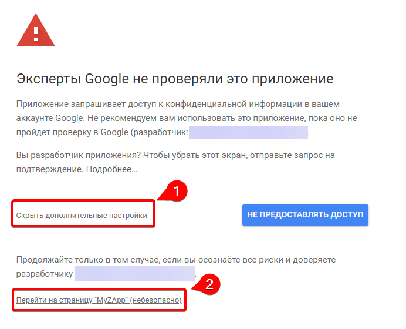

:::info **Пожалуйста, ознакомьтесь с [*Правилами использования материалов на данном ресурсе*](../Disclaimer).**
:::

> 🔗 **[Оригинальная страница](https://zennolab.atlassian.net/wiki/spaces/RU/pages/1667727363/Google)** — Источник данного материала

_______________________________________________  
# Настройка подключения Google Таблиц

## Вступление

Для того, чтобы начать пользоваться [❗→ Google-таблицами](https://zennolab.atlassian.net/wiki/spaces/RU/pages/724566092/Google "https://zennolab.atlassian.net/wiki/spaces/RU/pages/724566092/Google") в ZennoPoster, нужно выполнить следующие действия.

## Создание нового ключа Google API

### Создание нового приложения

- Войдите в свой Google аккаунт или создайте [новый](https://support.google.com/accounts/answer/27441?hl=ru "https://support.google.com/accounts/answer/27441?hl=ru").
- Зайдите в [Google Cloud Platform](https://console.developers.google.com/?hl=ru "https://console.developers.google.com/?hl=ru"). При первом заходе на сайт надо будет:

 - выбрать страну (1)
 - прочитать правила использования сервисов и, если Вы согласны с ними, принять их, отметив соответствующую настройку (2)
 - (опционально) согласиться на рассылку по email (3)
 - в конце нажать **AGREE AND CONTINUE** (4)

- Выберите раздел **OAuth consent screen** (1) и нажмите **CREATE PROJECT** (2).
Будет создан новый проект.

- Введите любое название проекта в поле **Project name** (1), но только на английском языке, **Location** (Местоположение, если нужно) (2) и нажмите **CREATE**(3).

- В следующем окне выберите **External** (1) и нажмите **CREATE** (2)

- В открывшемся окне надо ввести любое имя приложения в поле **App name** (1), выбрать email в списке **User support email** (2)

- Прокрутите страницу в самый низ и ещё раз введите свой email (3) и нажмите **SAVE AND CONTINUE** (4)

- В следующем окне (**Scopes**) просто проматываем страницу в самый низ и нажимаем **SAVE AND CONTINUE**.

- В окне Test users тоже пролистываем вниз и нажимаем **SAVE AND CONTINUE**.

- В новом окне (**Summary**) пролистываем вниз и нажимаем **BACK TO DASHBOARD**.

### Публикация проекта

#### Testing mode

:::warning Внимание
В этом режиме каждые 7 дней будет необходимо переавторизоваться в приложении (на май 2021 года. В последствии Google может изменить этот срок). Ссылка на справку Google.
:::

:::warning Внимание
Количество тестовых пользователей ограничено - их может быть не больше 100!После добавления пользователя в список тестеров удалить его оттуда уже нельзя!
:::

Можно оставить приложение в тестовом режиме. Тогда оно будет доступно только для аккаунта-создателя и пользователей, которые добавлены в список **Test Users**, для этого:

- на вкладке **OAuth consent screen** пролистайте чуть вниз и в разделе *Test users нажмите кнопку **+ADD USERS**.
- в открывшемся окне добавьте email адрес необходимого аккаунта и нажмите кнопку **SAVE**.

#### Publish App

Так же Вы можете опубликовать приложение. Тогда оно будет доступно всем пользователям у которых есть Google аккаунт.

В открывшемся окне нажмите кнопку **PUBLISH APP**

- **CONFIRM** во всплывающем окне

### Создание учётных данных

- В разделе **Credentials** (1) нажмите **CREATE CREDENTIALS** (2) и выберите пункт **OAuth client ID** (3)

- Выберите пункт **Desktop app** в выпадающем списке **Application type** (1) и нажмите **CREATE** (2)

- Откроется новое окно **OAuth client created**, в нём нажмите **OK**.

- После этого кликните либо по названию только что созданного приложения либо по значку его редактирования

- В открывшемся окне необходимо скачать ключ в виде файла, для этого нажмите кнопку **DOWNLOAD JSON**.

## Включение использования API Google Sheets и Drive

:::warning Внимание
Внимание! Очень важно включить оба API, иначе программа будет работать не корректно.
:::

Для корректной работы Google-таблиц осталось совсем не много!

- Для включения *Google Sheets API, перейдите по [этой ссылке](https://console.developers.google.com/apis/library/sheets.googleapis.com "https://console.developers.google.com/apis/library/sheets.googleapis.com").
- Выберите Ваш проект (1) и нажмите **ENABLE** (2).

- Для включения *Google Drive API, перейдите по [этой ссылке](https://console.developers.google.com/apis/library/drive.googleapis.com "https://console.developers.google.com/apis/library/drive.googleapis.com").
- Выберите Ваш проект (1) и нажмите **ENABLE** (2).

## Добавление ключа в программу

:::warning Внимание
Таблицы надо подключать отдельно в ProjectMaker и ZennoPoster
:::

- Откройте [❗→ настройки Google таблиц](https://zennolab.atlassian.net/wiki/spaces/RU/pages/735576090/Google+PM "https://zennolab.atlassian.net/wiki/spaces/RU/pages/735576090/Google+PM") (**Редактирование =&gt; Настройки =&gt; Google таблицы**)
- Нажмите […] и выберите файл учётных данных (1), нажмите **Подключить** (2).

:::warning Внимание
Файл обязательно должен иметь расширение .json!
:::

- После этого, откроется окно браузера, где необходимо будет войти в свой аккаунт Google, где Вы создавали ключ.
- Так как Вы только что создали свое приложение, может появиться окно с предупреждением. Поскольку, Вы доверяете своему приложению, необходимо выбрать **Дополнительные настройки** (1) и **Перейти на страницу "Ваше приложение"** (2).

- После этого, разрешите доступ Вашего нового приложения к данным вашего аккаунта, чтобы можно было читать и записывать таблицы.

- Затем снова:

- После этого в браузере появится надпись **Received verification code. You may now close this window** - это означает что всё было сделано правильно! Можете закрыть эту вкладку браузера.

## Лимиты запросов к API

### Какие есть ограничения?

Есть [ограничения на количество запросов](https://developers.google.com/analytics/devguides/config/mgmt/v3/limits-quotas?hl=ru "https://developers.google.com/analytics/devguides/config/mgmt/v3/limits-quotas?hl=ru"): 50 000 запросов в сутки на один проект и 10 запросов в секунду на один IP-адрес (эти лимиты актуальны на май 2021 года).

### Где можно увидеть текущее количество сделанных запросов?

Вы можете найти эту информацию в [Dashboard'е Google Cloud Platform](https://console.cloud.google.com/apis/dashboard?hl=ru "https://console.cloud.google.com/apis/dashboard?hl=ru") (не забудьте выбрать правильный проект).

### Как увеличить лимиты?

Информацию о том, как расширить лимиты Вы можете найти по этой ссылке - [Запрос дополнительной квоты](https://developers.google.com/analytics/devguides/config/mgmt/v3/limits-quotas?hl=ru#additional_quota "https://developers.google.com/analytics/devguides/config/mgmt/v3/limits-quotas?hl=ru#additional_quota").

### Как ZennoPoster расходует лимиты?

На количество запросов, в упрощенном виде, влияют два фактора - изменялась ли таблица и включена ли загрузка сторонних изменений ([❗→ настройка](https://zennolab.atlassian.net/wiki/spaces/RU/pages/735576090/Google+PM "https://zennolab.atlassian.net/wiki/spaces/RU/pages/735576090/Google+PM") *Политика обработки изменений таблицы).

Если загрузка сторонних изменений включена, то каждую минуту будет отправляться запрос к Drive API для сравнения версий таблиц. 

При изменении самой таблицы используются разные виды запросов, в целом до 5 запросов на таблицу в минуту. Т.е. если активно меняются 10 таблиц, то будет максимум около 60 запросов в минуту (Sheets API + Drive API).

  

## Возможные ошибки

### Ошибка авторизации (Ошибка 403: access\_denied)

Нажмите здесь, чтобы развернуть

**Подробный текст ошибки**: *The developer hasn’t given you access to this app. It’s currently being tested and it hasn’t been verified by Google. If you think you should have access, contact the developer

**Решение**: созданное Вами приложение для доступа к Google API находится в тестовом режиме и аккаунт, с которого Вы пытаетесь авторизоваться не является создателем этого приложения и не находится в списке тестовых пользователей.
Как опубликовать приложение или добавить пользователя в список тестовых Вы можете прочитать в этой же статье, в подразделе [❗→ Публикация проекта](https://zennolab.atlassian.net/wiki/spaces/RU/pages/1667727363/Google#Публикация-проекта "https://zennolab.atlassian.net/wiki/spaces/RU/pages/1667727363/Google#Публикация-проекта").

  

## Полезные ссылки

- [❗→ Операции над Google-таблицами](/wiki/spaces/RU/pages/509411347 "/wiki/spaces/RU/pages/509411347")
- [❗→ Google таблицы (PM)](/wiki/spaces/RU/pages/735576090 "/wiki/spaces/RU/pages/735576090")
- [❗→ Многопоточная работа с Google-таблицами (Версия 7.1.7.0 и выше)](/wiki/spaces/RU/pages/851673094 "/wiki/spaces/RU/pages/851673094")