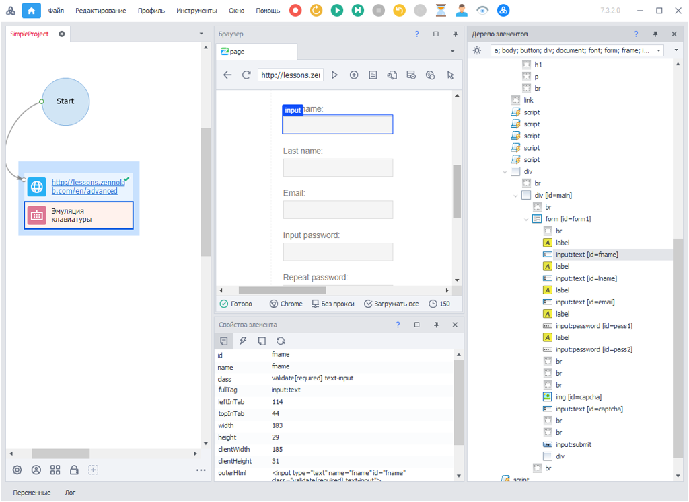
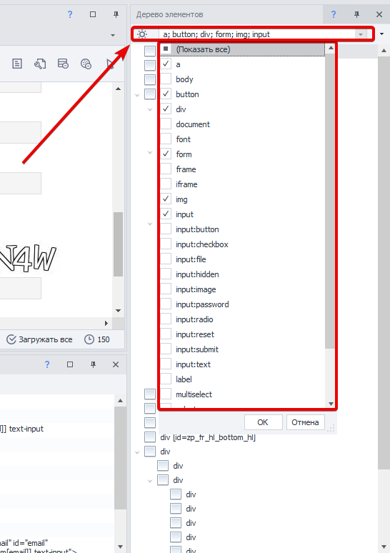
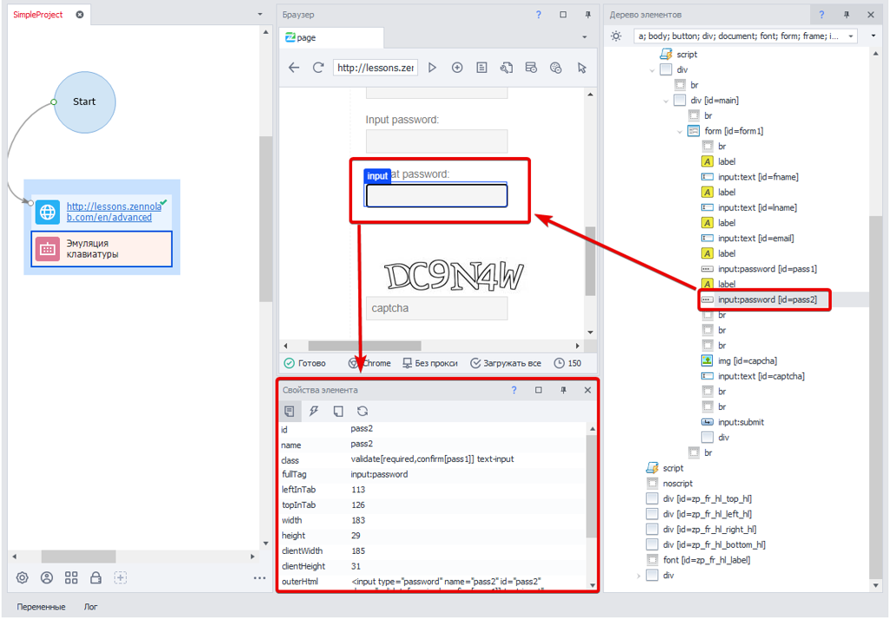

---
sidebar_position: 5
title: "Работа с элементами веб-страниц"
description: ""
date: "2025-07-20"
converted: true
originalFile: "Работа с элементами веб-страниц.txt"
targetUrl: "https://zennolab.atlassian.net/wiki/spaces/RU/pages/486408229/-"
---
:::info **Пожалуйста, ознакомьтесь с [*Правилами использования материалов на данном ресурсе*](../Disclaimer).**
:::

> 🔗 **[Оригинальная страница](https://zennolab.atlassian.net/wiki/spaces/RU/pages/486408229/-)** — Источник данного материала

_______________________________________________  
# Работа с элементами веб-страниц

## Дерево элементов

Когда не удаётся подобраться к нужному элементу с помощью [❗→ конструктора действий](/wiki/spaces/RU/pages/483426337 "/wiki/spaces/RU/pages/483426337"), можно открыть [❗→ Окно дерева элементов](/wiki/spaces/RU/pages/727777355 "/wiki/spaces/RU/pages/727777355") и попробовать найти элемент в этом окне. В данном окне элементы имеют древовидную структуру. 

Используя визуальное расположение элементов в дереве, Вы можете найти близлежащие элементы, вложенные элементы и элементы, содержащие текущий. Правым кликом мыши на элементе в дереве, можно отправить его данные уже в конструктор.

Используя фильтр Вы можете выделить только те HTML элементы, которые Вас интересуют:

## Свойства элемента

Выделяя тот или иной элемент в дереве Вы можете посмотреть его [❗→ свойства в соответствующем окне](/wiki/spaces/RU/pages/735608879 "/wiki/spaces/RU/pages/735608879"). Он при этом будет подсвечен рамкой в браузере.

Данные свойства Вы можете использовать в конструкторе действия для создания экшенов.

При активации режима [❗→ Следовать за курсором](https://zennolab.atlassian.net/wiki/spaces/RU/pages/534315373#%D0%A1%D0%BB%D0%B5%D0%B4%D0%BE%D0%B2%D0%B0%D1%82%D1%8C-%D0%B7%D0%B0-%D0%BA%D1%83%D1%80%D1%81%D0%BE%D1%80%D0%BE%D0%BC "https://zennolab.atlassian.net/wiki/spaces/RU/pages/534315373#%D0%A1%D0%BB%D0%B5%D0%B4%D0%BE%D0%B2%D0%B0%D1%82%D1%8C-%D0%B7%D0%B0-%D0%BA%D1%83%D1%80%D1%81%D0%BE%D1%80%D0%BE%D0%BC") свойства элемента и его позиция в дереве обновляются в режиме реального времени.