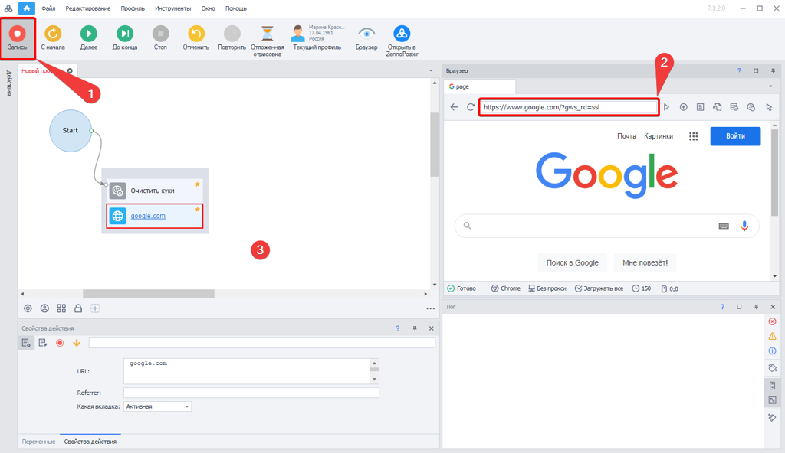
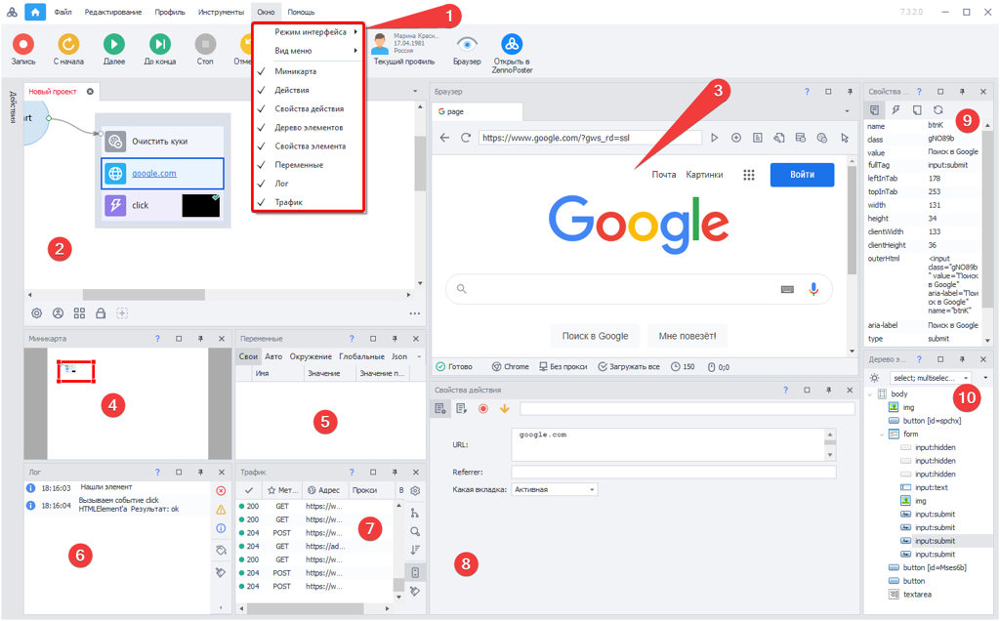
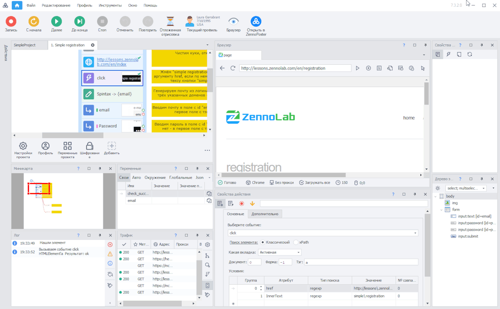
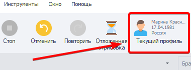
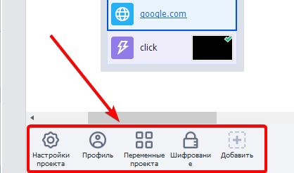
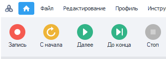

---
sidebar_position: 2
title: "Создание проекта"
description: ""
date: "2025-07-20"
converted: true
originalFile: "Создание проекта.txt"
targetUrl: "https://zennolab.atlassian.net/wiki/spaces/RU/pages/925728769"
---
:::info **Пожалуйста, ознакомьтесь с [*Правилами использования материалов на данном ресурсе*](../Disclaimer).**
:::

> 🔗 **[Оригинальная страница](https://zennolab.atlassian.net/wiki/spaces/RU/pages/925728769)** — Источник данного материала

_______________________________________________  
# Создание проекта

## С чего начинается запись

После запуска программы перед Вами будет [❗→ Стартовая страница](/wiki/spaces/RU/pages/735608964 "/wiki/spaces/RU/pages/735608964") где необходимо либо нажать *Новый проект, либо *Открыть существующий после чего откроется основная рабочая область в которой располагаются основные окна для создания и редактирования проекта.

Для того чтобы начать запись нажмите кнопку [1] (см. скриншот). После этого Вы можете ввести в адресную строку браузера [2] адрес сайта, с которым планируете работать и производить запись путем совершения действий в браузере. Либо можете добавлять экшены в проект вручную, кликнув правой клавишей мыши на любое пустое место в проекте [3].

|  |
| :--: |
| На скриншоте окна расположены согласно настройке: Окно =&gt; Режим интерфейса =&gt; Стандартный |

## Основные окна

В основном рабочем окне программы Вы можете разместить 9 функциональных окон. Их можно перетаскивать, изменять в размерах в зависимости от того как Вам удобнее. Часть окон можно закрыть, если Вы ими не пользуетесь или пользуетесь редко. Восстановить закрытые окна можно через меню [1].

### [2] Окно проекта

В данном окне при записи появляются [❗→ экшены](https://zennolab.atlassian.net/wiki/spaces/RU/pages/486342706/ProjectMaker "https://zennolab.atlassian.net/wiki/spaces/RU/pages/486342706/ProjectMaker"), когда Вы совершаете какие-либо действия в браузере [3]. Вы можете также создавать новые экшены вручную (правый клик мыши). Их можно перетаскивать, объединять в группы, соединять логическими связями, выстраивая последовательность для выполнения проекта.

### [3] Браузер

В [❗→ данном окне](/wiki/spaces/RU/pages/534315373 "/wiki/spaces/RU/pages/534315373")Вы можете открывать различные сайты и записывать пошагово действия путем нажатия ссылок, заполнения текстовых полей и т.д. Вверху данного окна имеются пиктограммы навигации, остановки загрузки страницы, управление вкладками, опции очистки кэша и куков + инструмент просмотра исходного кода, DOM и текста страницы.

[❗→ Подробнее](/wiki/spaces/RU/pages/534315373 "/wiki/spaces/RU/pages/534315373").

### [4] Миникарта

Перетаскивая рамку по схематичному отображению Вашего проекта Вы сможете легко изменить фокус в самом окне проекта. Это актуально при создании больших шаблонов.

[❗→ Подробнее](/wiki/spaces/RU/pages/735772693 "/wiki/spaces/RU/pages/735772693").

### [5] Переменные

В данном окне отображаются текущие значения переменных проекта. Во время отладки Вы можете наблюдать и анализировать их значения.

[❗→ Подробнее](/wiki/spaces/RU/pages/735608872 "/wiki/spaces/RU/pages/735608872").

### [6] Лог

В логе при отладке появляются сообщение об успешно выполненных действиях и о возникших ошибках. Это помогает исправить и доработать проект до готового вида.

[❗→ Подробнее](/wiki/spaces/RU/pages/725352532 "/wiki/spaces/RU/pages/725352532").

### [7] Окно трафика

В данном окне будут отображены все запросы, которые сделает браузер ProjectMaker. А также запросы сделанные с помощью [❗→ экшенов HTTP запросов](/wiki/spaces/RU/pages/534085713 "/wiki/spaces/RU/pages/534085713").

[❗→ Подробнее](/wiki/spaces/RU/pages/735805465 "/wiki/spaces/RU/pages/735805465").

### [8] Свойства действия

При выделении того или иного экшена в окне проекта [1], здесь Вы можете заполнить и изменить настройки его работы.

[❗→ Подробнее](/wiki/spaces/RU/pages/494731280 "/wiki/spaces/RU/pages/494731280").

### [9] Свойства элемента

Если у Вас активирован режим «Следовать за курсором» (правый клик мыши в окне браузера), то при наведении курсора на тот или иной элемент на страницы, Вы сможете посмотреть его свойства. Также свойства элементов будут отображаться при работе с [❗→ конструктором действий](/wiki/spaces/RU/pages/483426337 "/wiki/spaces/RU/pages/483426337") (правый клик мыши в окне браузера) и деревом элементов [10].

[❗→ Подробнее](/wiki/spaces/RU/pages/735608879 "/wiki/spaces/RU/pages/735608879").

### [10] Дерево элементов

Когда Вы не можете сразу идентифицировать элемент в браузере, Вы можете отыскать его в окне дерева элементов. Оно представляет собой структурированный наглядный вид кода с древовидной структурой, с помощью которого Вы легко найдете нужный Вам элемент на странице.

[❗→ Подробнее](/wiki/spaces/RU/pages/727777355 "/wiki/spaces/RU/pages/727777355").

## Данные проекта

### Текущие данные профиля

Используемые параметры профиля Вы можете посмотреть при отладке, кликнув на соответствующую иконку. 

[❗→ Подробнее](/wiki/spaces/RU/pages/735903758 "/wiki/spaces/RU/pages/735903758").

### Настройки проекта

Управлять параметрами проекта можно с помощью настроек из Панели статических блоков. 

[❗→ Подробнее](/wiki/spaces/RU/pages/534053179 "/wiki/spaces/RU/pages/534053179").

## Взаимодействие браузера и проекта

Проект и браузер синхронизируются в режиме реального времени. Вы можете производить отладку с любой точки шаблона. При возникновении ошибки на том или ином этапе отладки Вы можете на ходу исправить параметры экшена и сразу протестировать его работу с новыми параметрами. Дозаписать проект возможно также в любой момент, нажав на кнопку «Запись» в верхнем меню.

Используя кнопки отладки Вы можете инициировать прогон проекта с самого начала, пошагово, до точки останова. Выделив любой экшен, Вы можете протестировать его работу в рамках текущей страницы браузера.