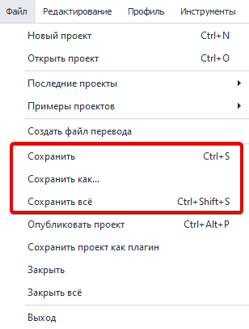
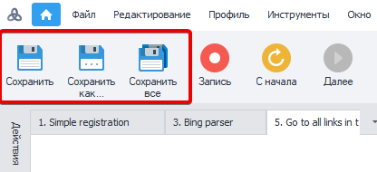
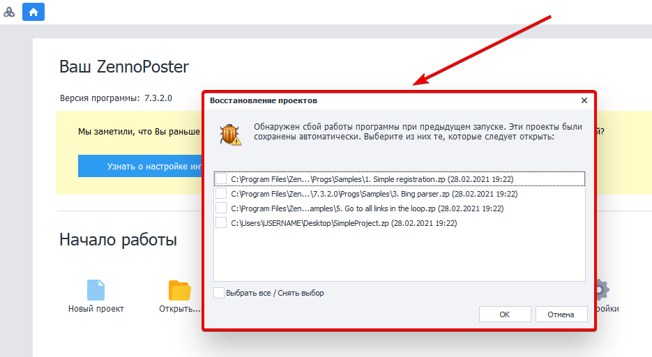
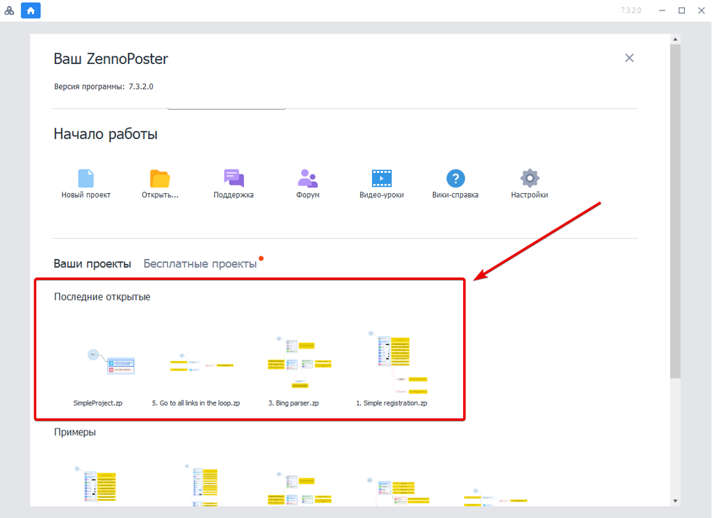

---
sidebar_position: 8
title: "Сохранение проекта"
description: ""
date: "2025-07-20"
converted: true
originalFile: "Сохранение проекта.txt"
targetUrl: "https://zennolab.atlassian.net/wiki/spaces/RU/pages/486342692"
---
:::info **Пожалуйста, ознакомьтесь с [*Правилами использования материалов на данном ресурсе*](../Disclaimer).**
:::

> 🔗 **[Оригинальная страница](https://zennolab.atlassian.net/wiki/spaces/RU/pages/486342692)** — Источник данного материала

_______________________________________________  
# Сохранение проекта

## Сохранение

Вы можете сохранять проекты несколькими способами:

- используя [❗→ горячие клавиши](/wiki/spaces/RU/pages/475332762 "/wiki/spaces/RU/pages/475332762") **Ctrl+S**
- с помощью меню

- с помощью кнопок на панели инструментов (предварительно [❗→ добавив кнопки с помощью настроек](https://zennolab.atlassian.net/wiki/spaces/RU/pages/735576065#%D0%9D%D0%B0%D1%81%D1%82%D1%80%D0%BE%D0%B9%D0%BA%D0%B8-%D0%BA%D0%BD%D0%BE%D0%BF%D0%BE%D0%BA-%D1%80%D0%B0%D0%B7%D0%B4%D0%B5%D0%BB%D0%BE%D0%B2 "https://zennolab.atlassian.net/wiki/spaces/RU/pages/735576065#%D0%9D%D0%B0%D1%81%D1%82%D1%80%D0%BE%D0%B9%D0%BA%D0%B8-%D0%BA%D0%BD%D0%BE%D0%BF%D0%BE%D0%BA-%D1%80%D0%B0%D0%B7%D0%B4%D0%B5%D0%BB%D0%BE%D0%B2"))

При создании больших проектов рекомендуем периодически самостоятельно производить сохранение проектов во избежание потери данных при зависании программы на слабых машинах.

## Бэкапы проекта

Автоматическое сохранение проектов происходит раз в 5 минут. При несохранении текущего проекта при следующем запуске программы Вам будет предложено его восстановить из бэкапа. Таким образом, даже при некорректном завершении программы можно свести к минимуму потерю данных.

## Загрузка

Загружать проекты можно как из самого ProjectMaker, так и по двойному клику на файле в проводнике Windows.

Последние проекты, над которыми Вы работали, удобно отображаются при старте программы:

