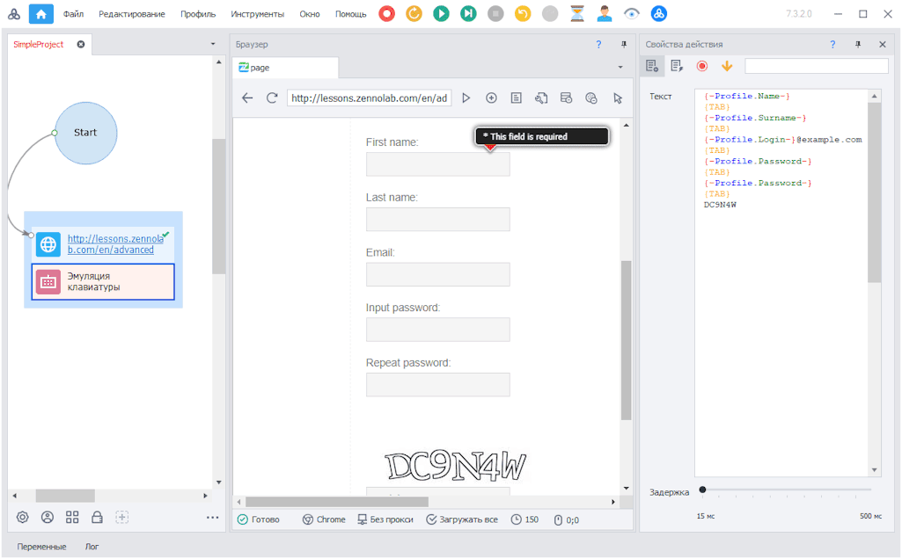

---
sidebar_position: 4
title: "Эмуляция мыши и клавиатуры"
description: ""
date: "2025-07-20"
converted: true
originalFile: "Эмуляция мыши и клавиатуры.txt"
targetUrl: "https://zennolab.atlassian.net/wiki/spaces/RU/pages/489291804"
---
:::info **Пожалуйста, ознакомьтесь с [*Правилами использования материалов на данном ресурсе*](../Disclaimer).**
:::

> 🔗 **[Оригинальная страница](https://zennolab.atlassian.net/wiki/spaces/RU/pages/489291804)** — Источник данного материала

_______________________________________________  
# Эмуляция мыши и клавиатуры

## Для чего используется эмуляция

- Необходимо послать клики мыши в указанные координаты на web странице;
- Необходимо эмулировать нажатие клавиш, например, «Escape» или «Enter» на web странице;
- Многие сайты ввели защиту от ботов, отслеживая, нажимаются ли клавиши при заполнении полей ввода. Эмуляция мыши и клавиатуры поможет обойти эту защиту.

## Где и как используется

Для [❗→ эмуляции клика мыши](/wiki/spaces/RU/pages/534315158 "/wiki/spaces/RU/pages/534315158") Вам потребуется указать координаты, в пределах которых произойдёт клик, и выбрать, какой клавишей мыши кликать. Также можно выбрать тип распределения: нормальное - более вероятно попадание ближе к центру,  или равномерное - ровное распределение в пределах указанных координат.

Для [❗→ эмуляции ввода текста с клавиатуры](/wiki/spaces/RU/pages/735608949 "/wiki/spaces/RU/pages/735608949") потребуется ввести сам текст, и указать время задержки между нажатием. Чтобы эмулировать нажатие специальных клавиш, нажмите **Ctrl+Space** на поле ввода текста, в открывшемся списке выберите нужную кнопку.

При заполнении полей и кликах на кнопки и ссылки, эмуляция включена по умолчанию. В [❗→ настройках проекта](/wiki/spaces/RU/pages/534315477 "/wiki/spaces/RU/pages/534315477") можно централизованно изменять уровень эмуляции для всех экшенов, заполняющих поля на web странице и кликающих по кнопкам и ссылкам. У каждого экшена [❗→ есть своя настройка](https://zennolab.atlassian.net/wiki/spaces/RU/pages/534315117#%D0%9D%D0%B0%D1%81%D1%82%D1%80%D0%BE%D0%B9%D0%BA%D0%B0-%D0%B4%D0%B5%D0%B9%D1%81%D1%82%D0%B2%D0%B8%D1%8F%3A--%D0%92%D0%BA%D0%BB%D0%B0%D0%B4%D0%BA%D0%B0-%E2%80%9C%D0%94%D0%BE%D0%BF%D0%BE%D0%BB%D0%BD%D0%B8%D1%82%D0%B5%D0%BB%D1%8C%D0%BD%D0%BE%E2%80%9D%5BhardBreak%5D "https://zennolab.atlassian.net/wiki/spaces/RU/pages/534315117#%D0%9D%D0%B0%D1%81%D1%82%D1%80%D0%BE%D0%B9%D0%BA%D0%B0-%D0%B4%D0%B5%D0%B9%D1%81%D1%82%D0%B2%D0%B8%D1%8F%3A--%D0%92%D0%BA%D0%BB%D0%B0%D0%B4%D0%BA%D0%B0-%E2%80%9C%D0%94%D0%BE%D0%BF%D0%BE%D0%BB%D0%BD%D0%B8%D1%82%D0%B5%D0%BB%D1%8C%D0%BD%D0%BE%E2%80%9D%5BhardBreak%5D") эмуляции, которая может перебить централизованную настройку.

В экшене эмуляции клавиатуры можно использовать простой текст, переменные проекта и специальные клавиши (`{TAB}`**, `{ENTER}`**, `{BACKSPACE}`**, `{CTRL}` и другие. Чтобы получить полный список доступных клавиш нажмите CTRL+ПРОБЕЛ в поле ввода текста):

Также смотрите [❗→ поиск по скриншоту](/wiki/spaces/RU/pages/492044304 "/wiki/spaces/RU/pages/492044304").

## C# методы движения виртуальной мыши:

- [**FullEmulationMouseMoveToHtmlElement**](https://help.zennolab.com/en/v5/zennoposter/5.10.4.1/webframe.html#topic384.html "https://help.zennolab.com/en/v5/zennoposter/5.10.4.1/webframe.html#topic384.html") - переместить виртуальную мышь к элементу из текущего положения виртуальной мыши;
- [**FullEmulationMouseMove**](https://help.zennolab.com/en/v5/zennoposter/5.10.4.1/webframe.html#topic382.html "https://help.zennolab.com/en/v5/zennoposter/5.10.4.1/webframe.html#topic382.html") - переместить виртуальную мышь к координатам из текущего положения виртуальной мыши;
- [**FullEmulationMouseClick**](https://help.zennolab.com/en/v5/zennoposter/5.10.4.1/webframe.html#topic381.html "https://help.zennolab.com/en/v5/zennoposter/5.10.4.1/webframe.html#topic381.html") - кликнуть мышкой в текущем положении виртуальной мыши;
- [**FullEmulationMouseMoveAboveHtmlElement**](https://help.zennolab.com/en/v5/zennoposter/5.10.4.1/webframe.html#topic383.html "https://help.zennolab.com/en/v5/zennoposter/5.10.4.1/webframe.html#topic383.html") - эмуляция чтения элемента;
- Свойство [**FullEmulationMouseCurrentPosition**](https://help.zennolab.com/en/v5/zennoposter/5.10.4.1/webframe.html#topic413.html "https://help.zennolab.com/en/v5/zennoposter/5.10.4.1/webframe.html#topic413.html") - возвращает текущую позицию виртуальной мыши.
- Метод [**FullEmulationMouseSetOptions**](https://help.zennolab.com/en/v5/zennoposter/5.10.4.1/webframe.html#topic385.html "https://help.zennolab.com/en/v5/zennoposter/5.10.4.1/webframe.html#topic385.html") - устанавливает параметры эмуляции мыши, метод нужно вызывать после каждого вызова метода Navigate, метод доступен начиная с версии 5.10.4.1.