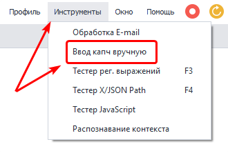
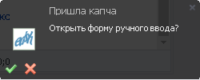
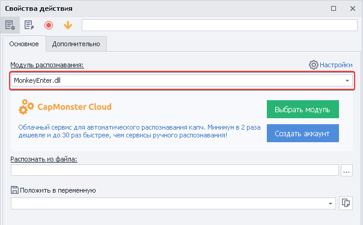
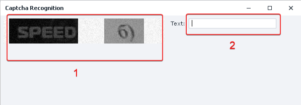
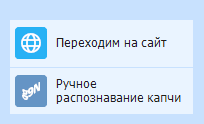

---
sidebar_position: 2
title: "Ввод капч вручную"
description: ""
date: "2025-08-25"
converted: true
originalFile: "Ввод капч вручную.txt"
targetUrl: "https://zennolab.atlassian.net/wiki/spaces/RU/pages/534053215"
---
:::info **Пожалуйста, ознакомьтесь с [*Правилами использования материалов на данном ресурсе*](../Disclaimer).**
:::

> 🔗 **[Оригинальная страница](https://zennolab.atlassian.net/wiki/spaces/RU/pages/534053215)** — Источник данного материала

_______________________________________________  

## Описание

С каждым днём защита сайтов в виде капч усложняет массовое выполнение. Если сервисы не смогут разгадать, то вы всегда можете это сделать вручную.

:::warning Внимание
Экшен работает только с простыми, текстовыми капчами. Распознать с его помощью Recaptcha, Funcaptcha, HCaptcha и другие сложные капчи не выйдет.
:::

  

## Как открыть окно?

С помощью верхнего меню **Инструменты =&gt; Ввод капч вручную**.

Так же можно открыть через всплывающее окно в правом нижнем углу (это окно появляется когда происходит отправка из экшена [❗→ Распознать каптчу](https://zennolab.atlassian.net/wiki/spaces/RU/pages/534053026 "https://zennolab.atlassian.net/wiki/spaces/RU/pages/534053026") .

  

## Для чего это используется?

- Разгадывание капчи без использования сервисов.

  

## Как работать с окном?

### Подготовка 

Добавляем в проект экшен [❗→ Распознать капчу](https://zennolab.atlassian.net/wiki/spaces/RU/pages/534053026 "https://zennolab.atlassian.net/wiki/spaces/RU/pages/534053026")

Из списка выбираем модуль распознавания **MonkeyEnter.dll**

  

### Разгадывание капчи

1. Капча, которую необходимо разгадать.
2. Вводим результат.
3. Нажимаем клавишу **Enter**.
4. Ответ вносится в переменную, которую мы указали при настройке экшена [❗→ Распознать капчу](https://zennolab.atlassian.net/wiki/spaces/RU/pages/534053026 "https://zennolab.atlassian.net/wiki/spaces/RU/pages/534053026").

:::warning Внимание
Данный способ не подходит для разгадывания ReCaptcha2, ReCaptcha3, FunCaptcha, hCaptcha.
:::

  

## Пример использования

Нужно отправить сообщение на форуме, где установленная неизвестная сервисам капча.

1. Добавляем в проект экшен [❗→ Распознать капчу](https://zennolab.atlassian.net/wiki/spaces/RU/pages/534053026 "https://zennolab.atlassian.net/wiki/spaces/RU/pages/534053026").
2. Выбираем модуль распознавания **MonkeyEnter.dll.**
3. Открываем удобным способ окно ввода капчи.
4. Вносим результат разгадывания.
5. Отправляем сообщение.

Таким образом если вам попался новый вид капчи, то Ваша работа не будет остановлена. Вы всегда можете воспользоваться альтернативой сервисам в виде ручного ввода.

  

## Полезные ссылки

1. [❗→ Распознать капчу](https://zennolab.atlassian.net/wiki/spaces/RU/pages/534053026 "https://zennolab.atlassian.net/wiki/spaces/RU/pages/534053026")
2. [❗→ Распознать ReCaptcha](https://zennolab.atlassian.net/wiki/spaces/RU/pages/534053033/ReCaptcha "https://zennolab.atlassian.net/wiki/spaces/RU/pages/534053033/ReCaptcha")