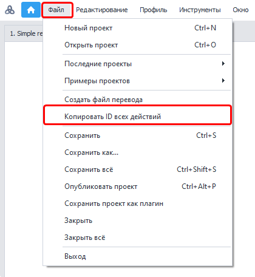

---
sidebar_position: 11
title: "Копировать ID всех действий"
description: ""
date: "2025-08-25"
converted: true
originalFile: "Копировать ID всех действий.txt"
targetUrl: "https://zennolab.atlassian.net/wiki/spaces/RU/pages/2013626428/ID"
---
:::info **Пожалуйста, ознакомьтесь с [*Правилами использования материалов на данном ресурсе*](../Disclaimer).**
:::

> 🔗 **[Оригинальная страница](https://zennolab.atlassian.net/wiki/spaces/RU/pages/2013626428/ID)** — Источник данного материала

_______________________________________________  

:::info Информация
Добавлено в ZennoPoster 7.5.0.0
:::

## Описание

Данная функция позволяет получить комментарии и ID для всех действий в проекте.

  

## Как это работает?




Достаточно кликнуть по пункту “Копировать ID всех действий” из меню “Файл” и данные автоматически будут помещены в буфер обмена, после чего их можно вставить в любой текстовый редактор.

  

## Формат данных

Информация по каждому экшену будет размещена с новой строки.
Сначала *комментарий экшена, затем, через символ табуляции, ID экшена.

Ниже можно увидеть пример вывода данных для проекта Simple registration.zp (этот проект поставляется с каждой копией ZennoPoster, найти его можно на [❗→ стартовой странице](https://zennolab.atlassian.net/wiki/spaces/RU/pages/735608964 "https://zennolab.atlassian.net/wiki/spaces/RU/pages/735608964"))

```
Очистить куки	cca-6467
http://lessons.zennolab.com/en/index	2a4729be-c63c-4c43-b955-c30fd3c7aabd
click	1431f77f-064c-43e8-82af-1034b3175b35
Spintax	63250dd2-3d78-4e20-8ae7-7c45a8b40772
email	8facc19e-465f-450d-989e-5293be48263d
Password	5ef8b1f4-92be-40ba-ae15-f04a295e9745
Password	7ea99429-fe9f-4048-a259-19441d0f492a
click	fa9c19ca-eef1-4a1e-ac9e-1563d8965663
Взять текст	tp-6515
'{check_success}' != ''	tv-4708
Registration failed	e8e3218e-9e05-4171-bf62-4a335f882a9f
Registration completed! {-Variable.email-}:{-Profile.Password-}	45b5a8fc-9240-4737-9724-be9818cce1de
```

  

## Полезные ссылки

- [❗→ Поиск по проекту](https://zennolab.atlassian.net/wiki/spaces/RU/pages/724566074 "https://zennolab.atlassian.net/wiki/spaces/RU/pages/724566074")