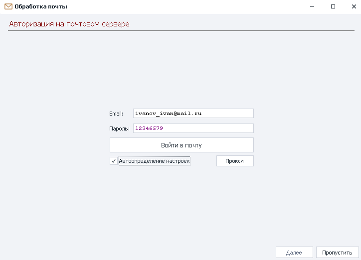
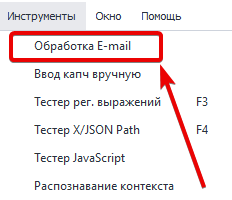
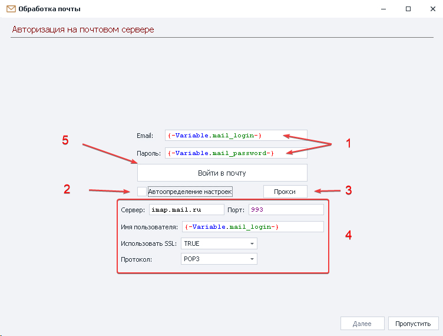
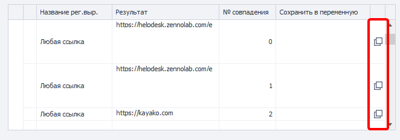

:::info **Пожалуйста, ознакомьтесь с [*Правилами использования материалов на данном ресурсе*](../Disclaimer).**
:::

> 🔗 **[Оригинальная страница](https://zennolab.atlassian.net/wiki/spaces/RU/pages/534086094/e-mail)** — Источник данного материала

_______________________________________________  

## Описание

Работа с почтовыми аккаунтами не используя окно браузера. Позволяет найти нужное письмо и информацию в нём. Подходит для массовой обработки входящей корреспонденции.

  

## Как добавить действие в проект?

- Через меню *Инструменты:

- Можно [❗→ добавить кнопку](https://zennolab.atlassian.net/wiki/spaces/RU/pages/735576065#%D0%9D%D0%B0%D1%81%D1%82%D1%80%D0%BE%D0%B9%D0%BA%D0%B8-%D0%BA%D0%BD%D0%BE%D0%BF%D0%BE%D0%BA-%D0%BC%D0%B5%D0%BD%D1%8E "https://zennolab.atlassian.net/wiki/spaces/RU/pages/735576065#%D0%9D%D0%B0%D1%81%D1%82%D1%80%D0%BE%D0%B9%D0%BA%D0%B8-%D0%BA%D0%BD%D0%BE%D0%BF%D0%BE%D0%BA-%D0%BC%D0%B5%D0%BD%D1%8E") для быстрого доступа:

Так же можно добавить через инструмент [❗→ Принять Почту](https://zennolab.atlassian.net/wiki/spaces/RU/pages/735576144 "https://zennolab.atlassian.net/wiki/spaces/RU/pages/735576144") перейдя в *Расширенный вид.

  

## Для чего это используется?

- Быстрый доступ к письмам
- Получения данных из письма
- Активация учетных записей на сайтах
- Удаление нужных писем из ящика
- Удаление загруженных писем

  

## Как настроить?

:::note На заметку
Перед работой с экшеном убедитесь, что в вашей учетной записи активирована опция работы через Imap.
:::

### Настройки входа в почтовый аккаунт

1. Указываем логин и пароль от учетной записи или переменные содержащие эти данные.
2. Установив чек-бокс Zennoposter сам подберёт параметры для соединения с почтовым сервером. **Работает не со всеми сервисами**.
3. Выбираем работать с прокси или через вашего провайдера.
4. Указываем данные для IMAP соединения, если Zennoposter не смог автоматически определить настройки . Данные можно взять на сайте сервиса.
5. Заполнив все поля нажимаем *Войти в почту для перехода к следующему шагу.

:::note На заметку
При возникновении ошибки на данном этапе появится комментарий в левом нижнем углу
:::

Исправьте ошибку, следуя рекомендациям.

  

### Поиск нужного письма из всех

#### Интервалы загрузки писем

Письма от сервисов могут приходить с задержкой, для этого указываем промежуток времени в секундах и количество попыток скачивания списка писем. Разделитель “**;**“ на скриншоте указывает на количество попыток. Первая через *15 сек, вторая - *30 сек, третья - *60 сек. 

#### Из каталога загружать не более

Указываем количество загружаемых писем.

#### Удалять скачанные

Удалит все скачанные письма. Если указали в предыдущем пункте 200 писем, то все будут удалены из ящика.

#### Обновить список

Получить список папок в почте.

#### Каталоги Imap

Можно отметить папки в которых будем искать нужное письмо - *Входящие, Спам, Исходящие, Черновики и др. Если оставить поле пустым, то скачивание будет происходить из папок *Inbox и *Спам.

#### Скачать письма

Zennoposter скачает с почты все письма согласно заданным выше параметрам.

#### Список скачанных писем

№1 на скриншоте

Поле покажет все скачанные письма с указанием *Темы письма, Имени и Почты отправителя.

#### Варианты отображения содержимого письма

№2 на скриншоте

- в исходном HTML-коде.
- только текст.
- Скрыть заголовки (отображать или скрыть служебные заголовки.)

#### Тело письма

№3 на скриншоте

Отображение тела письма.

#### Критерий поиска письма

Указываем критерий поиска письма используя [❗→ регулярные выражения](https://zennolab.atlassian.net/wiki/spaces/RU/pages/534086111 "https://zennolab.atlassian.net/wiki/spaces/RU/pages/534086111") и нажимаем *Искать письмо. Если всё сделано правильно, то в **Списке скачанных писем** ***зеленным цветом*** выделится нужное письмо. 

#### Удалять найденное письмо

Если включена данная настройка, то найденное письмо будет удалено из ящика после обработки.

Нажимаем *Далее и переходим к следующему шагу

:::note На заметку
Письмо должно находится в почте.
:::

  

### Поиск элемента в выбранном письме

#### Список регулярных выражений и найденных элементов

##### **Название рег. выр.**

Имя регулярного выражения.

##### **Результат**

То, что было найдено с помощью выражения.

##### **№ совпадения**

Часто по одному регулярному выражению может быть сразу несколько результатов. Тут отображается порядковый номер найденного элемента (нумерация с нуля!).

:::warning Внимание
Не рекомендуется в своих проекта привязываться к номеру совпадения. Т.к. сегодня письмо имеет одну структуру и нужная ссылка вторая, завтра текст письма изменится и нужная ссылка будет уже 7-я.Старайтесь подбирать регулярное выражение таким образом, чтоб в результате его работы оставалось только одно совпадение.
:::

##### **Сохранить в переменную**

В этой колонке Вы должны выбрать (или создать новую) переменную куда будет сохранён результат работы регулярки.

##### **Копировать макрос переменной в буфер обмена**

С помощью кнопок выделенных красной рамкой на скриншоте Вы можете скопировать макрос [❗→ переменной](https://zennolab.atlassian.net/wiki/spaces/RU/pages/486309922 "https://zennolab.atlassian.net/wiki/spaces/RU/pages/486309922").

:::tip Совет
Можно сохранять результат работы сразу нескольких регулярных выражений!Например в письме есть активационный код, адрес сайта, номер телефона, имя и фамилия - всё это Вы можете достать за одно действие! Достаточно под каждый элемент составить регулярное выражение и добавить переменные, в которые будет сохранён результат работы.
:::

#### Редактирование регулярных выражений

Если Вам не подходит ни одна из предустановленных регулярок то Вы можете создать свою.

##### **Создание с нуля**

  
После клика по кнопке с символом **+** (плюс) ** откроется окно [❗→ Конструктора регулярных выражений](https://zennolab.atlassian.net/wiki/spaces/RU/pages/534086111 "https://zennolab.atlassian.net/wiki/spaces/RU/pages/534086111"), в поле текста уже будет вставлен текст письма. Останется только создать выражение и назвать его (чтоб можно было легко отличить от других), затем нажать кнопку ОК. После этого Ваше регулярное выражение появится в общем списке. 

##### **Удаление**

  
При нажатии по кнопке с символом **-** (минус) будет удалено текущее выделенное в общем списке выражение.

:::warning Внимание
Удалить можно только созданные пользователем выражения.
:::

##### **Редактирование**

  
С помощью данного действия Вы можете отредактировать выделенное выражение.
Если для редактирования было выбрано предустановленное выражение, то после клика по кнопке ОК, в [❗→ Конструкторе выражений](https://zennolab.atlassian.net/wiki/spaces/RU/pages/534086111 "https://zennolab.atlassian.net/wiki/spaces/RU/pages/534086111"), в общий список будет добавлена новая регулярка.
Если же для редактирования было выбрано пользовательское выражение, то после клика по ОК в *Конструкторе изменения будут записаны в ту же, выделенную, регулярку.

  

### Завершение

Проделав все действия по поиску нужной информации нажимаем *Закончить.

  

Zennoposter предложит добавить экшен [❗→ Принять почту](https://zennolab.atlassian.net/wiki/spaces/RU/pages/735576144 "https://zennolab.atlassian.net/wiki/spaces/RU/pages/735576144") в проект для дальнейшего использования.

:::warning Внимание
В ситуациях когда в почте присутствуют два идентичных письма, экшен обработает самое новое.
:::

  

## Полезные ссылки

1. [❗→ Принять почту](https://zennolab.atlassian.net/wiki/spaces/RU/pages/735576144 "https://zennolab.atlassian.net/wiki/spaces/RU/pages/735576144")
2. [❗→ Тестер регулярных выражений](https://zennolab.atlassian.net/wiki/spaces/RU/pages/534086111 "https://zennolab.atlassian.net/wiki/spaces/RU/pages/534086111")
3. [❗→ Список](https://zennolab.atlassian.net/wiki/spaces/RU/pages/534053375 "https://zennolab.atlassian.net/wiki/spaces/RU/pages/534053375")