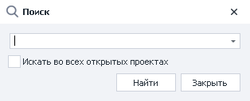
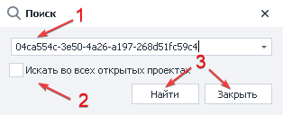
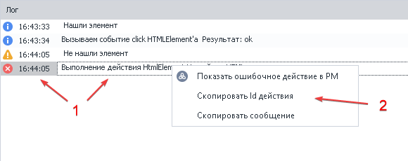

---
sidebar_position: 8
title: "Поиск по проекту"
description: ""
date: "2025-08-25"
converted: true
originalFile: "Поиск по проекту.txt"
targetUrl: "https://zennolab.atlassian.net/wiki/spaces/RU/pages/724566074"
---
:::info **Пожалуйста, ознакомьтесь с [*Правилами использования материалов на данном ресурсе*](../Disclaimer).**
:::

> 🔗 **[Оригинальная страница](https://zennolab.atlassian.net/wiki/spaces/RU/pages/724566074)** — Источник данного материала

_______________________________________________  

## Описание

Позволяет найти в проекте экшен по id или переменной, которую он использует.

  

## Как открыть окно в ProjectMaker?

- С помощью комбинации горячих клавиш **CTRL+F**
- Так же для удобства можно вынести кнопку на Панель инструментов сверху. Как это сделать можно [❗→ прочитать здесь](https://zennolab.atlassian.net/wiki/spaces/RU/pages/735576065#%D0%9D%D0%B0%D1%81%D1%82%D1%80%D0%BE%D0%B9%D0%BA%D0%B8-%D0%BA%D0%BD%D0%BE%D0%BF%D0%BE%D0%BA-%D0%BC%D0%B5%D0%BD%D1%8E "https://zennolab.atlassian.net/wiki/spaces/RU/pages/735576065#%D0%9D%D0%B0%D1%81%D1%82%D1%80%D0%BE%D0%B9%D0%BA%D0%B8-%D0%BA%D0%BD%D0%BE%D0%BF%D0%BE%D0%BA-%D0%BC%D0%B5%D0%BD%D1%8E").

  

## Для чего это используется?

- Отладка проекта
- Поиск ошибок, переменных и экшенов
- Быстрый переход к элементу проекта

  

## Как работает поиск?

1. Вводим в поле id экшена или название переменной.
2. Устанавливаем чек-бокс если открыто больше одного проекта и нужен поиск во всех.
3. Запускаем процесс или закрываем окно.

:::info Информация
На скрине указан id ошибки. Как его получить описано ниже.
:::

  

### Как получить id экшена

При работе проекта в [❗→ логе](https://zennolab.atlassian.net/wiki/spaces/RU/pages/725352532 "https://zennolab.atlassian.net/wiki/spaces/RU/pages/725352532") могут возникать ошибки.

1. Наводим курсор на сообщение и нажимаем правую кнопку мыши.
2. Кликаем на соответствующий раздел.

:::note На заметку
Начиная с ZennoPoster 7.3.2.0 можно скопировать id не только у сообщения об ошибке, но вообще у любого сообщения.
:::

  

## Пример использования

После написания проекта в ProjectMaker вы решили запустить его в Zennoposter. В ходе выполнения один из потоков отобразил ошибку, нужно её найти и исправить.

1. Копируем код ошибки в буфер обмена.
2. Переходим в окно Поиск по проекту.
3. Вставляем id ошибки.
4. Нас переносит к экшену, на котором возникла ошибка при выполнении определённого потока.
5. Устраняем ошибку или изменяем логику.

Способ применим не только для своих, но и для покупных шаблонов. Зачастую авторы продают свои продукты в закрытом виде и посмотреть, исправить мы не сможем. Просто скопируйте ошибку и передайте разработчику для дальнейшего устранения.

  

## Полезные ссылки

1. [❗→ Лог](https://zennolab.atlassian.net/wiki/spaces/RU/pages/725352532 "https://zennolab.atlassian.net/wiki/spaces/RU/pages/725352532")