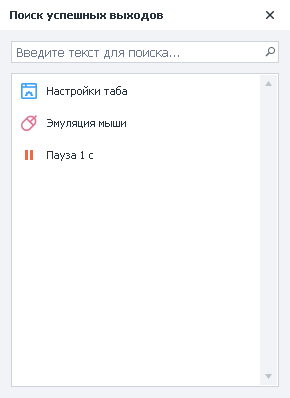
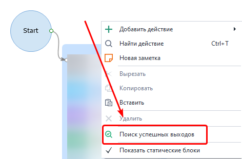
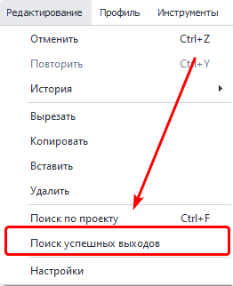
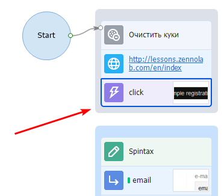
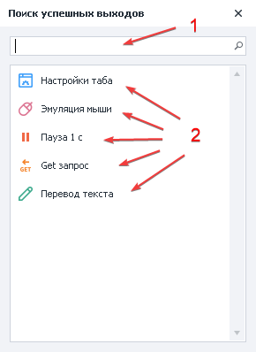

---
sidebar_position: 9
title: "Поиск успешных выходов"
description: ""
date: "2025-08-25"
converted: true
originalFile: "Поиск успешных выходов.txt"
targetUrl: "https://zennolab.atlassian.net/wiki/spaces/RU/pages/724566081"
---
:::info **Пожалуйста, ознакомьтесь с [*Правилами использования материалов на данном ресурсе*](../Disclaimer).**
:::

> 🔗 **[Оригинальная страница](https://zennolab.atlassian.net/wiki/spaces/RU/pages/724566081)** — Источник данного материала

_______________________________________________  
  
## Описание

Позволяет найти незапланированное “успешное” завершение проекта, а так же разрывы при работе шаблона.

  

## Как открыть окно?

- Вызываем контекстное меню правой кнопкой в любой части холста проекта и выбираем *Поиск успешных выходов.

- Либо через верхнее меню программы *Редактирование=&gt;*Поиск успешных выходов.

  

## Для чего это используется?

Иногда по неосторожности или невнимательности можно не соединить два экшена с помощью стрелок логики из-за чего проект будет работать не так как Вы задумали. 
Проявляться это может так: проект завершается успешно, но Вы видите, что он выполнил только часть работы, но при этом никаких ошибок не было.

Пример:

На скриншоте выше проект завершится успехом на экшене *click, т.к. он никак не соединён с другими экшенами.
Когда в проекте 5-10 [❗→ кубиков](https://zennolab.atlassian.net/wiki/spaces/RU/pages/486342706 "https://zennolab.atlassian.net/wiki/spaces/RU/pages/486342706") это не кажется проблемой, но если Вы работаете над большим проектом, содержащим сотни экшенов, то поиск такого “разрыва” вручную вряд ли доставит много удовольствия.

## Как работать с окном?

1. Строка быстрого поиска экшена или кубика с указанной функцией.
2. Список действий, которые приведут к успешному завершению проекта.
3. Дважды кликаем по действию в списке и фокус проекта сместится на этот экшен.

:::note На заметку
Поиск по функции производится если она указана внутри экшена
:::

  

## Пример использования

Для отладки рекомендуем после написания каждого шаблона пользоваться данной функцией.

1. Открываем окно.
2. Сверяем список удачный завершением с вашей логикой.
3. Исправляем шаблон при необходимости.

Таким образом если вы где-то ошиблись, то функция всегда поможет вам, показав удачные варианты завершения потока.

  

## Полезные ссылки

- [❗→ Редактор проектов](https://zennolab.atlassian.net/wiki/spaces/RU/pages/534052914 "https://zennolab.atlassian.net/wiki/spaces/RU/pages/534052914")