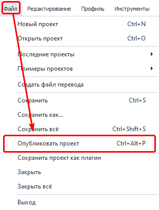
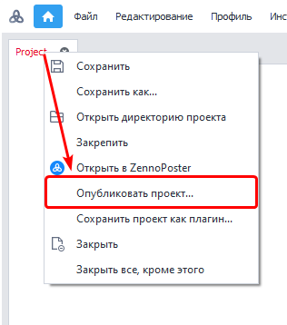
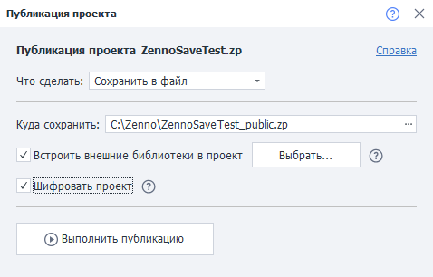
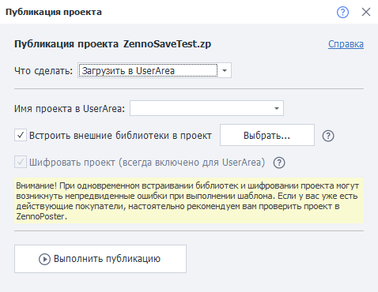
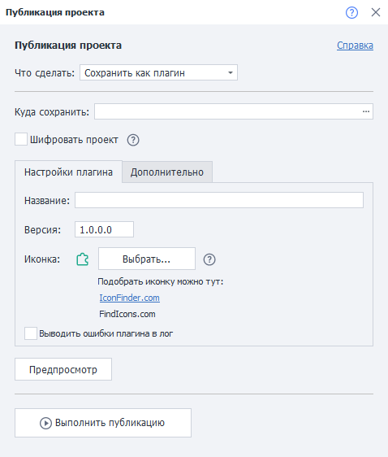

---
sidebar_position: 7
title: "Публикация проекта"
description: ""
date: "2025-08-25"
converted: true
originalFile: "Публикация проекта.txt"
targetUrl: "https://zennolab.atlassian.net/wiki/spaces/RU/pages/724566067"
---
:::info **Пожалуйста, ознакомьтесь с [*Правилами использования материалов на данном ресурсе*](../Disclaimer).**
:::

> 🔗 **[Оригинальная страница](https://zennolab.atlassian.net/wiki/spaces/RU/pages/724566067)** — Источник данного материала

_______________________________________________  
  
## Описание

Публикация соберёт все зависимые библиотеки, зашифрует, заархивирует и упакует в новый шаблон. Продавцам шаблонов теперь не нужно собирать комплект библиотек и передавать их вместе с шаблоном, расписывая в инструкции, где они должны находиться. Все права на выполнение проекта, которые Вы настроили, останутся без изменений. А с новой функцией загрузки в [Личный кабинет](https://userarea.zennolab.com/lk/login.aspx "https://userarea.zennolab.com/lk/login.aspx") Вам не придётся тратить много времени на поддержку и обновление Вашего проекта - Вам достаточно лишь загрузить обновление из ProjectMaker, а Ваши клиенты получат обновление автоматически

  

## Как открыть окно?

- С помощью комбинации горячих клавиш `Ctrl+Alt+P` (комбинация по умолчанию)
- Через верхнее меню ***Файл***=&gt;***Опубликовать проект***

- кликнув правой кнопкой мыши по вкладке нужного шаблона в панели открытых проектов

  

## Для чего это используется?

- Для выдачи доступа к шаблону пользователям [❗→ ZennoBox](https://zennolab.atlassian.net/wiki/spaces/RU/pages/495386651 "https://zennolab.atlassian.net/wiki/spaces/RU/pages/495386651") или Zennoposter на условиях подписки.
- [❗→ Для сохранения плагинов](https://zennolab.atlassian.net/wiki/spaces/RU/pages/475365697 "https://zennolab.atlassian.net/wiki/spaces/RU/pages/475365697");
- Для шифрования проектов, в которых используются сторонние библиотеки.

  

## Особенности

- Упаковать внешние зависимости в один проект. Теперь можно не задумываться, как передать пользователю «Внешние зависимости».
- Позволяет ускорить выполнение и запуск проекта. За счёт прекомпиляции всей логики и кода проекта.
- Повышает безопасность, даже если у вас украдут учетную запись, проект невозможно будет открыть.

  

## Как работать с инструментом?

### Что сделать?

Здесь необходимо выбрать желаемый вариант действия с проектом:

- Сохранить в локальный файл.
- Загрузить в [❗→ UserArea](https://zennolab.atlassian.net/wiki/spaces/RU/pages/494895200 "https://zennolab.atlassian.net/wiki/spaces/RU/pages/494895200").
- Сохранить как [❗→ плагин](https://zennolab.atlassian.net/wiki/spaces/RU/pages/475365697 "https://zennolab.atlassian.net/wiki/spaces/RU/pages/475365697").

:::note На заметку
При загрузке в UserArea, проект уже должен там существовать.
:::

:::warning Внимание
При сохранении проекта как плагина, нужно использовать BotUI в качестве входных настроек. Также, рекомендуется изучить статью Плагины.
:::

  

### Сохранить в файл

#### Куда сохранить

Необходимо указать локальный путь на Вашем компьютере, куда Вы хотели бы сохранить проект.

#### Встроить внешние библиотеки

:::note На заметку
Данный пункт появляется только при использовании внешних библиотек.
:::

Если у вас добавлены внешние библиотеки с помощью блока [❗→ Ссылки из GAC](https://zennolab.atlassian.net/wiki/spaces/RU/pages/534315491 "https://zennolab.atlassian.net/wiki/spaces/RU/pages/534315491") , то также необходимо выбрать, какие библиотеки будут “вшиты” в проект и зашифрованы.

:::warning Внимание
При возникновении ошибок, библиотеки придётся размещать рядом с .zp файлом проекта.
:::

#### Шифровать проект

Галочку “Шифровать проект” рекомендуется устанавливать тогда, когда Вы используете сторонние библиотеки.

### Загрузить в UserArea

Всё, что Вам нужно здесь выбрать - это имя проекта из выпадающего списка. Подробней о том, как продавать проекты через UserArea и что такое ZennoBox можно узнать в соответствующих статьях - [❗→ Продажа ботов](https://zennolab.atlassian.net/wiki/spaces/RU/pages/494895200 "https://zennolab.atlassian.net/wiki/spaces/RU/pages/494895200") и [❗→ ZennoBox](https://zennolab.atlassian.net/wiki/spaces/RU/pages/495386651 "https://zennolab.atlassian.net/wiki/spaces/RU/pages/495386651") .

#### Встроить внешние библиотеки

Описано выше.

Если у вас добавлены внешние библиотеки с помощью блока [❗→ Ссылки из GAC](https://zennolab.atlassian.net/wiki/spaces/RU/pages/534315491 "https://zennolab.atlassian.net/wiki/spaces/RU/pages/534315491") , то также необходимо выбрать, какие библиотеки будут “вшиты” в проект и зашифрованы.

### Сохранить проект как плагин

:::note На заметку
Подробно описано в статье про Плагины
:::

  

## Ограничения

В зависимые сборки необходимо добавлять все сборки, которые Вы хотите опубликовать (если подключаемая библиотека 1 зависит от библиотеки 2, то надо обе добавлять в Reference). Иногда это сделать невозможно, так как некоторые сторонние сборки могут использовать функционал из-за которого упаковка и шифрование могут завершаться с ошибкой, либо привести к неработоспособности готового шаблона. Если в проекте используются внешние зависимости, всегда проверяйте работоспособность проекта. Если что-то не работает, то первым делом нужно пробовать исключать сборки из объединения.

  

## Полезные ссылки

- [❗→ Продажа ботов](https://zennolab.atlassian.net/wiki/spaces/RU/pages/494895200 "https://zennolab.atlassian.net/wiki/spaces/RU/pages/494895200")
- [❗→ ZennoBox](https://zennolab.atlassian.net/wiki/spaces/RU/pages/495386651 "https://zennolab.atlassian.net/wiki/spaces/RU/pages/495386651")
- [❗→ Плагины](https://zennolab.atlassian.net/wiki/spaces/RU/pages/475365697 "https://zennolab.atlassian.net/wiki/spaces/RU/pages/475365697")
- [❗→ Шифрование](https://zennolab.atlassian.net/wiki/spaces/RU/pages/534315498 "https://zennolab.atlassian.net/wiki/spaces/RU/pages/534315498")