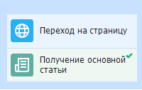

:::info **Пожалуйста, ознакомьтесь с [*Правилами использования материалов на данном ресурсе*](../Disclaimer).**
:::

> 🔗 **[Оригинальная страница](https://zennolab.atlassian.net/wiki/spaces/RU/pages/534315397)** — Источник данного материала

_______________________________________________  

## Описание

Позволяет проверить работу экшена [❗→ Распознавание контента](https://zennolab.atlassian.net/wiki/spaces/RU/pages/534085781/Contex+Recognition "https://zennolab.atlassian.net/wiki/spaces/RU/pages/534085781/Contex+Recognition") перед использованием в проекте. Определить минимальные границы релевантности.

:::info Информация
Тестер понимает только английский язык
:::

  

## Как открыть окно?

С помощью верхнего меню **Инструменты =&gt;Распознавание контекста**

  

## Для чего это используется?

- Определение тематики текста

  

## Как работать с окном?

Тестер позволит определить релевантность текста без запуска проекта.

1. Задаём необходимый текст в соответствующем поле.
2. Запускаем процесс обработки текста.
3. Результат - к каким тематикам можно отнести текст в процентах.

  

## Пример использования

Зайти на страницу сайта, определить главную статью и тестером проверить релевантность.

1. Переходим на страницу.
2. Добавляем экшен [❗→ Article Extraction](https://zennolab.atlassian.net/wiki/spaces/RU/pages/534315067/Article+Extraction "https://zennolab.atlassian.net/wiki/spaces/RU/pages/534315067/Article+Extraction").
3. Помещаем главную статью в переменную.
4. Добавляем текст в тестер и проверяем результат.

  

## Полезные ссылки

1. [❗→ Context Recognition](https://zennolab.atlassian.net/wiki/spaces/RU/pages/534085781/Contex+Recognition "https://zennolab.atlassian.net/wiki/spaces/RU/pages/534085781/Contex+Recognition")
2. [❗→ Article Extraction](https://zennolab.atlassian.net/wiki/spaces/RU/pages/534315067/Article+Extraction "https://zennolab.atlassian.net/wiki/spaces/RU/pages/534315067/Article+Extraction")
3. [❗→ Создание контента](https://zennolab.atlassian.net/wiki/spaces/RU/pages/489095179 "https://zennolab.atlassian.net/wiki/spaces/RU/pages/489095179")