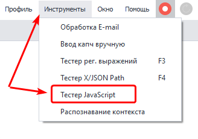
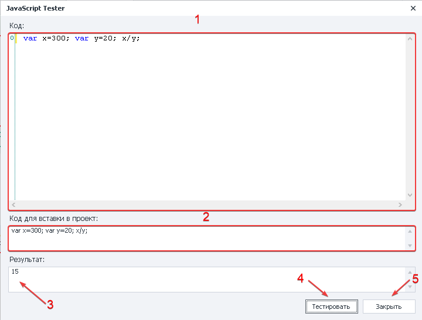
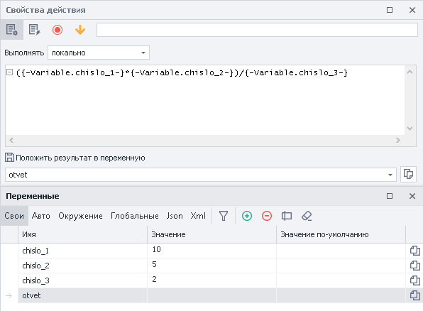
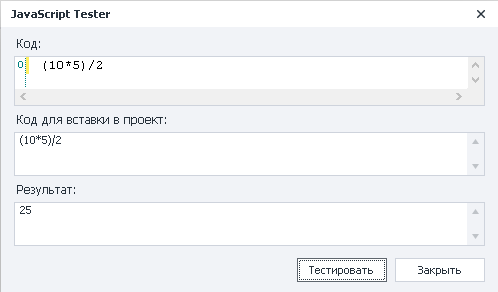
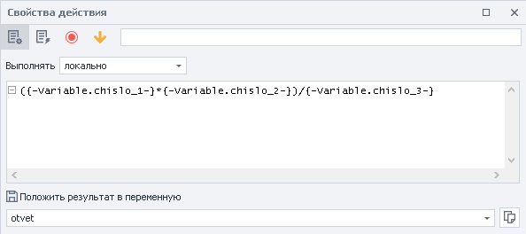
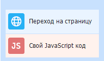

---
sidebar_position: 5
title: "Тестер JavaScript"
description: ""
date: "2025-08-25"
converted: true
originalFile: "Тестер JavaScript.txt"
targetUrl: "https://zennolab.atlassian.net/wiki/spaces/RU/pages/534086128/JavaScript"
---
:::info **Пожалуйста, ознакомьтесь с [*Правилами использования материалов на данном ресурсе*](../Disclaimer).**
:::

> 🔗 **[Оригинальная страница](https://zennolab.atlassian.net/wiki/spaces/RU/pages/534086128/JavaScript)** — Источник данного материала

_______________________________________________  
## Описание

Инструмент позволяет проверить корректность работы локального JS кода. Тестер формирует код для вставки в экшен.

:::info Информация
Работает только с кодом локального выполнения
:::

  

## Как открыть окно?

С помощью верхнего меню **Инструменты =&gt; Тестер JavaScript**.

  

## Для чего это используется?

- Проверка JS до использования в проекте
- Формирование кода для использования в шаблоне

  

## Как работать с окном?

1. Поля для кода, который необходимо проверить.
2. В каком формате нужно вставить код в экшен [❗→ JavaScript](https://zennolab.atlassian.net/wiki/spaces/RU/pages/489259137/JavaScript "https://zennolab.atlassian.net/wiki/spaces/RU/pages/489259137/JavaScript").
3. Результат выполнения кода.
4. Тестировать выполнение кода.
5. Закрыть тестер.

Пример

Нужно провести математические вычисление при помощи JS с использованием переменных.

Экшен [❗→ JavaScript](https://zennolab.atlassian.net/wiki/spaces/RU/pages/489259137/JavaScript "https://zennolab.atlassian.net/wiki/spaces/RU/pages/489259137/JavaScript") и переменные.

Перед использованием в проекте запустим тестер и проверим правильность написания кода и выполнение.

Тестер показал, что мы составили код верно - просто заменим статичные значения переменными и добавим в экшен [❗→ JavaScript](https://zennolab.atlassian.net/wiki/spaces/RU/pages/489259137/JavaScript "https://zennolab.atlassian.net/wiki/spaces/RU/pages/489259137/JavaScript").

  

## Пример использования

Перейти на страницу и выполнить [❗→ JavaScript](https://zennolab.atlassian.net/wiki/spaces/RU/pages/489259137/JavaScript "https://zennolab.atlassian.net/wiki/spaces/RU/pages/489259137/JavaScript").

1. Заходим на сайте.
2. Необходимый код помещаем в тестер и проверяем работу.
3. Копируем код для вставки в проект.
4. Добавляем экшен [❗→ JavaScript](https://zennolab.atlassian.net/wiki/spaces/RU/pages/489259137/JavaScript "https://zennolab.atlassian.net/wiki/spaces/RU/pages/489259137/JavaScript") в формате из тестера.

Таким образом помимо тестирования самого кода перед использованием его в проекте, **Zennoposter** скажет в каком формате будет правильно поместить его в экшен.

  

## Полезные ссылки

1. [❗→ JavaScript](https://zennolab.atlassian.net/wiki/spaces/RU/pages/489259137/JavaScript "https://zennolab.atlassian.net/wiki/spaces/RU/pages/489259137/JavaScript")
2. [❗→ Переменные проекта](https://zennolab.atlassian.net/wiki/spaces/RU/pages/735608872 "https://zennolab.atlassian.net/wiki/spaces/RU/pages/735608872")