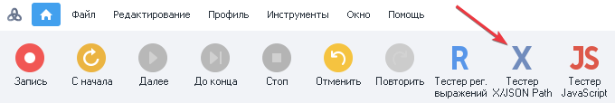
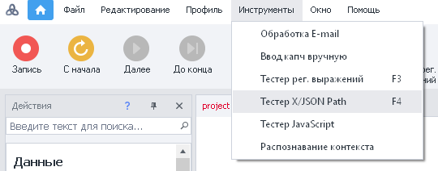
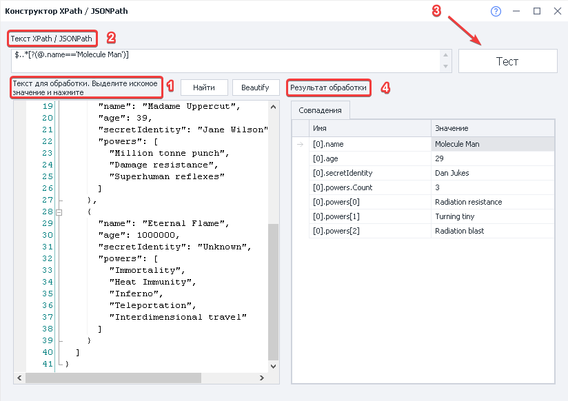
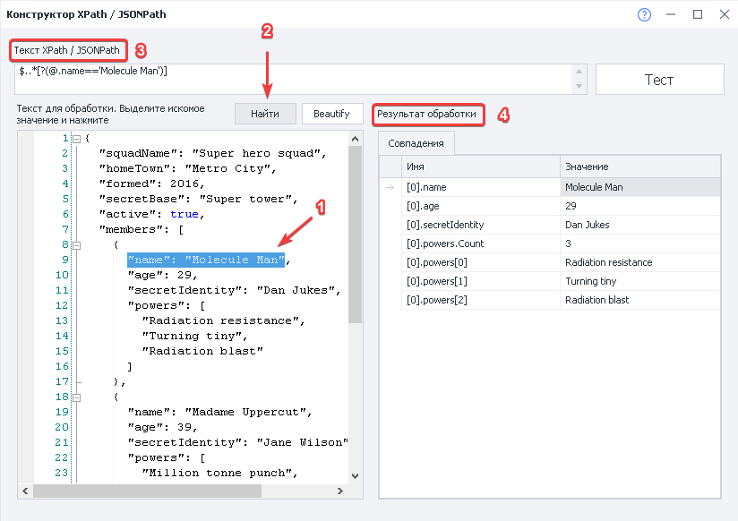

---
sidebar_position: 4
title: "Тестер X\/JSON Path"
description: ""
date: "2025-08-25"
converted: true
originalFile: "Тестер XJSON Path.txt"
targetUrl: "https://zennolab.atlassian.net/wiki/spaces/RU/pages/534315390/X+JSON+Path"
---
:::info **Пожалуйста, ознакомьтесь с [*Правилами использования материалов на данном ресурсе*](../Disclaimer).**
:::

> 🔗 **[Оригинальная страница](https://zennolab.atlassian.net/wiki/spaces/RU/pages/534315390/X+JSON+Path)** — Источник данного материала

_______________________________________________  

## Описание

Инструмент предназначен для проверки корректности данных в формате XPath / JSONPath и помощи в составлении правильных выражений для парсинга данных из XML и JSON документов.

## Как открыть окно?

На панели инструментов, если данная кнопка включена в настройках внешнего вида:




Или Главное Меню - Инструменты - Тестер X/JSON Path:




## Как проверить правильность выражения XPath / JSONPath?




1. В поле ввода вставляем код для обработки;
2. Вставляем готовое XPath / JSONPath выражение, которое необходимо проверить;
3. Нажимаем кнопку “Тест“;
4. В поле “Результат обработки” получаем совпадения, полученные по заданному выражению, если оно было составлено правильно.

## Как быстро составить выражение XPath / JSONPath?




1. В поле ввода вставляем код для обработки;
2. Нажимаем кнопку “Найти“;
3. В поле “XPath / JSONPath“ получаем выражение готовое выражение;
4. В поле “Результат обработки” получаем совпадения, полученные по заданному выражению, если оно было составлено правильно.

Получившееся выражение можно использовать в экшене [❗→ Обработка JSON и XML](https://zennolab.atlassian.net/wiki/spaces/RU/pages/488964124/JSON+XML "https://zennolab.atlassian.net/wiki/spaces/RU/pages/488964124/JSON+XML").

Кнопка **Beautify** позволяет автоматически отформатировать код и привести его к удобному для чтения формату. 

  

## Базовый синтаксис XPath.

| **Выражение** | **Результат** |
| --- | --- |
| ```*имя\_узла``` | Выбирает все узлы с именем "имя\_узла" |
| ```/``` | Выбирает от корневого узла |
| ```//``` | Выбирает узлы от текущего узла, соответствующего выбору, независимо от их местонахождения |
| ```.``` | Выбирает текущий узел |
| ```..``` | Выбирает родителя текущего узла |
| ```@``` | Выбирает атрибуты |

Для поиска неизвестных узлов используются специальные символы:

| **Спецсимвол** | **Описание** |
| --- | --- |
| ```*``` | Соответствует любому узлу элемента |
| ```@*``` | Соответствует любому узлу атрибута |
| ```node()``` | Соответствует любому узлу любого типа |

  

## Базовый синтаксис JSONPath.

| **Выражение** | **Результат** |
| --- | --- |
| ```$``` | Выбирает от корневого узла |
| ```..``` | Родительский оператор |
| ```.``` или ```[]``` | Оператор потомка |
| ```..``` | Выбирает узлы от текущего узла, соответствующего выбору |
| ```@``` | Выбирает текущий узел |
| ```?()``` | Применяет выражение по фильтру |

### Примеры:

``` json
{ "store": {
    "book": [ 
      { "category": "reference",
        "author": "Nigel Rees",
        "title": "Sayings of the Century",
        "price": 8.95
      },
      { "category": "fiction",
        "author": "Evelyn Waugh",
        "title": "Sword of Honour",
        "price": 12.99
      },
      { "category": "fiction",
        "author": "Herman Melville",
        "title": "Moby Dick",
        "isbn": "0-553-21311-3",
        "price": 8.99
      },
      { "category": "fiction",
        "author": "J. R. R. Tolkien",
        "title": "The Lord of the Rings",
        "isbn": "0-395-19395-8",
        "price": 22.99
      }
    ],
    "bicycle": {
      "color": "red",
      "price": 19.95
    }
  }
}
```

| **Выражение** | **JSONPath** | **Результат** |
| --- | --- | --- |
| `/store/book/author` | ```$.store.book[*].author``` | элементы "author" всех элементов "book" в "store" |
| `//author` | ```$..author``` | все элементы "author" |
| `/store/*` | ```$.store.*``` | всё содержимое в "store" |
| `/store//price` | ```$.store..price``` | значение цены элемента "price" всех элементов в "store" |
| `//book[3]` | ```$..book[2]``` | третий элемент "book" |
| `//book[last()]` | ```$..book[(@.length-1)]``` ```$..book[-1]``` | последний элемент "book" |
| `//book[position()<3]` | ```$..book[0,1]``` ```$..book[:2]``` | первые 2 элемента "book" |
| `//book[isbn]` | ```$..book[?(@.isbn)]``` | фильтровать все элементы "book" со значением "isbn" |
| `//book[price<10]` | ```$..book[?(@.price<10)]``` | фильтровать все элементы "book" со значением цены "price" меньше, чем 10 |
| `//*` | ```$..*``` | все элементы в XML документе. Все члены JSON структуры. |