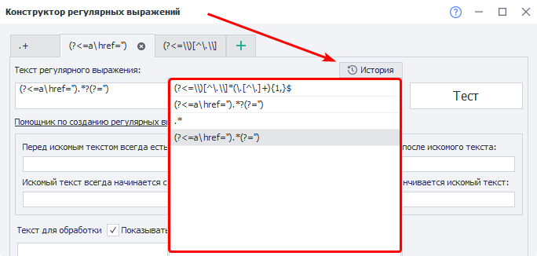
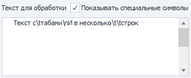

:::info **Пожалуйста, ознакомьтесь с [*Правилами использования материалов на данном ресурсе*](../Disclaimer).**
:::

> 🔗 **[Оригинальная страница](https://zennolab.atlassian.net/wiki/spaces/RU/pages/534086111)** — Источник данного материала

_______________________________________________  
  
## Описание

Регулярные выражения - это своеобразный фильтр для поиска текстовых строк, соответствующий требуемым условиям. Встроенный конструктор регулярных выражений позволит быстро создавать правила, не вникая во все тонкости их составления. 

  

## Где используются регулярные выражения?

- Извлечение информации со страниц сайта
- Фильтрация данных в списках, таблицах
- Поиск письма и\или ссылки подтверждения регистрации;
- Поиск конкретного фрагмента в тексте
- Поиск строк для удаления в списках;
- И множество других полезных применений

  

## Как быстро составить регулярное выражение в ZennoPoster?

Для их составления вы можете воспользоваться помощником - *Тестером регулярных выражений. Его можно найти в меню **Инструменты → Тестер рег. выражений**


### Окно Тестера регулярных выражений


#### Вкладки


Вы можете одновременно работать над несколькими регулярными выражениям в разных вкладках. В качестве имени вкладки используется текст регулярного выражения.

#### История




Сюда сохраняются все выражения, которые Вы проверяли с помощью кнопки *Тест.

#### Текст регулярного выражения

Тут будет находиться текст регулярного выражения. Вы можете редактировать текст в этом поле.

:::warning Внимание
При внесении изменений в поля и чекбоксы из группы Помощник по созданию регулярных выражений все правки, которые Вы вносили в текст выражения вручную, будут утеряны!
:::

#### Кнопка Тест

После нажатия выражение из поля *Текст регулярного выражения применится к *Текст для обработки. Что из этого получилось можно найти в *Результат обработки.

#### Перед искомым текстом всегда есть, Это идёт после искомого текста

Этот текст ищется, но не будет включён в результат работы выражения.

#### Искомый текст всегда начинается с, Этим заканчивается искомый текст

Данный текст включается в результат работы.

#### Разрешить переносы

Включение\отключение многострочного поиска.

#### Самое короткое совпадение

При включении данной опции, в результатах мы получим самую короткую подстроку, соответствующую составленному выражению.

#### Текст для обработки

В это поле нужно ввести текст, по которому будет производиться поиск текста.

Данные в это поле можно внести прямо из переменной проекта: **ПКМ=&gt;Установить значение из переменной**.

:::info Информация
Возможность установить значение из переменной добавлена в ZennoPoster 7.4.0.0
:::


В выпадающем списке будут отображены переменные текущего активного проекта.

##### **Показывать специальные символы**

Стоит ли отображать переносы строки, табы (и некоторые другие символы) в виде специальных символов?

**Выключено**


**Включено**




#### Результат обработки

##### **Вкладка Совпадения**

Здесь будет отображён результат применения регулярного выражения к тексту.

##### **Вкладка Группы**

Сюда попадут результаты работы в случае применения Групповых регулярных выражений. Пример таких выражений можно найти в описании экшена [❗→ Обработка текст =&gt; Regex =&gt; В переменные](https://zennolab.atlassian.net/wiki/spaces/RU/pages/488865793#Regex "https://zennolab.atlassian.net/wiki/spaces/RU/pages/488865793#Regex").

  

## Пример использования

Давайте разберём на примере конкретной и часто встречающейся задачи – парсинг ссылок. Допустим, мы получили HTML какого-то DIVа или [❗→ весь DOM страницы](https://zennolab.atlassian.net/wiki/spaces/RU/pages/735903769 "https://zennolab.atlassian.net/wiki/spaces/RU/pages/735903769") и нам нужно спарсить все ссылки с этого кода и сохранить их в [❗→ список](https://zennolab.atlassian.net/wiki/spaces/RU/pages/534053375 "https://zennolab.atlassian.net/wiki/spaces/RU/pages/534053375"). 


1. Вставляем в поле наш исходный код в котором будем искать ссылки (быстро вставить код текущей активной вкладки в *Тестер можно с помощью окна [❗→ Просмотр текста страницы](https://zennolab.atlassian.net/wiki/spaces/RU/pages/735903769 "https://zennolab.atlassian.net/wiki/spaces/RU/pages/735903769") ).
2. Укажем подстроку, которая обычно идет перед ссылкой, а именно тег `a href=”`.
3. Добавим кавычки, которыми закрывается строка ссылки. Не забываем галочку «Самое короткое совпадение», ведь нам нужно собрать строку только между двумя крайними кавычками.
4. Нажмём кнопку «Тест» и в поле «Результат обработки» появится нужный нам список из ссылок (если есть совпадения). Если получилось что-то не то, попробуйте изменить условия поиска.
5. Можем скопировать готовое регулярное выражение и применить его в своём шаблоне. Например, в действии [❗→ Обработка текста → Regex](https://zennolab.atlassian.net/wiki/spaces/RU/pages/488865793 "https://zennolab.atlassian.net/wiki/spaces/RU/pages/488865793")

:::note На заметку
Регулярное выражение ищет столько подстрок, сколько есть в тексте. Если нужно взять какой-то конкретный номер совпадения, пользуйтесь диапазонами.
:::

  

## Символы со специальным значением

Большинство символов в регулярном выражении представляют сами себя за исключением специальных символов `[` `]` `\` `/` `^` `$` `.` `|` `?` `*` `+` `(` `)` `{` `}`, которые могут быть экранированы символом `\` (обратная косая черта) для представления самих себя в качестве символов текста. То есть простейшее регулярное выражение можно записать так: `abc```xml
, которому будет соответствовать строка **abc**. 

| **Спец. символ** | **Значение** | **Пример** | **Соответствие** |
| --- | --- | --- | --- |
| ```*``` | Число повторений 0 и больше | ```ab*c``` | `abc`, `abbc`, `ac` |
| ```.``` | Один любой символ, исключая символ новой строки | `a.c` | `aac` |
| ```+``` | Число повторений 1 и больше | `ab+c` | `abc`, `abbc` |
| ```?``` | Число повторений 0 или 1 | `ab?c` | `abc`, `ac` |
| ```\|``` | Оператор “ИЛИ“ | ```a\|b\|c``` | `a`, `b`, `c` |
| ```()``` | Группировка | ```zennolab(com)+``` | `zennolabcom`, `zennolabcomcom` |
| ```[]``` | Список символов, один из которых может присутствовать в тексте | ```zennoposter[57]``` | `zennoposter5`, `zennoposter7` |
| ```[^]``` | Список символов, которые не входят в указанный набор | ```[^0-9]``` | `abc` 123 |
| ```-``` | Диапазон символов (используется в квадратных скобках) | ```[3-7]``` `[а-д]` | `3`, `4`, `5`, `6`, `7` `а`, `б`, `в`, `г`, `д` |
| ```^``` | Начало строки | ```^a``` | `a`aa aaa |
| ```$``` | Конец строки | ```a$``` | aaa aa`a` |
| ```{}``` | Количество повторений предыдущего символа.<br/><br/>Число повторений<br/>`{n}` - ровно n раз<br/>`{m,n}` - от m до n включительно<br/>`{m,}` - не менее m раз<br/>`{,n}` не более n раз | `zen{2}oposter` `(abc){2,3}` | `zennoposter` `abcabc`, `abcabcabc` |
| ```\``` | Экранирование специальных символов | `a\.b\.c` | `a.b.c` |
| ```\b``` | Граница слова | `a\b` `\ba` | aa`a` aa`a` |
| ```\B``` | Не граница слова | `\Ba\B` | a`a`a a`a`a |
| ```\s``` | Пробельный символ | `aaa\s?bbb` | `aaa bbb`, `aaabbb` |
| ```\S``` | Непробельный символ | `aaa\S+` | `aaabc` cccc |
| ```\d``` | Цифровой символ | `\d+` | abc `123` abc |
| ```\D``` | Нецифровой символ | `\D+` | `abc` 123 `abc` |
| ```\w``` | Буквенный или цифровой символ, включая знак \_ | `\w+` | `abc`, `123` |
| ```\W``` | Любой символ, кроме буквенного, цифрового или \_ | `\W+` | 123`₽` |
| ```\r``` | Возврат каретки | | |
| ```\n``` | Перевод строки | | |
| ```\t``` | Знак табуляции | | |

* * *

## Модификаторы

Модификаторы действуют с момента вхождения и до конца регулярного выражения или противоположного модификатора.

| **Модификатор**| **Описание**| **Описание** |
| --- | --- | --- |
| ```(?i)``` | Включает | нечувствительность к регистру |
| ```(?-i)``` | Выключает |
| ```(?s)``` | Включает | режим соответствия точки символам переноса строки. |
| ```(?-s)``` | Выключает |
| ```(?m)``` | Многострочный поиск.<br/>Символы `^` и `$` вызывают соответствие только | после и до символов новой строки |
| ```(?-m)``` | с началом и концом текста |
| ```(?x)``` | Включает | режим без учёта пробелов между частями регулярного выражения и позволяет использовать `#` для комментариев |
| ```(?-x)``` | Выключает |

  

## Просмотр вперёд и назад

Поиска фрагмента текста, «просматривая» (но не включая в найденное) окружающий текст, который расположен до или после искомого фрагмента текста. Просмотр с отрицанием используется реже и «следит» за тем, чтобы указанные соответствия, напротив, не встречались до или после искомого текстового фрагмента.

| **Представление** | **Вид просмотра** | **Пример** | **Соответствие** |
| --- | --- | --- | --- |
| ```(?=шаблон)``` | Позитивный просмотр вперёд | ```Людовик(?=XVI)``` | ЛюдовикXV, `Людовик`XVI, `Людовик`XVIII, ЛюдовикLXVII, ЛюдовикXXL |
| ```(?!шаблон)``` | Негативный просмотр вперёд (с отрицанием) | ```Людовик(?!XVI)``` | `Людовик`XV, ЛюдовикXVI, ЛюдовикXVIII, `Людовик`LXVII, `Людовик`XXL |
| ```(?&lt;=шаблон)``` | Позитивный просмотр назад | ```(?<=Сергей )Иванов``` | Сергей `Иванов`, Игорь Иванов |
| ```(?&lt;!шаблон)``` | Негативный просмотр назад (с отрицанием) | ```(?<!Сергей )Иванов``` | Сергей Иванов, Игорь `Иванов` |

## Сборник регулярных выражений

Примеры полезных регулярок для быстрого решения наиболее распространенных задач.

### E-mail адрес

```
(?i)[A-Z0-9._%+-]+@[A-Z0-9-]+.+.[A-Z]{2,4}
```

### Номер телефона

```
+?(\d{1,3})?[- .]?(?(?:\d{2,4}))?[- .]?[\d-]{5,9}
```

### IP адрес

```
(?:(?:25[0-5]|2[0-4][0-9]|[01]?[0-9][0-9]?)\.){3}(?:25[0-5]|2[0-4][0-9]|[01]?[0-9][0-9]?)
```

### URL адрес

```
(https?:\/\/)?([\w\.]+)\.([a-z]{2,6}\.?)(\/[\w\.]*)*\/?
```

### Извлечение имени и расширения файла из пути

```
(?<=\\)[^\.\\]*(\.[^\.]+){1,}$
```

Если Вы не знаете , как составить регулярное выражение для своей ситуации, попросите помощи у нашего сообщества на форуме в разделе [Вопросы новичков](https://zennolab.com/discussion/forums/voprosy-novichkov.16/ "https://zennolab.com/discussion/forums/voprosy-novichkov.16/") или в специальной теме [Регулярные выражения на все случаи жизни](https://zennolab.com/discussion/threads/reguljarnye-vyrazhenija-na-vse-sluchai-zhizni.20829/ "https://zennolab.com/discussion/threads/reguljarnye-vyrazhenija-na-vse-sluchai-zhizni.20829/").