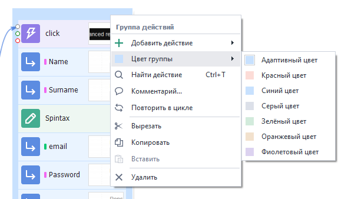

:::info **Пожалуйста, ознакомьтесь с [*Правилами использования материалов на данном ресурсе*](../Disclaimer).**
:::

> 🔗 **[Оригинальная страница](https://zennolab.atlassian.net/wiki/spaces/RU/pages/506200090)** — Источник данного материала

_______________________________________________  
# 💎 Преимущества интерфейса ProjectMaker 7

Интерфейс ProjectMaker 7 удовлетворяет самым требовательным критериям к современному ПО для конструирования и разработки проектов. 

:::info Информация
Инструкции по настройке ищите в пункте “3. Кастомизация”
:::

  

### **3 качества, которыми обладает интерфейс ProjectMaker 7:**

1. [❗→ Современный вид](https://zennolab.atlassian.net/wiki/spaces/RU/pages/506200090/ProjectMaker+7#1.-%D0%A1%D0%BE%D0%B2%D1%80%D0%B5%D0%BC%D0%B5%D0%BD%D0%BD%D1%8B%D0%B9-%D0%B2%D0%B8%D0%B4 "https://zennolab.atlassian.net/wiki/spaces/RU/pages/506200090/ProjectMaker+7#1.-%D0%A1%D0%BE%D0%B2%D1%80%D0%B5%D0%BC%D0%B5%D0%BD%D0%BD%D1%8B%D0%B9-%D0%B2%D0%B8%D0%B4")
2. [❗→ Функциональность](https://zennolab.atlassian.net/wiki/spaces/RU/pages/506200090/ProjectMaker+7#2.-%D0%A4%D1%83%D0%BD%D0%BA%D1%86%D0%B8%D0%BE%D0%BD%D0%B0%D0%BB%D1%8C%D0%BD%D0%BE%D1%81%D1%82%D1%8C "https://zennolab.atlassian.net/wiki/spaces/RU/pages/506200090/ProjectMaker+7#2.-%D0%A4%D1%83%D0%BD%D0%BA%D1%86%D0%B8%D0%BE%D0%BD%D0%B0%D0%BB%D1%8C%D0%BD%D0%BE%D1%81%D1%82%D1%8C")
3. [❗→ Кастомизация (Настройка под свой вкус)](https://zennolab.atlassian.net/wiki/spaces/RU/pages/506200090/ProjectMaker+7#3.-%D0%9A%D0%B0%D1%81%D1%82%D0%BE%D0%BC%D0%B8%D0%B7%D0%B0%D1%86%D0%B8%D1%8F-%28%D0%9D%D0%B0%D1%81%D1%82%D1%80%D0%BE%D0%B9%D0%BA%D0%B0-%D0%BF%D0%BE%D0%B4-%D1%81%D0%B2%D0%BE%D0%B9-%D0%B2%D0%BA%D1%83%D1%81%29 "https://zennolab.atlassian.net/wiki/spaces/RU/pages/506200090/ProjectMaker+7#3.-%D0%9A%D0%B0%D1%81%D1%82%D0%BE%D0%BC%D0%B8%D0%B7%D0%B0%D1%86%D0%B8%D1%8F-(%D0%9D%D0%B0%D1%81%D1%82%D1%80%D0%BE%D0%B9%D0%BA%D0%B0-%D0%BF%D0%BE%D0%B4-%D1%81%D0%B2%D0%BE%D0%B9-%D0%B2%D0%BA%D1%83%D1%81)")

  

# 1. Современный вид

:::tip Совет
Минимализм, выразительность и лаконичность форм позволяют делать интерфейс программы доступным любому пользователю без дополнительной подготовки.
:::

**📹 Здесь было видео**

Яркие кнопки с узнаваемым предназначением, сконцентрированные на нужных местах, заставляют быстро ориентироваться в управлении программой, а понятные образы иконок дают понять о предназначении пунктов меню. 

  

# 2. Функциональность

## 2.1. Главное меню

Все функции программы доступны в главном меню - классическое меню, к которому все пользователи привыкли еще с первых версий Windows. Теперь это стандарт для современных студий разработки проектов.

## 2.2. Панель инструментов

Кроме классического меню, имеется панель инструментов, вид, порядок и показ кнопок на которой можно выбрать как угодно!

[❗→ Как настроить панель инструментов](https://zennolab.atlassian.net/wiki/spaces/RU/pages/506200090/ProjectMaker+7#3.2.-%D0%9D%D0%B0%D1%81%D1%82%D1%80%D0%BE%D0%B9%D0%BA%D0%B0-%D0%BF%D0%B0%D0%BD%D0%B5%D0%BB%D0%B8-%D0%B8%D0%BD%D1%81%D1%82%D1%80%D1%83%D0%BC%D0%B5%D0%BD%D1%82%D0%BE%D0%B2 "https://zennolab.atlassian.net/wiki/spaces/RU/pages/506200090/ProjectMaker+7#3.2.-%D0%9D%D0%B0%D1%81%D1%82%D1%80%D0%BE%D0%B9%D0%BA%D0%B0-%D0%BF%D0%B0%D0%BD%D0%B5%D0%BB%D0%B8-%D0%B8%D0%BD%D1%81%D1%82%D1%80%D1%83%D0%BC%D0%B5%D0%BD%D1%82%D0%BE%D0%B2")

## 2.3. Окна инструментов

Основные и вспомогательные окна программы, такие, как “Проект“, “Браузер“, “Свойства действия“, “Лог выполнения“ и другие, имеют обособленный, привычный для функциональных окон вид. 

## 2.4. Использование 2 мониторов

В ProjectMaker 7 вы можете разносить на разные мониторы все окна инструментов, какие пожелаете. Даже браузер.

**📹 Здесь было видео**

## 2.5. Умная панель действий (Toolbox для кубиков)

В ProjectMaker 7 вы можете использовать панель действий везде, где вам захочется:

1. В режиме “скрыть браузер“ (Режим расширенного редактора в ZP5)
2. В режиме “показать браузер“ (Режим записи и отладки в ZP5)
3. Скрыть и вызывать по быстрой комбинации клавиш Ctrl + T

**📹 Здесь было видео**

### Умный поиск действий

:::note На заметку
Теперь вам не нужно помнить, где располагалось и как называлось действие (кубик), ведь в новой панели действий встроен действительно “умный поиск“.
:::

**📹 Здесь было видео**

## 2.6. Быстрая навигация в проекте

:::warning Внимание
Каждый, кто сталкивался с большими проектами, всегда задавался вопросом:-- А куда ведет эта линия?
:::

ProjectMaker7 может ответить на этот вопрос, ведь теперь, при наведении на точку крепления линии, можно увидеть предпросмотр действия, куда ведет линия! 

**Посмотрите, как это работает:**

**📹 Здесь было видео**

  

# 3. Кастомизация (Настройка под свой вкус)

## 3.1. Тема для интерфейса

:::tip Совет
Есть 2 темы - светлая и темная.
:::

Светлая подойдет тем, кто привык к классическому виду программ. Темная же сейчас очень популярна для некоторых пользователей, подойдет тем, кто любит все необычное, либо работает ночью и хочет снизить нагрузку на глаза.

Как настроить

Редактирование → Настройки:

## 3.2. Настройка панели инструментов

:::tip Совет
Есть 3 вида панели инструментов: стандартный, компактный и суперкомпактный.
:::

### 3.2.1. Стандартный вид

Предназначен для больших мониторов (full hd, 2k и выше):

Как настроить

### 3.2.2. Компактный 

Предназначен для экранов ноутбуков, либо для тех, кто хочет сэкономить место на экране.

Как настроить

### 3.2.3. Супер компактный

Вы даже можете убрать пункты классического меню:

Как настроить

Для этого откройте настройку меню:

В правой вкладке вы сможете настроить кнопки показа главного меню:

### 3.2.4. Полная настройка панели под свой вкус

Для этого также откройте настройки меню:

:::info Информация
Окно → Вид меню → Настроить…
:::

Здесь вы можете настроить любые кнопки на панели, а также их порядок - просто перетащите пункты мышью:

**📹 Здесь было видео**

## 3.3. Управление окнами инструментов

Каждое окно инструментов может находиться в 4 состояниях:

1. Скрыто
2. Показано + закреплено к главному окну
3. Показано + автоскрыто к главному окну
4. Показано отдельно от главного окна

**📹 Здесь было видео**

**Кроме этого, настройки действий могут находиться еще в дополнительном, 5 состоянии:**

5. Показано в окне редактора.

**📹 Здесь было видео**

## 3.4. Тема для проекта

:::tip Совет
Тема проекта - это то, как выглядит ваш проект. Для ZennoPoster 7 мы разработали абсолютно новую, современную тему, отвечающую требованиям контрастности, различимости образов и читаемости, при этом, не напрягающую глаза при длительной работе.Но если вам хочется как в пятерке - выбирайте классику
:::

В новом ProjectMaker мы добавили возможность выбрать несколько тем оформления проектов на ваш вкус. Мы рекомендуем следующие темы:

### 3.4.1. Современная (Modern2 + дополнительный фон действий)

Как включить

Редактирование → Настройки:

### 3.4.2. Классическая (Classic)

Как включить

Редактирование → Настройки:

## 3.5. Настройка вида элементов внутри проекта

Кроме всего прочего, ProjectMaker7 позволяет дополнительные возможности по кастомизации элементов проекта.

### 3.5.1. Настройка цвета групп

Правой кнопкой по группе:

### 3.5.2. Настройка цвета и шрифта заметок

Правой кнопкой по заметке:

