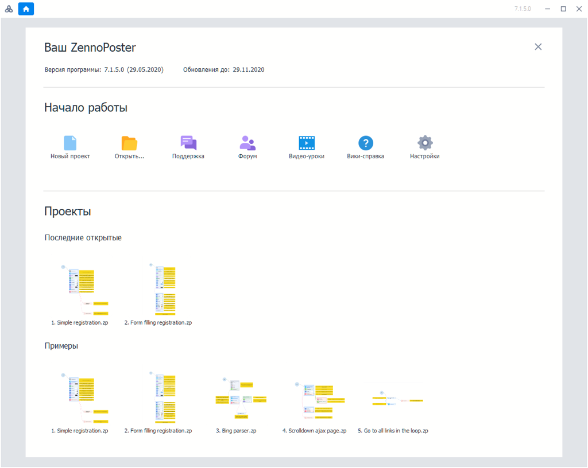
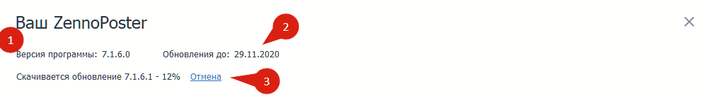
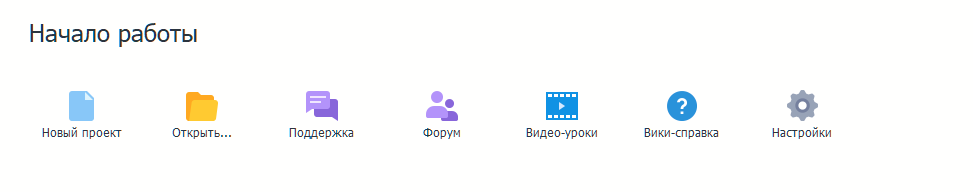
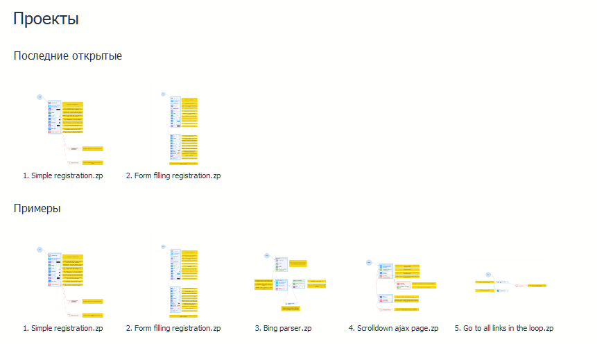
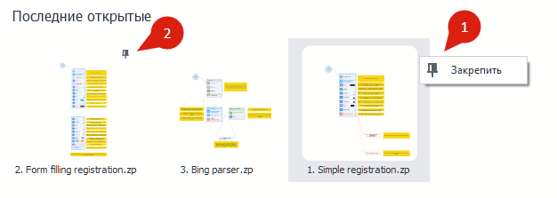
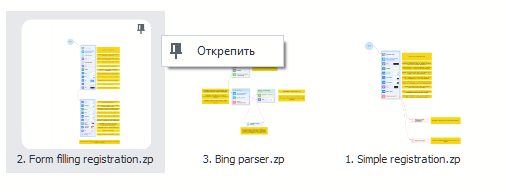
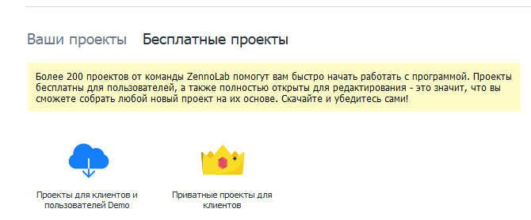

---
sidebar_position: 2
title: "Стартовая страница"
description: ""
date: "2025-07-19"
converted: true
originalFile: "Стартовая страница.txt"
targetUrl: "https://zennolab.atlassian.net/wiki/spaces/RU/pages/735608964"
---
:::info **Пожалуйста, ознакомьтесь с [*Правилами использования материалов на данном ресурсе*](../Disclaimer).**
:::

> 🔗 **[Оригинальная страница](https://zennolab.atlassian.net/wiki/spaces/RU/pages/735608964)** — Источник данного материала

_______________________________________________  
# 👓 Стартовая страница

Стартовый экран - это то, с чего начинается запуск ProjectMaker!

Стартовый экран содержит 3 основных блока:

1. Ваш ZennoPoster
2. Начало работы
3. Проекты

## Ваш ZennoPoster

На этом экране расположена следующая информация:

1. Текущая версия программы 

2. Срок, до которого оплачены обновления. После покупки, вы получаете 6 месяцев бесплатных обновлений. После окончания обновлений программа работать не перестанет, просто не сможет обновиться на более новую версию. 

:::tip Совет
Ознакомиться с тарифами на обновление вашей версии можно в личном кабинете
:::

3. Строка с загрузкой обновления показывается при автоматическом обновлении программы. После загрузки будет предложено запустить установку новой версии, программа закроется и запустит обновление.

## Начало работы

В этом блоке вы можете:

1. Создать новый проект
2. Открыть проект из файла
3. Обратиться в поддержку
4. [Открыть форум](https://zennolab.com/discussion/ "https://zennolab.com/discussion/"), где можно обсудить программу, задать вопрос или пожаловаться на баг
5. [❗→ Открыть видео-уроки](https://zennolab.atlassian.net/wiki/spaces/RU/pages/475562082/ZennoPoster "https://zennolab.atlassian.net/wiki/spaces/RU/pages/475562082/ZennoPoster")
6. Открыть справку в браузере
7. Открыть [❗→ настройки программы](/wiki/spaces/RU/pages/475300064 "/wiki/spaces/RU/pages/475300064")

## Ваши проекты

**В этом блоке показываются:**

1. Ваши последние открытые проекты. Кол-во отображаемых проектов можно изменить в Настройки → Редактирование → [❗→ Запоминать количество последних открытых проектов](https://zennolab.atlassian.net/wiki/spaces/RU/pages/725385223#%D0%97%D0%B0%D0%BF%D0%BE%D0%BC%D0%B8%D0%BD%D0%B0%D1%82%D1%8C-%D0%BA%D0%BE%D0%BB%D0%B8%D1%87%D0%B5%D1%81%D1%82%D0%B2%D0%BE-%D0%BF%D0%BE%D1%81%D0%BB%D0%B5%D0%B4%D0%BD%D0%B8%D1%85-%D0%BE%D1%82%D0%BA%D1%80%D1%8B%D1%82%D1%8B%D1%85-%D0%BF%D1%80%D0%BE%D0%B5%D0%BA%D1%82%D0%BE%D0%B2 "https://zennolab.atlassian.net/wiki/spaces/RU/pages/725385223#%D0%97%D0%B0%D0%BF%D0%BE%D0%BC%D0%B8%D0%BD%D0%B0%D1%82%D1%8C-%D0%BA%D0%BE%D0%BB%D0%B8%D1%87%D0%B5%D1%81%D1%82%D0%B2%D0%BE-%D0%BF%D0%BE%D1%81%D0%BB%D0%B5%D0%B4%D0%BD%D0%B8%D1%85-%D0%BE%D1%82%D0%BA%D1%80%D1%8B%D1%82%D1%8B%D1%85-%D0%BF%D1%80%D0%BE%D0%B5%D0%BA%D1%82%D0%BE%D0%B2").
2. Примеры проектов. Рекомендуется их изучить, если вы только знакомитесь с программой

### Закрепление проектов

:::info Информация
Если вы часто работаете с отдельными проектами, вы можете закрепить их.
:::

1. Кликните правой кнопкой мыши на проекте и выберите Закрепить
2. Закрепленный проект будет прикреплен в начале списка
3. Также, вы можете открепить их через то же меню:

## Бесплатные проекты

Ссылки на [форум](https://zennolab.com/discussion/ "https://zennolab.com/discussion/"), где можно скачать как [публичные бесплатные проекты](https://zennolab.com/discussion/forums/besplatnye-shablony.246/ "https://zennolab.com/discussion/forums/besplatnye-shablony.246/"), так и [приватные](https://zennolab.com/discussion/forums/privatnye-shablony-dlja-klientov.251/ "https://zennolab.com/discussion/forums/privatnye-shablony-dlja-klientov.251/"). Для доступа к приватным шаблонам нужно обладать на форуме статусом Client, как его получить можно [прочитать здесь](https://zennolab.com/discussion/pages/client/ "https://zennolab.com/discussion/pages/client/").