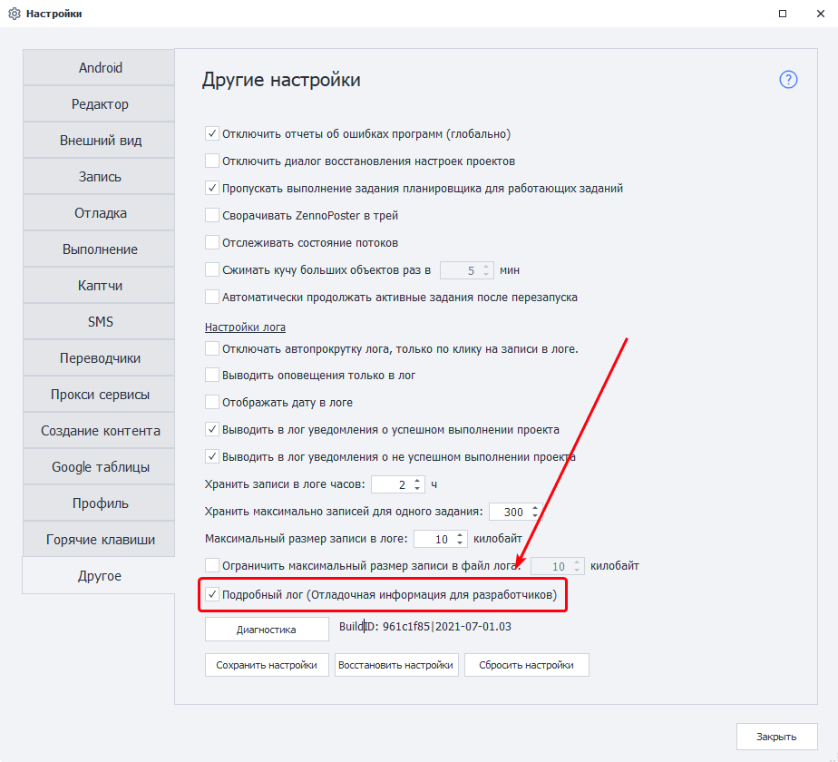
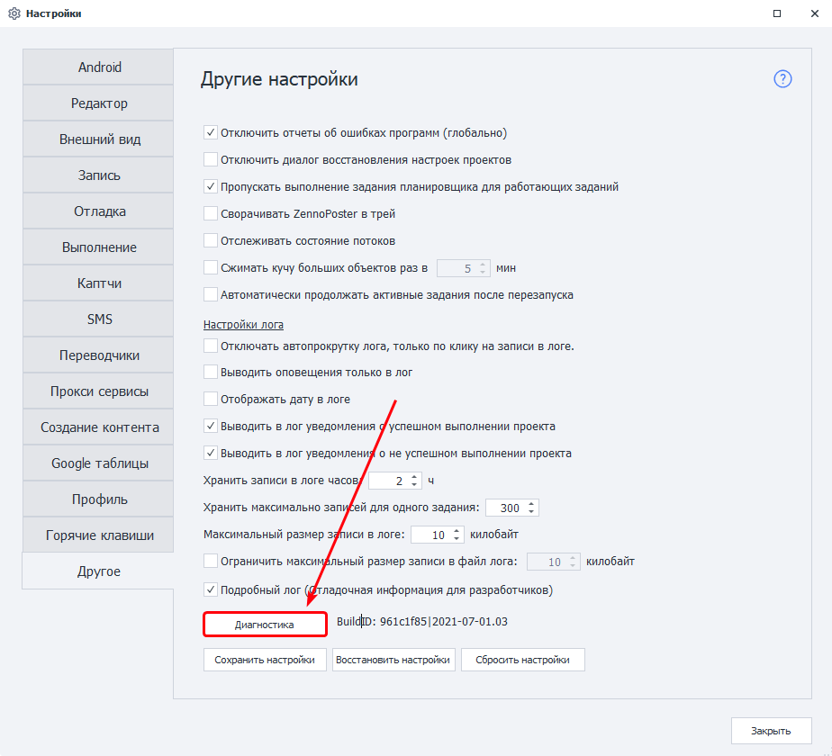
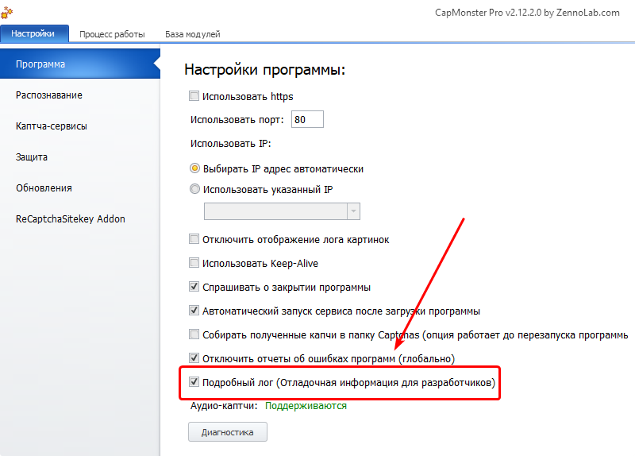
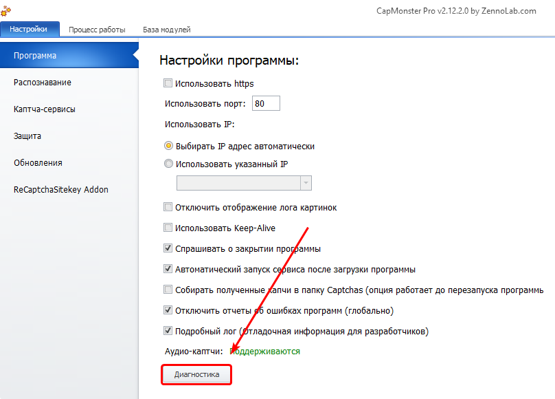

:::info **Пожалуйста, ознакомьтесь с [*Правилами использования материалов на данном ресурсе*](../Disclaimer).**
:::

> 🔗 **[Оригинальная страница](https://zennolab.atlassian.net/wiki/spaces/RU/pages/870419658)** — Источник данного материала

_______________________________________________  
# Диагностика (репорт) с подробным логом

## Инструкция для ZennoPoster и ZennoBox

<details>
<summary>Нажмите здесь, чтобы развернуть</summary>

### **1. Включить подробный лог.**

*Настройки-Другое-Подробный лог (Отладочная информация для разработчиков)


**Возможно включение через**[**специальное приложение.**](https://github.com/ZennoHelpers/DetailedLogSwitcher "https://github.com/ZennoHelpers/DetailedLogSwitcher")

### **2. Перезагрузить программу.**

### **3. Выполнить действия приведшие к ошибке.**

### **4. Запустить** ***Диагностику**.**

Запускать диагностику необходимо **после** проявления проблемы, желательно запомнить время её проявления. 
Запустить её можно несколькими способами:

- из интерфейса программы (*Настройки-*Другое-кнопка *Диагностика внизу окна)


- либо из директории установленной программы
ZennoPoster 7 -` С:\Program Files\ZennoLab\RU\ZennoPoster Pro V7\7.4.0.0\Progs\Diagnostic.exe`
ZennoPoster 5 - `C:\Program Files\ZennoLab\RU\ZennoPoster Pro\5.47.0.0\Progs\Diagnostic.exe```json


В Вашем случае путь может немного отличаться (другая буква диска, версия программы, язык)

### **5. Полученный файл report.zip передать нам**

После завершения Диагностики будет сформирован файл report.zip, находиться файл будет в директории, куда установлена программа (откроется автоматически по завершении Диагностики).

Полученный файл нужно [отправить в поддержку](https://helpdesk.zennolab.com/ "https://helpdesk.zennolab.com/").

</details>

  

## Инструкция для ZennoDroid

<details>
<summary>Нажмите здесь, чтобы развернуть</summary>

### **1. Включить подробный лог.**

*Настройки-Другое-Подробный лог (Отладочная информация для разработчиков)




**Возможно включение через**[**специальное приложение.**](https://github.com/ZennoHelpers/DetailedLogSwitcher "https://github.com/ZennoHelpers/DetailedLogSwitcher")

### **2. Перезагрузить программу.**

### **3. Выполнить действия приведшие к ошибке.**

### **4. Запустить** ***Диагностику**.**

Запускать диагностику необходимо **после** проявления проблемы, желательно запомнить время её проявления.
Запустить её можно несколькими способами:

- из интерфейса программы (*Настройки-*Другое-кнопка *Диагностика внизу окна)




- либо из директории установленной программы

```C:\Program Files\ZennoLab\RU\ZennoDroid Pro\2.2.4.0\Progs\Diagnostic.exe```json

В Вашем случае путь может немного отличаться (другая буква диска, версия программы, язык)

### **5. Полученный файл report.zip передать нам**

После завершения Диагностики будет сформирован файл report.zip, находиться файл будет в директории, куда установлена программа (откроется автоматически по завершении Диагностики).

Полученный файл нужно [отправить в поддержку](https://helpdesk.zennolab.com/ "https://helpdesk.zennolab.com/").

### **5.1. Если используется эмулятор MEmu**

Запустить эмулятор, в меню нажать на пункт Информация о системе, затем нажать на кнопку Сформировать отчет о диагностике. Получивший файл отправить в поддержку вместе с основным отчетом

Информация о системе в MEmu


</details>

* * *

## Инструкция для CapMonster2

<details>
<summary>Нажмите здесь, чтобы развернуть</summary>

### **1. Включить подробный лог.**

*Настройки =&gt; Программа =&gt; Подробный лог (отладочная информация для разработчиков) (над кнопкой Диагностика)*




**Возможно включение через**[**специальное приложение.**](https://github.com/ZennoHelpers/DetailedLogSwitcher "https://github.com/ZennoHelpers/DetailedLogSwitcher")

### **2. Перезагрузить программу.**

### **3. Выполнить действия приведшие к ошибке.**

### **4. Запустить** ***Диагностику**.**

Запускать диагностику необходимо **после** проявления проблемы, желательно запомнить время её проявления.
Запустить её можно несколькими способами:

- из интерфейса программы (*Настройки* =&gt; *Программа* =&gt; кнопка *Диагностика* (в самом низу окна))




- либо из директории установленной программы

```C:\Program Files\ZennoLab\RU\CapMonster Pro\2.12.2.0\Progs\Diagnostic.exe```json

В Вашем случае путь может немного отличаться (другая буква диска, версия программы, язык)

### **5. Полученный файл report.zip передать нам**

После завершения Диагностики будет сформирован файл report.zip, находиться файл будет в директории, куда установлена программа (откроется автоматически по завершении Диагностики).

Полученный файл нужно [отправить в поддержку](https://helpdesk.zennolab.com/ "https://helpdesk.zennolab.com/").

</details>

  

## Инструкция для ZennoProxyChecker

<details>
<summary>Нажмите здесь, чтобы развернуть</summary>

### **1. Выполнить действия приведшие к ошибке.**

### **2. Запустить** ***Диагностику**.**

Запускать диагностику необходимо **после** проявления проблемы, желательно запомнить время её проявления.
Запустить её можно из директории установленной программы

```C:\Program Files\ZennoLab\RU\ZennoProxyChecker\3.6.0.0\Progs\Diagnostic.exe`
В Вашем случае путь может немного отличаться (другая буква диска, версия программы,)

### **3. Полученный файл report.zip передать нам**

После завершения Диагностики будет сформирован файл report.zip, находиться файл будет в директории, куда установлена программа (откроется автоматически по завершении Диагностики).

Полученный файл нужно [отправить в поддержку](https://helpdesk.zennolab.com/ "https://helpdesk.zennolab.com/").

</details>