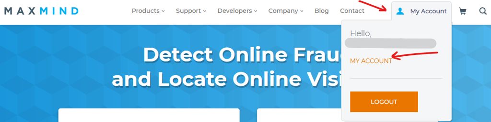

:::info **Пожалуйста, ознакомьтесь с [*Правилами использования материалов на данном ресурсе*](../../Disclaimer).**
:::

> 🔗 **[Оригинальная страница](https://zennolab.atlassian.net/wiki/spaces/RU/pages/1500020737/geo+ZennoPoster)** — Источник данного материала

_______________________________________________  
# Если geo база не загружается средствами ZennoPoster

Если на вашем компьютере отсутствует geo база, ZennoPoster не сможет выполнять некоторые действия. Проверить наличие базы можно по пути: 

`%appdata%\ZennoLab\ZennoPoster\7\Data\GeoLite2-City.mmdb` для ZennoPoster-7

`%appdata%\ZennoLab\ZennoBox\7\Data\GeoLite2-City.mmdb` для ZennoBox-7

Если файла с базой у вас нет, либо вы считаете что он поврежден или устарел, вы можете обновить его самостоятельно. Для этого вам нужно:

1. Зарегистрироваться на сайте https://www.maxmind.com
2. Зайти в личный кабинет

3. Нажать пункт Download files и выбрать GeoLite2 City в binary формате, нажать Download GZIP

4. Разархивировать скачанный архив и положить `GeoLite2-City.mmdb` по нужному пути (примеры путей указаны в начале статьи). Имя файла по нужному пути должно быть строго `GeoLite2-City.mmdb`