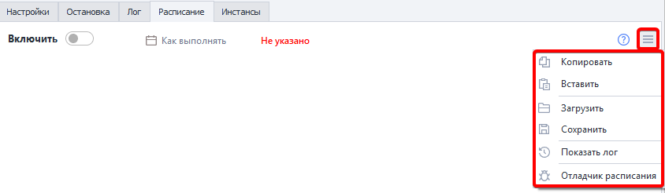

---
sidebar_position: 1
title: "Общая информация по Планировщику"
description: ""
date: "2025-09-10"
converted: true
originalFile: "Общая информация по Планировщику.txt"
targetUrl: "https://zennolab.atlassian.net/wiki/spaces/RU/pages/1959329865"
---
import DisclaimerNotice from '@site/src/components/DisclaimerNotice';

<DisclaimerNotice />

> 🔗 **[Оригинальная страница](https://zennolab.atlassian.net/wiki/spaces/RU/pages/1959329865)** — Источник данного материала

_______________________________________________  

:::tip Совет
Планировщик расписания — обновленный инструмент ZennoPoster 7, позволяющий детально настроить и автоматизировать выполнение проектов по расписанию.
:::

**📹 Здесь было видео**

## **Возможности планировщика расписания:**

1. Создание простых расписаний с однократным выполнением заданий (пример 1).
2. Создание сложных расписаний с учетом интервалов времени, попыток и их повторений (пример 2, 3, 4).
3. [❗→ Отладка расписаний](https://zennolab.atlassian.net/wiki/spaces/RU/pages/547520519 "https://zennolab.atlassian.net/wiki/spaces/RU/pages/547520519"), чтобы быть уверенным в том, что все выполнится так, как задумано.

:::info Информация
Независимо от сложности необходимого расписания, планирование заданий в ZennoPoster 7 доступно любому пользователю с любым уровнем подготовки. Последовательность элементов интерфейса делает процесс составления расписания понятным и логичным.
:::

### Пример 1

:::note На заметку
Выполнить проект 1 раз завтра в 12:30.
:::

### Пример 2

:::note На заметку
Выполнять шаблон каждый день с 10:00 до 15:00 максимум раз с паузой между выполнением в 10 минут.
:::

### Пример 3

:::note На заметку
Выполнять проект каждый день с 8:00 до 12:00 и с 13:00 до 19:00, повторяя его каждые 20-40 минут и добавляя от 1 до 7 попыток.
:::

### Пример 4 

:::note На заметку
Выполнять проект каждый Вт, Ср, Чт с 16:00 до 23:00, случайно распределяя 50 повторений выполнения проекта по указанному интервалу.
:::

## **Как начать работу с планировщиком?**

1. По умолчанию, планировщик выключен
2. Сначала, настройте расписание, как вы хотите, чтобы выполнялся шаблон
3. После - проверьте, правильно ли выставлены настройки
4. После этого переместите слайдер в положение “Включено“

:::warning Внимание
Имейте ввиду, если в настройках расписания будут ошибки - они будут подсвечены красной рамкой, а функция включения будет неактивна.
:::

### Меню планировщика

:::info Информация
До версии 7.2.1.0 Меню находилось под кнопкой Включить. Начиная с 7.2.1.0 Меню было перемещено в правый верхний угол вкладки Расписание.
:::

- **Копировать** — копировать расписание проекта;
- **Вставить** — вставить расписание проекта;
- **Загрузить** — загрузить файл с настройками расписания;
- **Сохранить** — сохранить файл с настройками расписания;
- **Показать лог** — показать историю добавления попыток планировщиком;
- [❗→ Отладчик расписания](https://zennolab.atlassian.net/wiki/spaces/RU/pages/547520519 "https://zennolab.atlassian.net/wiki/spaces/RU/pages/547520519") — запустить отладчик расписания задания. Позволяет рассчитать приблизительное время выполнения заданий.
